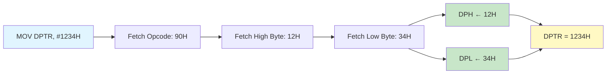
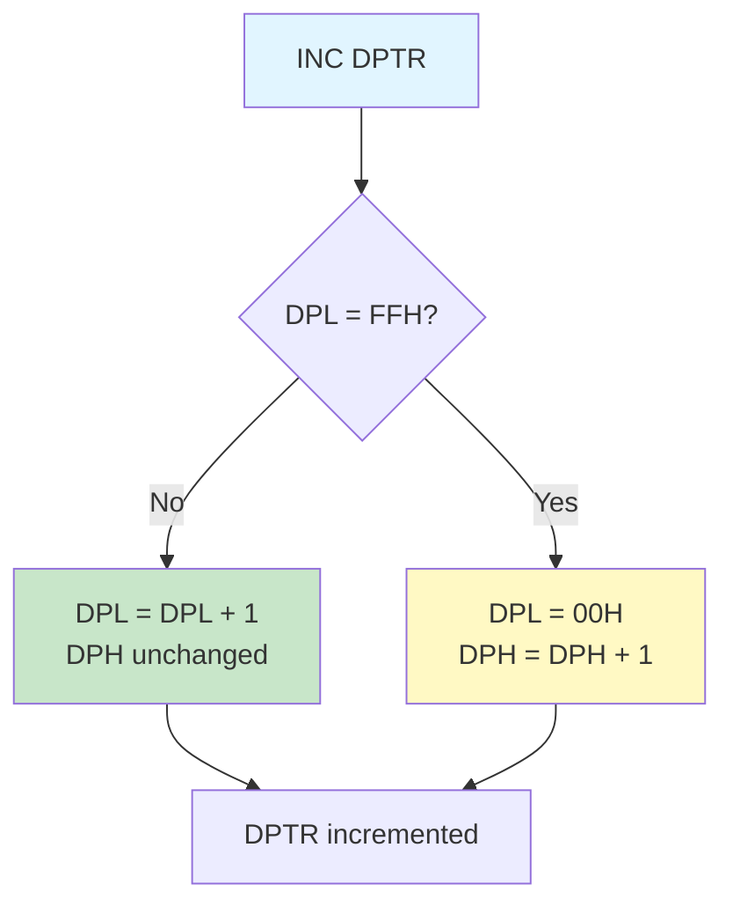
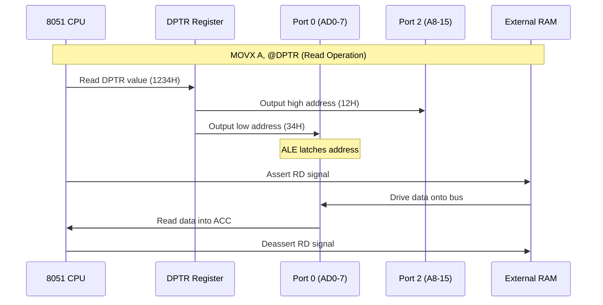

# DPTR (Data Pointer) - DPL & DPH Registers

## Overview

The Data Pointer (DPTR) is a 16-bit register in the 8051 microcontroller, composed of two 8-bit Special Function Registers: DPL (Data Pointer Low) and DPH (Data Pointer High). DPTR is primarily used for accessing external memory and lookup tables in code memory.

**Register Details:**

| Register | Address | Name | Bit-Addressable | Reset Value | Size |
|----------|---------|------|-----------------|-------------|------|
| DPL | 82H | Data Pointer Low | No | 00H | 8-bit |
| DPH | 83H | Data Pointer High | No | 00H | 8-bit |
| DPTR | 82H-83H | Data Pointer | No | 0000H | 16-bit |

**Primary Functions:**
- Accessing external data memory (MOVX instructions)
- Reading from code memory (MOVC instructions)
- Lookup table operations
- Pointer arithmetic for data structures
- Base address for indexed addressing

## Register Structure

### Individual Registers

```
Address: 82H (DPL - Data Pointer Low Byte)
Bit:  7    6    5    4    3    2    1    0
     ┌────┬────┬────┬────┬────┬────┬────┬────┐
     │DPL7│DPL6│DPL5│DPL4│DPL3│DPL2│DPL1│DPL0│
     └────┴────┴────┴────┴────┴────┴────┴────┘
      Low byte of 16-bit address (A0-A7)

Address: 83H (DPH - Data Pointer High Byte)
Bit:  7    6    5    4    3    2    1    0
     ┌────┬────┬────┬────┬────┬────┬────┬────┐
     │DPH7│DPH6│DPH5│DPH4│DPH3│DPH2│DPH1│DPH0│
     └────┴────┴────┴────┴────┴────┴────┴────┘
      High byte of 16-bit address (A8-A15)
```

### Combined 16-bit DPTR

```
DPTR (16-bit Data Pointer)
┌─────────────────────────────────────────────┐
│         DPH (83H)      │      DPL (82H)      │
├────┬────┬────┬────┬────┼────┬────┬────┬────┤
│ A15│ A14│ A13│ A12│ A11│ A10│ A9 │ A8 │ A7 │...│ A0 │
└────┴────┴────┴────┴────┴────┴────┴────┴────┴───┴────┘
  MSB                                              LSB

Address Range: 0000H - FFFFH (64KB)
```

**Bit Description:**
- **DPH (Bits 15-8)**: High byte of address (A15-A8)
- **DPL (Bits 7-0)**: Low byte of address (A7-A0)
- **Combined**: Forms complete 16-bit address for external memory access

## Loading DPTR

### Method 1: Load 16-bit Immediate Value

The most common way to load DPTR is using the `MOV DPTR, #data16` instruction.

**Syntax:**
```assembly
MOV DPTR, #data16        ; Load 16-bit immediate value into DPTR
```

**Operation:**
- DPH ← High byte of data16
- DPL ← Low byte of data16
- Single 3-byte instruction (1 opcode + 2 data bytes)
- Execution time: 2 machine cycles

**Example:**
```assembly
MOV DPTR, #1234H         ; DPTR = 1234H
                         ; DPH = 12H, DPL = 34H

MOV DPTR, #8000H         ; DPTR = 8000H (external RAM start)
MOV DPTR, #0FFFFH        ; DPTR = FFFFH (maximum address)
```

**Loading Process Visualization:**



### Method 2: Load Individual Bytes

You can also load DPH and DPL separately.

**Syntax:**
```assembly
MOV DPH, #data8          ; Load high byte
MOV DPL, #data8          ; Load low byte
```

**Example:**
```assembly
MOV DPH, #12H            ; DPH = 12H
MOV DPL, #34H            ; DPL = 34H
                         ; DPTR = 1234H

; Load from register
MOV A, #56H
MOV DPH, A               ; DPH = 56H
MOV DPL, #78H            ; DPL = 78H
                         ; DPTR = 5678H
```

**Comparison:**

| Method | Bytes | Cycles | Use Case |
|--------|-------|--------|----------|
| MOV DPTR, #data16 | 3 | 2 | Most efficient for constants |
| MOV DPH/DPL separately | 4 | 2 | When bytes come from different sources |

## DPTR Increment Operation

### INC DPTR Instruction

The 8051 provides a dedicated instruction to increment DPTR as a 16-bit value.

**Syntax:**
```assembly
INC DPTR                 ; DPTR = DPTR + 1
```

**Operation:**
- Increments DPTR as a 16-bit register
- Handles carry from DPL to DPH automatically
- Single 1-byte instruction
- Execution time: 2 machine cycles

**Increment Behavior:**



**Examples:**

```assembly
; Example 1: Normal increment
MOV DPTR, #1234H         ; DPTR = 1234H
INC DPTR                 ; DPTR = 1235H (DPH=12H, DPL=35H)

; Example 2: Carry from low to high byte
MOV DPTR, #12FFH         ; DPTR = 12FFH
INC DPTR                 ; DPTR = 1300H (DPH=13H, DPL=00H)

; Example 3: Rollover at maximum
MOV DPTR, #0FFFFH        ; DPTR = FFFFH
INC DPTR                 ; DPTR = 0000H (rolls over)
```

**Use Cases:**
- Sequential memory access
- Array traversal
- Buffer scanning
- String operations
- Block data transfers

## Accessing External Data Memory (MOVX)

### MOVX Instructions with DPTR

DPTR is used with MOVX instructions to access external data memory (RAM).

**Syntax:**
```assembly
MOVX A, @DPTR            ; Read from external memory
MOVX @DPTR, A            ; Write to external memory
```

**Operation:**
- **MOVX A, @DPTR**: Reads byte from external RAM at address DPTR into accumulator
- **MOVX @DPTR, A**: Writes accumulator to external RAM at address DPTR
- Uses RD (Read) or WR (Write) control signals
- Execution time: 2 machine cycles each

**External Memory Access Timing:**



**Memory Access Example:**

```assembly
; Read from external RAM
MOV DPTR, #8000H         ; Point to external RAM address 8000H
MOVX A, @DPTR            ; Read byte from 8000H into A
MOV R0, A                ; Save to register

; Write to external RAM
MOV DPTR, #8001H         ; Point to address 8001H
MOV A, #55H              ; Data to write
MOVX @DPTR, A            ; Write 55H to external RAM at 8001H
```

## Accessing Code Memory (MOVC)

### MOVC Instructions with DPTR

DPTR is used with MOVC instructions to read constant data from code memory (ROM/Flash).

**Syntax:**
```assembly
MOVC A, @A+DPTR          ; Read from code memory at address A+DPTR
```

**Operation:**
- Reads byte from code memory at address (A + DPTR)
- Result stored in accumulator
- Uses PSEN (Program Store Enable) signal
- Execution time: 2 machine cycles
- Read-only operation (cannot write to code memory during execution)

**Indexed Addressing:**


**Lookup Table Example:**

```assembly
; Lookup table in code memory
ORG 1000H
LOOKUP_TABLE:
    DB 00H, 10H, 20H, 30H, 40H, 50H, 60H, 70H
    DB 80H, 90H, 0A0H, 0B0H, 0C0H, 0D0H, 0E0H, 0F0H

; Read from lookup table
ORG 0100H
MAIN:
    MOV DPTR, #LOOKUP_TABLE  ; Point to table base
    MOV A, #05H              ; Index = 5
    MOVC A, @A+DPTR          ; Read table[5] = 50H
    ; A now contains 50H
```

**Use Cases:**
- Lookup tables (sine, cosine, logarithm tables)
- Character fonts for displays
- Configuration data
- Constant arrays
- String constants

## Practical Examples

### Example 1: Block Data Transfer

Transfer a block of data from external RAM to internal RAM.

```assembly
; Transfer 10 bytes from external RAM (8000H) to internal RAM (30H)
BLOCK_TRANSFER:
    MOV DPTR, #8000H         ; Source address (external RAM)
    MOV R0, #30H             ; Destination address (internal RAM)
    MOV R7, #10              ; Byte count

TRANSFER_LOOP:
    MOVX A, @DPTR            ; Read from external RAM
    MOV @R0, A               ; Write to internal RAM
    INC DPTR                 ; Next source address
    INC R0                   ; Next destination address
    DJNZ R7, TRANSFER_LOOP   ; Repeat until count = 0
    RET
```

**Memory State Visualization:**

```
External RAM (8000H-8009H)    →    Internal RAM (30H-39H)
┌──────┬─────┐                    ┌──────┬─────┐
│ 8000H│ 11H │ ───────────────→  │  30H │ 11H │
│ 8001H│ 22H │ ───────────────→  │  31H │ 22H │
│ 8002H│ 33H │ ───────────────→  │  32H │ 33H │
│  ...  │ ... │                    │  ... │ ... │
│ 8009H│ AAH │ ───────────────→  │  39H │ AAH │
└──────┴─────┘                    └──────┴─────┘
```

### Example 2: String Display from Code Memory

Read and display a null-terminated string from code memory.

```assembly
; String in code memory
ORG 2000H
MESSAGE:
    DB "Hello, 8051!", 0    ; Null-terminated string

; Display string via serial port
ORG 0100H
DISPLAY_STRING:
    MOV DPTR, #MESSAGE       ; Point to string start
    CLR A                    ; Index = 0

DISPLAY_LOOP:
    MOVC A, @A+DPTR          ; Read character
    JZ DISPLAY_DONE          ; If null terminator, done
    ACALL SEND_CHAR          ; Send character via serial
    INC DPTR                 ; Next character
    CLR A                    ; Reset index
    SJMP DISPLAY_LOOP

DISPLAY_DONE:
    RET

SEND_CHAR:
    MOV SBUF, A              ; Send via serial port
    JNB TI, $                ; Wait for transmission
    CLR TI
    RET
```

### Example 3: Lookup Table for 7-Segment Display

Use DPTR to access a lookup table for converting digits to 7-segment codes.

```assembly
; 7-segment lookup table (common cathode)
ORG 3000H
SEG7_TABLE:
    DB 3FH  ; 0: 0011 1111
    DB 06H  ; 1: 0000 0110
    DB 5BH  ; 2: 0101 1011
    DB 4FH  ; 3: 0100 1111
    DB 66H  ; 4: 0110 0110
    DB 6DH  ; 5: 0110 1101
    DB 7DH  ; 6: 0111 1101
    DB 07H  ; 7: 0000 0111
    DB 7FH  ; 8: 0111 1111
    DB 6FH  ; 9: 0110 1111

; Convert digit to 7-segment code
DIGIT_TO_SEG7:
    ; Input: A = digit (0-9)
    ; Output: A = 7-segment code
    MOV DPTR, #SEG7_TABLE    ; Point to table
    MOVC A, @A+DPTR          ; Read code
    RET

; Usage example
MAIN:
    MOV A, #7                ; Digit 7
    ACALL DIGIT_TO_SEG7      ; Convert
    MOV P1, A                ; Display on Port 1
```

### Example 4: Multi-Byte Data Structure Access

Access elements in a structure stored in external RAM.

```assembly
; Structure definition (in external RAM at 9000H):
; typedef struct {
;     uint8_t id;          // Offset 0
;     uint8_t status;      // Offset 1
;     uint16_t value;      // Offset 2-3 (high, low)
;     uint8_t checksum;    // Offset 4
; } DataRecord;

READ_RECORD:
    MOV DPTR, #9000H         ; Base address of structure

    ; Read ID (offset 0)
    MOVX A, @DPTR            ; Read ID
    MOV R0, A                ; Save ID

    ; Read status (offset 1)
    INC DPTR
    MOVX A, @DPTR            ; Read status
    MOV R1, A                ; Save status

    ; Read value high byte (offset 2)
    INC DPTR
    MOVX A, @DPTR            ; Read value high
    MOV R2, A                ; Save value high

    ; Read value low byte (offset 3)
    INC DPTR
    MOVX A, @DPTR            ; Read value low
    MOV R3, A                ; Save value low

    ; Read checksum (offset 4)
    INC DPTR
    MOVX A, @DPTR            ; Read checksum
    MOV R4, A                ; Save checksum

    RET
```

## Common Pitfalls and Solutions

### Pitfall 1: Forgetting to Reset Index in MOVC Loop

**Problem:**
```assembly
; Incorrect: Index accumulates
DISPLAY_LOOP:
    MOVC A, @A+DPTR          ; A is not reset!
    JZ DONE
    ; ... process character
    INC DPTR
    SJMP DISPLAY_LOOP        ; A still contains previous character!
```

**Solution:**
```assembly
; Correct: Reset index after each read
DISPLAY_LOOP:
    CLR A                    ; Reset index to 0
    MOVC A, @A+DPTR          ; Read character
    JZ DONE
    ; ... process character
    INC DPTR                 ; Move to next position
    SJMP DISPLAY_LOOP
```

### Pitfall 2: DPTR Overflow Not Handled

**Problem:**
```assembly
; Reading beyond 64KB boundary
MOV DPTR, #0FFFFH
MOVX A, @DPTR                ; Read from FFFFH
INC DPTR                     ; DPTR = 0000H (wraps around!)
MOVX A, @DPTR                ; Reads from 0000H, not 10000H
```

**Solution:**
```assembly
; Check for boundary conditions
MOV DPTR, #0FFFFH
MOVX A, @DPTR
; Check if at end of memory
MOV A, DPH
CJNE A, #0FFH, NOT_END
MOV A, DPL
CJNE A, #0FFH, NOT_END
; Handle end of memory condition
SJMP END_OF_MEMORY
NOT_END:
INC DPTR
```

### Pitfall 3: Incorrect Byte Order in 16-bit Operations

**Problem:**
```assembly
; Incorrect: Loading bytes in wrong order
MOV DPL, #12H                ; Low byte = 12H
MOV DPH, #34H                ; High byte = 34H
; DPTR = 3412H (not 1234H!)
```

**Solution:**
```assembly
; Correct: Use MOV DPTR for 16-bit values
MOV DPTR, #1234H             ; Correct: DPTR = 1234H

; Or load in correct order
MOV DPH, #12H                ; High byte first
MOV DPL, #34H                ; Low byte second
; DPTR = 1234H (correct)
```

### Pitfall 4: Modifying DPTR in Nested Calls

**Problem:**
```assembly
FUNCTION_A:
    MOV DPTR, #8000H         ; Set DPTR
    ACALL FUNCTION_B         ; Calls another function
    MOVX A, @DPTR            ; DPTR may be changed by FUNCTION_B!
    RET

FUNCTION_B:
    MOV DPTR, #9000H         ; Overwrites DPTR!
    MOVX A, @DPTR
    RET
```

**Solution:**
```assembly
; Save and restore DPTR
FUNCTION_A:
    MOV DPTR, #8000H
    PUSH DPL                 ; Save DPTR
    PUSH DPH
    ACALL FUNCTION_B
    POP DPH                  ; Restore DPTR
    POP DPL
    MOVX A, @DPTR            ; DPTR is preserved
    RET
```

## Best Practices

### 1. Use MOV DPTR for 16-bit Constants

✅ **Recommended:**
```assembly
MOV DPTR, #1234H             ; Efficient: 3 bytes, 2 cycles
```

❌ **Not Recommended:**
```assembly
MOV DPH, #12H                ; Less efficient: 4 bytes, 2 cycles
MOV DPL, #34H
```

### 2. Save DPTR in Reusable Functions

```assembly
; Good practice: Save and restore DPTR
MY_FUNCTION:
    PUSH DPL                 ; Save DPTR
    PUSH DPH

    ; Function code that uses DPTR
    MOV DPTR, #8000H
    MOVX A, @DPTR

    POP DPH                  ; Restore DPTR
    POP DPL
    RET
```

### 3. Use INC DPTR for Sequential Access

✅ **Efficient:**
```assembly
INC DPTR                     ; 1 byte, 2 cycles, handles carry
```

❌ **Inefficient:**
```assembly
MOV A, DPL                   ; 5 bytes, multiple cycles
ADD A, #01H
MOV DPL, A
MOV A, DPH
ADDC A, #00H
MOV DPH, A
```

### 4. Clear Accumulator in MOVC Loops

```assembly
; Always reset A when using MOVC in loops
LOOP:
    CLR A                    ; Reset index
    MOVC A, @A+DPTR          ; Read from code memory
    ; Process data
    INC DPTR
    SJMP LOOP
```

### 5. Check Boundaries for Large Data Transfers

```assembly
; Add boundary checking for safety
TRANSFER_DATA:
    MOV R7, #100             ; Transfer count
LOOP:
    MOVX A, @DPTR
    ; Check if DPTR reached limit
    MOV A, DPH
    CJNE A, #0FFH, CONTINUE
    MOV A, DPL
    CJNE A, #0FFH, CONTINUE
    SJMP TRANSFER_DONE       ; Reached end
CONTINUE:
    INC DPTR
    DJNZ R7, LOOP
TRANSFER_DONE:
    RET
```

## Summary

The Data Pointer (DPTR) is a versatile 16-bit register composed of DPL and DPH, essential for:
- **External memory access**: Reading/writing external RAM via MOVX instructions
- **Code memory access**: Reading constants and lookup tables via MOVC instructions
- **Pointer operations**: Sequential data access with INC DPTR
- **Indexed addressing**: Base address for array and structure access

**Key Points to Remember:**

1. **Composition**: DPTR = DPH (high byte) + DPL (low byte)
2. **Address Range**: 0000H - FFFFH (64KB)
3. **Reset Value**: 0000H (both DPH and DPL = 00H)
4. **Loading**: Use `MOV DPTR, #data16` for efficiency
5. **Increment**: Use `INC DPTR` for automatic 16-bit increment with carry
6. **MOVX Instructions**: Access external data memory
   - `MOVX A, @DPTR` - Read from external RAM
   - `MOVX @DPTR, A` - Write to external RAM
7. **MOVC Instructions**: Access code memory (read-only)
   - `MOVC A, @A+DPTR` - Read from ROM/Flash with index

**Critical Rules:**
- ⚠️ Always use `MOV DPTR, #data16` for 16-bit constants (most efficient)
- ⚠️ Save and restore DPTR in reusable functions (PUSH DPL/DPH, POP DPH/DPL)
- ⚠️ Clear accumulator (CLR A) when using MOVC in loops
- ⚠️ Use INC DPTR for sequential access (handles carry automatically)
- ⚠️ Check for boundary conditions in large data transfers
- ⚠️ DPTR wraps around at FFFFH → 0000H

**Register Summary:**

| Property | DPL | DPH | DPTR |
|----------|-----|-----|------|
| Address | 82H | 83H | 82H-83H |
| Size | 8-bit | 8-bit | 16-bit |
| Reset Value | 00H | 00H | 0000H |
| Bit-Addressable | No | No | No |
| Access | Read/Write | Read/Write | Read/Write |
| Function | Low byte (A0-A7) | High byte (A8-A15) | Full address |

**Instruction Summary:**

| Instruction | Bytes | Cycles | Description |
|-------------|-------|--------|-------------|
| MOV DPTR, #data16 | 3 | 2 | Load 16-bit immediate value |
| MOV DPL, #data8 | 2 | 1 | Load low byte |
| MOV DPH, #data8 | 2 | 1 | Load high byte |
| INC DPTR | 1 | 2 | Increment 16-bit pointer |
| MOVX A, @DPTR | 1 | 2 | Read from external RAM |
| MOVX @DPTR, A | 1 | 2 | Write to external RAM |
| MOVC A, @A+DPTR | 1 | 2 | Read from code memory |

By understanding and properly using DPTR, you can efficiently access external memory, implement lookup tables, and handle complex data structures in 8051 applications.

## Related Topics

- **External Memory Interface**: Port 0 (AD0-7), Port 2 (A8-15), ALE, RD, WR, PSEN signals
- **MOVX Instructions**: External data memory access timing and protocols
- **MOVC Instructions**: Code memory access and lookup table implementation
- **Memory Organization**: Internal vs. external memory addressing
- **Addressing Modes**: Indexed addressing with DPTR
- **Stack Pointer (SP)**: Another important pointer register for stack operations

---

**Reference:** This document covers the Data Pointer (DPTR) registers DPL (82H) and DPH (83H) in the 8051 microcontroller architecture.
