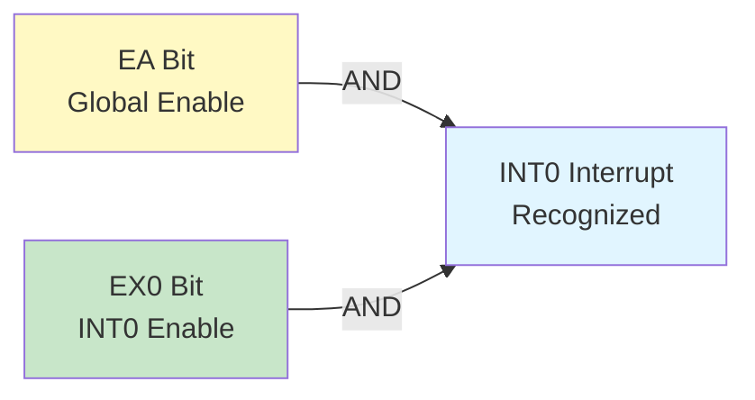
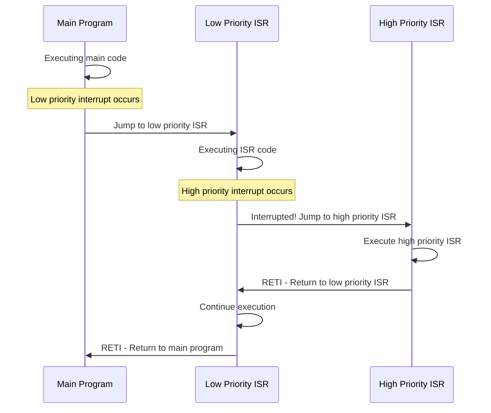

# Interrupt System Registers - IE & IP

## Overview

The 8051 microcontroller has a powerful interrupt system that allows the CPU to respond to internal and external events. The interrupt system is controlled by two Special Function Registers: IE (Interrupt Enable) and IP (Interrupt Priority). These registers enable/disable interrupts and set their priority levels, providing flexible interrupt management for real-time applications.

**Register Details:**

| Register | Address | Name | Bit-Addressable | Reset Value | Function |
|----------|---------|------|-----------------|-------------|----------|
| IE | 0A8H | Interrupt Enable | Yes | 00H | Enable/disable interrupts |
| IP | 0B8H | Interrupt Priority | Yes | ×××00000b | Set interrupt priority levels |

**8051 Interrupt Sources:**

The standard 8051 has 5 interrupt sources:

| Interrupt | Vector Address | Source | Description |
|-----------|----------------|--------|-------------|
| INT0 | 0003H | External Interrupt 0 | P3.2 pin (INT0) |
| Timer 0 | 000BH | Timer 0 Overflow | TF0 flag |
| INT1 | 0013H | External Interrupt 1 | P3.3 pin (INT1) |
| Timer 1 | 001BH | Timer 1 Overflow | TF1 flag |
| Serial | 0023H | Serial Port | RI or TI flag |

**Key Features:**
- **5 Interrupt Sources**: 2 external, 2 timer, 1 serial
- **2 Priority Levels**: High priority and low priority
- **Nested Interrupts**: High priority can interrupt low priority
- **Individual Enable**: Each interrupt can be enabled/disabled separately
- **Global Enable**: Master enable/disable for all interrupts
- **Automatic Vectoring**: Hardware automatically jumps to interrupt vector

## IE - Interrupt Enable Register (0A8H)

### Register Structure

```
Address: 0A8H (IE - Interrupt Enable Register)
Bit:  7    6    5    4    3    2    1    0
     ┌────┬────┬────┬────┬────┬────┬────┬────┐
     │ EA │ -- │ -- │ ES │ ET1│ EX1│ ET0│ EX0│
     └────┴────┴────┴────┴────┴────┴────┴────┘
      Global    Reserved  Serial Timer1 INT1 Timer0 INT0
      Enable              Port
```

**Bit Definitions:**

| Bit | Symbol | Name | Description | Reset Value |
|-----|--------|------|-------------|-------------|
| 7 | EA | Enable All | Global interrupt enable: 1=Enable all, 0=Disable all | 0 |
| 6 | -- | Reserved | Reserved for future use | 0 |
| 5 | -- | Reserved | Reserved for future use | 0 |
| 4 | ES | Enable Serial | Serial port interrupt enable: 1=Enable, 0=Disable | 0 |
| 3 | ET1 | Enable Timer 1 | Timer 1 interrupt enable: 1=Enable, 0=Disable | 0 |
| 2 | EX1 | Enable External 1 | External interrupt 1 enable: 1=Enable, 0=Disable | 0 |
| 1 | ET0 | Enable Timer 0 | Timer 0 interrupt enable: 1=Enable, 0=Disable | 0 |
| 0 | EX0 | Enable External 0 | External interrupt 0 enable: 1=Enable, 0=Disable | 0 |

**Note:** IE is bit-addressable, allowing direct bit operations like `SETB EA` or `CLR ET0`.

### Interrupt Enable Logic

For an interrupt to be recognized, **both** conditions must be true:
1. **EA = 1** (Global enable)
2. **Individual enable bit = 1** (EX0, ET0, EX1, ET1, or ES)



**Example: Enable Timer 0 Interrupt**

```assembly
; Enable Timer 0 interrupt
SETB ET0                     ; Enable Timer 0 interrupt
SETB EA                      ; Enable global interrupts
; Timer 0 interrupt now active
```

## IP - Interrupt Priority Register (0B8H)

### Register Structure

```
Address: 0B8H (IP - Interrupt Priority Register)
Bit:  7    6    5    4    3    2    1    0
     ┌────┬────┬────┬────┬────┬────┬────┬────┐
     │ -- │ -- │ -- │ PS │ PT1│ PX1│ PT0│ PX0│
     └────┴────┴────┴────�────┴────┴────┴────┘
      Reserved        Serial Timer1 INT1 Timer0 INT0
                      Port   Priority Bits
```

**Bit Definitions:**

| Bit | Symbol | Name | Description | Reset Value |
|-----|--------|------|-------------|-------------|
| 7 | -- | Reserved | Reserved for future use | × |
| 6 | -- | Reserved | Reserved for future use | × |
| 5 | -- | Reserved | Reserved for future use | × |
| 4 | PS | Priority Serial | Serial port priority: 1=High, 0=Low | 0 |
| 3 | PT1 | Priority Timer 1 | Timer 1 priority: 1=High, 0=Low | 0 |
| 2 | PX1 | Priority External 1 | External interrupt 1 priority: 1=High, 0=Low | 0 |
| 1 | PT0 | Priority Timer 0 | Timer 0 priority: 1=High, 0=Low | 0 |
| 0 | PX0 | Priority External 0 | External interrupt 0 priority: 1=High, 0=Low | 0 |

**Note:** IP is bit-addressable, allowing direct bit operations like `SETB PT0` or `CLR PX1`.

### Priority Levels

The 8051 has **two priority levels**:
- **Priority 1 (High)**: Priority bit = 1
- **Priority 0 (Low)**: Priority bit = 0 (default)

**Priority Rules:**

1. **High priority interrupts can interrupt low priority ISRs**
2. **Same priority interrupts cannot interrupt each other**
3. **If multiple interrupts occur simultaneously, hardware polling sequence determines order**

**Hardware Polling Sequence (Highest to Lowest):**

```
1. INT0 (External Interrupt 0)    - Highest natural priority
2. Timer 0
3. INT1 (External Interrupt 1)
4. Timer 1
5. Serial Port                     - Lowest natural priority
```

## Interrupt Vectors and ISR Structure

### Interrupt Vector Table

When an interrupt occurs, the CPU automatically jumps to a specific address called the **interrupt vector**. Each interrupt has a fixed vector address:

```
Memory Map of Interrupt Vectors:
┌──────────┬─────────────────────────────────┐
│ Address  │ Interrupt Source                │
├──────────┼─────────────────────────────────┤
│ 0000H    │ Reset Vector                    │
│ 0003H    │ External Interrupt 0 (INT0)     │
│ 000BH    │ Timer 0 Overflow (TF0)          │
│ 0013H    │ External Interrupt 1 (INT1)     │
│ 001BH    │ Timer 1 Overflow (TF1)          │
│ 0023H    │ Serial Port (RI or TI)          │
│ 002BH    │ (Reserved for future use)       │
└──────────┴─────────────────────────────────┘

Each vector has 8 bytes of space (0003H-000AH, 000BH-0012H, etc.)
```

### ISR Structure

**Typical ISR Implementation:**

```assembly
; Method 1: Direct ISR at vector address (if ISR is short)
ORG 0003H                    ; INT0 vector
    ; ISR code here (max 8 bytes)
    RETI

; Method 2: Jump to ISR (recommended for longer ISRs)
ORG 0003H                    ; INT0 vector
    LJMP INT0_ISR            ; Jump to actual ISR (3 bytes)

ORG 0100H                    ; ISR location
INT0_ISR:
    ; Save registers if needed
    PUSH ACC
    PUSH PSW

    ; ISR code here
    ; ... handle interrupt

    ; Restore registers
    POP PSW
    POP ACC

    RETI                     ; Return from interrupt
```

**RETI Instruction:**
- Returns from interrupt service routine
- Restores PC from stack
- Re-enables interrupt logic for same-priority interrupts

## Interrupt Priority and Nesting

### Priority Levels Explained

The 8051 supports **two priority levels** controlled by the IP register:

**Priority Level 1 (High Priority):**
- Set by writing 1 to the corresponding IP bit
- Can interrupt Priority Level 0 ISRs
- Cannot be interrupted by Priority Level 0

**Priority Level 0 (Low Priority):**
- Default priority (IP bit = 0)
- Cannot interrupt any ISR
- Can be interrupted by Priority Level 1

### Nested Interrupt Example



**Example Configuration:**

```assembly
; Set INT0 as high priority, Timer 0 as low priority
SETB PX0                     ; INT0 = High priority
CLR PT0                      ; Timer 0 = Low priority (default)

; Enable interrupts
SETB EX0                     ; Enable INT0
SETB ET0                     ; Enable Timer 0
SETB EA                      ; Enable global interrupts

; If Timer 0 ISR is executing and INT0 occurs:
; - INT0 will interrupt Timer 0 ISR (nested interrupt)
; - INT0 ISR executes
; - Returns to Timer 0 ISR
; - Timer 0 ISR completes
```

### Priority Resolution Table

| Scenario | Priority Bit | Result |
|----------|--------------|--------|
| High interrupts Low ISR | IP bit = 1 | Nested interrupt occurs |
| Low tries to interrupt High ISR | IP bit = 0 | Blocked until High ISR completes |
| Same priority interrupts | Both = 0 or both = 1 | Blocked, no nesting |
| Multiple same priority | Hardware polling | Natural priority order used |

## External Interrupt Configuration

### External Interrupt Pins

The 8051 has two external interrupt pins:
- **INT0**: P3.2 (External Interrupt 0)
- **INT1**: P3.3 (External Interrupt 1)

### Trigger Modes (IT0, IT1 bits in TCON)

External interrupts can be configured for two trigger modes using the TCON register:

**TCON Register (88H) - Relevant Bits:**

| Bit | Symbol | Function |
|-----|--------|----------|
| 2 | IT1 | INT1 trigger type: 1=Edge-triggered, 0=Level-triggered |
| 0 | IT0 | INT0 trigger type: 1=Edge-triggered, 0=Level-triggered |

**Edge-Triggered Mode (IT0/IT1 = 1):**
- Interrupt triggered on **falling edge** (high-to-low transition)
- IE0/IE1 flag set by hardware on falling edge
- Flag cleared automatically when ISR is entered
- Pin can return high immediately after edge

**Level-Triggered Mode (IT0/IT1 = 0):**
- Interrupt triggered when pin is **low**
- IE0/IE1 flag set by hardware when pin is low
- Flag cleared automatically when ISR is entered
- Pin must return high before RETI or interrupt will re-trigger

**Configuration Examples:**

```assembly
; Edge-triggered INT0
SETB IT0                     ; Edge-triggered mode
SETB EX0                     ; Enable INT0
SETB EA                      ; Enable global interrupts

; Level-triggered INT1
CLR IT1                      ; Level-triggered mode
SETB EX1                     ; Enable INT1
SETB EA                      ; Enable global interrupts
```

## Practical Examples

### Example 1: External Interrupt Button Handler

Handle button press using INT0 with debouncing.

```assembly
; Button on INT0 (P3.2) with LED on P1.0
ORG 0000H
    LJMP MAIN

; INT0 vector
ORG 0003H
    LJMP INT0_ISR

ORG 0030H
MAIN:
    MOV SP, #2FH                 ; Initialize stack

    ; Configure INT0
    SETB IT0                     ; Edge-triggered (falling edge)
    SETB EX0                     ; Enable INT0
    SETB EA                      ; Enable global interrupts

    CLR P1.0                     ; LED off initially

LOOP:
    SJMP LOOP                    ; Wait for interrupt

; INT0 ISR - Button press handler
INT0_ISR:
    PUSH ACC
    PUSH PSW

    ; Simple debounce delay
    MOV R7, #50                  ; Delay counter
DEBOUNCE:
    MOV R6, #200
DELAY_INNER:
    DJNZ R6, DELAY_INNER
    DJNZ R7, DEBOUNCE

    ; Toggle LED
    CPL P1.0

    POP PSW
    POP ACC
    RETI
```

### Example 2: Timer and Serial Interrupt Combination

Use Timer 0 for periodic tasks and serial interrupt for communication.

```assembly
; Multiple interrupt sources
ORG 0000H
    LJMP MAIN

; Timer 0 vector
ORG 000BH
    LJMP TIMER0_ISR

; Serial port vector
ORG 0023H
    LJMP SERIAL_ISR

ORG 0100H
MAIN:
    MOV SP, #2FH

    ; Configure Timer 0 (1ms interrupt @ 12MHz)
    MOV TMOD, #01H               ; Timer 0, Mode 1
    MOV TH0, #0FCH               ; 1ms
    MOV TL0, #18H
    SETB TR0                     ; Start Timer 0

    ; Configure Serial Port (9600 baud)
    MOV TMOD, #21H               ; Timer 1 Mode 2 for baud rate
    MOV TH1, #0FDH
    MOV TL1, #0FDH
    SETB TR1
    MOV SCON, #50H               ; Mode 1, REN=1

    ; Enable interrupts
    SETB ET0                     ; Enable Timer 0
    SETB ES                      ; Enable Serial
    SETB EA                      ; Enable global

LOOP:
    SJMP LOOP

; Timer 0 ISR - Periodic task (1ms)
TIMER0_ISR:
    PUSH ACC

    ; Reload timer
    MOV TH0, #0FCH
    MOV TL0, #18H

    ; Periodic task (e.g., scan keypad, update display)
    CPL P1.7                     ; Toggle status LED

    POP ACC
    RETI

; Serial ISR - Handle UART communication
SERIAL_ISR:
    PUSH ACC

    JNB RI, CHECK_TI             ; Check receive
    CLR RI
    MOV A, SBUF                  ; Read data
    ; Process received data
    SJMP SERIAL_EXIT

CHECK_TI:
    JNB TI, SERIAL_EXIT          ; Check transmit
    CLR TI
    ; Transmission complete

SERIAL_EXIT:
    POP ACC
    RETI
```

### Example 3: Priority-Based Interrupt System

Implement high-priority emergency interrupt with low-priority background tasks.

```assembly
; INT0 = High priority (emergency stop)
; Timer 0 = Low priority (background task)
ORG 0000H
    LJMP MAIN

ORG 0003H
    LJMP INT0_ISR

ORG 000BH
    LJMP TIMER0_ISR

ORG 0100H
MAIN:
    MOV SP, #2FH

    ; Set priorities
    SETB PX0                     ; INT0 = High priority
    CLR PT0                      ; Timer 0 = Low priority

    ; Configure Timer 0
    MOV TMOD, #01H
    MOV TH0, #3CH                ; 50ms @ 12MHz
    MOV TL0, #0B0H
    SETB TR0

    ; Enable interrupts
    SETB IT0                     ; Edge-triggered INT0
    SETB EX0
    SETB ET0
    SETB EA

LOOP:
    SJMP LOOP

; High priority ISR - Emergency stop
INT0_ISR:
    PUSH ACC
    PUSH PSW

    ; Emergency action (can interrupt Timer 0 ISR)
    CLR TR0                      ; Stop timer
    SETB P1.0                    ; Turn on alarm LED

    POP PSW
    POP ACC
    RETI

; Low priority ISR - Background task
TIMER0_ISR:
    PUSH ACC
    PUSH PSW

    ; Reload timer
    MOV TH0, #3CH
    MOV TL0, #0B0H

    ; Long background task
    ; Can be interrupted by INT0
    MOV R7, #100
TASK_LOOP:
    NOP
    DJNZ R7, TASK_LOOP

    POP PSW
    POP ACC
    RETI
```

### Example 4: Interrupt-Driven Event Counter

Count external events using INT1 interrupt.

```assembly
; Event counter using INT1
EVENT_COUNT EQU 30H              ; Counter variable (16-bit)

ORG 0000H
    LJMP MAIN

ORG 0013H
    LJMP INT1_ISR

ORG 0100H
MAIN:
    MOV SP, #2FH

    ; Initialize counter
    MOV EVENT_COUNT, #00H
    MOV EVENT_COUNT+1, #00H

    ; Configure INT1
    SETB IT1                     ; Edge-triggered
    SETB EX1                     ; Enable INT1
    SETB EA                      ; Enable global

LOOP:
    ; Display count on Port 1
    MOV P1, EVENT_COUNT
    SJMP LOOP

; INT1 ISR - Increment event counter
INT1_ISR:
    PUSH ACC
    PUSH PSW

    ; Increment 16-bit counter
    INC EVENT_COUNT+1            ; Increment low byte
    MOV A, EVENT_COUNT+1
    JNZ COUNT_DONE               ; If not zero, done
    INC EVENT_COUNT              ; Increment high byte

COUNT_DONE:
    POP PSW
    POP ACC
    RETI
```

## Common Pitfalls and Solutions

### Pitfall 1: Forgetting to Enable Global Interrupts (EA)

**Problem:**
```assembly
; Incorrect: Individual interrupt enabled but EA not set
INIT_INTERRUPT:
    SETB ET0                     ; Enable Timer 0 interrupt
    ; Missing SETB EA!
    RET
; Timer 0 interrupt will never occur!
```

**Solution:**
```assembly
; Correct: Enable both individual and global interrupts
INIT_INTERRUPT:
    SETB ET0                     ; Enable Timer 0 interrupt
    SETB EA                      ; Enable global interrupts
    RET
; Timer 0 interrupt now active
```

**Reason:** For any interrupt to be recognized, **both** the individual enable bit (EX0, ET0, EX1, ET1, ES) **and** the global enable bit (EA) must be set to 1. Forgetting to set EA is one of the most common mistakes.

### Pitfall 2: Not Clearing External Interrupt Flags in Edge-Triggered Mode

**Problem:**
```assembly
; Incorrect: Not clearing IE0/IE1 flag in edge-triggered mode
SETB IT0                         ; Edge-triggered mode
SETB EX0
SETB EA

; INT0 ISR
INT0_ISR:
    ; Process interrupt
    CPL P1.0
    ; Missing: CLR IE0 (if manually set)
    RETI
; If IE0 was set by software, it won't be cleared!
```

**Solution:**
```assembly
; Correct: Hardware clears flag automatically in edge-triggered mode
SETB IT0                         ; Edge-triggered mode
SETB EX0
SETB EA

; INT0 ISR
INT0_ISR:
    ; Process interrupt
    CPL P1.0
    ; No need to clear IE0 - hardware clears it automatically
    RETI

; Note: Only clear IE0/IE1 manually if you set them by software
; Hardware automatically clears them when entering ISR
```

**Reason:** In edge-triggered mode (IT0/IT1 = 1), the hardware automatically clears the IE0/IE1 flag when the ISR is entered. You only need to manually clear these flags if you set them by software for testing purposes. In level-triggered mode (IT0/IT1 = 0), the flag is automatically cleared when the ISR is entered, but will be set again if the pin is still low.

### Pitfall 3: Not Saving/Restoring Registers in ISR

**Problem:**
```assembly
; Incorrect: Modifying registers without saving
TIMER0_ISR:
    ; Reload timer
    MOV TH0, #3CH                ; Modifies ACC!
    MOV TL0, #0B0H

    ; Use accumulator
    MOV A, R0                    ; Corrupts main program's ACC!
    ADD A, #01H
    MOV R0, A

    RETI                         ; Main program's ACC is corrupted!
```

**Solution:**
```assembly
; Correct: Save and restore all modified registers
TIMER0_ISR:
    PUSH ACC                     ; Save accumulator
    PUSH PSW                     ; Save flags (including register bank select)

    ; Reload timer
    MOV TH0, #3CH
    MOV TL0, #0B0H

    ; Use accumulator safely
    MOV A, R0
    ADD A, #01H
    MOV R0, A

    POP PSW                      ; Restore flags
    POP ACC                      ; Restore accumulator
    RETI                         ; Safe return
```

**Reason:** ISRs can interrupt the main program at any point. If the ISR modifies registers (ACC, B, PSW, DPTR, R0-R7) without saving them first, it will corrupt the main program's data. Always save modified registers at the beginning of the ISR and restore them before RETI.

### Pitfall 4: Using Level-Triggered Mode for Pulse Signals

**Problem:**
```assembly
; Incorrect: Level-triggered for short pulse
CLR IT0                          ; Level-triggered mode
SETB EX0
SETB EA

; If INT0 pulse is very short (< 1 machine cycle)
; Interrupt may be missed or trigger multiple times
```

**Solution:**
```assembly
; Correct: Edge-triggered for pulse signals
SETB IT0                         ; Edge-triggered mode
SETB EX0
SETB EA

; Edge-triggered mode captures falling edge
; Works reliably with short pulses
; Interrupt occurs once per falling edge
```

**Reason:**
- **Level-triggered mode (IT0/IT1 = 0)**: Requires the pin to be held low for at least one machine cycle. If the pin returns high before the ISR completes, the interrupt will re-trigger immediately after RETI, causing multiple interrupts for a single event.
- **Edge-triggered mode (IT0/IT1 = 1)**: Captures the falling edge transition. The pin can return high immediately after the edge, and the interrupt will occur only once. This is ideal for button presses, pulse signals, and event counting.

**Recommendation:**
- Use **edge-triggered** for: buttons, pulse signals, event counting, one-shot triggers
- Use **level-triggered** for: slow signals, wake-up from power-down mode, signals that need to be held

## Best Practices

### 1. Always Enable Global Interrupts Last

✅ **Recommended:**
```assembly
; Configure interrupt sources first
SETB IT0                         ; Configure INT0 mode
SETB EX0                         ; Enable INT0
SETB ET0                         ; Enable Timer 0
; Enable global interrupts last
SETB EA                          ; Enable all interrupts
```

❌ **Not Recommended:**
```assembly
; Enabling EA first may cause premature interrupts
SETB EA                          ; Global enable first (wrong order)
SETB IT0                         ; Configure mode (may trigger interrupt)
SETB EX0                         ; Enable INT0
```

### 2. Keep ISRs Short and Fast

```assembly
; Good practice: Minimal ISR, set flag for main loop
TIMER0_ISR:
    PUSH ACC

    ; Reload timer
    MOV TH0, #3CH
    MOV TL0, #0B0H

    ; Set flag for main loop processing
    SETB FLAG_TIMER_EXPIRED

    POP ACC
    RETI

; Main loop handles time-consuming tasks
MAIN_LOOP:
    JNB FLAG_TIMER_EXPIRED, MAIN_LOOP
    CLR FLAG_TIMER_EXPIRED
    ; Perform time-consuming processing here
    ACALL PROCESS_DATA
    SJMP MAIN_LOOP
```

### 3. Always Save and Restore Modified Registers

```assembly
; Complete register preservation
ISR_TEMPLATE:
    PUSH ACC                     ; Always save ACC
    PUSH PSW                     ; Always save PSW (flags + bank select)
    PUSH DPL                     ; Save if using DPTR
    PUSH DPH

    ; ISR code here
    ; ...

    POP DPH                      ; Restore in reverse order
    POP DPL
    POP PSW
    POP ACC
    RETI
```

### 4. Use Priority Levels Appropriately

```assembly
; Set critical interrupts to high priority
INIT_PRIORITIES:
    ; Emergency stop = High priority
    SETB PX0                     ; INT0 high priority

    ; Background tasks = Low priority
    CLR PT0                      ; Timer 0 low priority
    CLR PT1                      ; Timer 1 low priority
    CLR PS                       ; Serial low priority

    ; Enable interrupts
    SETB EX0
    SETB ET0
    SETB EA
    RET
```

### 5. Use Edge-Triggered Mode for Button Inputs

```assembly
; Recommended for buttons and switches
INIT_BUTTON:
    SETB IT0                     ; Edge-triggered (falling edge)
    SETB EX0                     ; Enable INT0
    SETB EA                      ; Enable global
    RET

; Add debouncing in ISR
BUTTON_ISR:
    PUSH ACC
    PUSH PSW

    ; Simple debounce delay
    MOV R7, #50
DEBOUNCE:
    MOV R6, #200
DELAY:
    DJNZ R6, DELAY
    DJNZ R7, DEBOUNCE

    ; Process button press
    CPL P1.0

    POP PSW
    POP ACC
    RETI
```

## Summary

The 8051 microcontroller has a powerful interrupt system controlled by two Special Function Registers: IE (Interrupt Enable) and IP (Interrupt Priority). This interrupt system provides flexible interrupt management with 5 interrupt sources, 2 priority levels, and support for nested interrupts, enabling efficient real-time response to internal and external events.

**Register Summary:**

| Register | Address | Bit-Addressable | Reset Value | Function |
|----------|---------|-----------------|-------------|----------|
| IE | 0A8H | Yes | 00H | Enable/disable interrupts |
| IP | 0B8H | Yes | ×××00000b | Set interrupt priority levels |

**IE Register Bit Summary:**

| Bit | Symbol | Function | Reset Value |
|-----|--------|----------|-------------|
| 7 | EA | Global interrupt enable: 1=Enable all, 0=Disable all | 0 |
| 6 | -- | Reserved | 0 |
| 5 | -- | Reserved | 0 |
| 4 | ES | Serial port interrupt enable: 1=Enable, 0=Disable | 0 |
| 3 | ET1 | Timer 1 interrupt enable: 1=Enable, 0=Disable | 0 |
| 2 | EX1 | External interrupt 1 enable: 1=Enable, 0=Disable | 0 |
| 1 | ET0 | Timer 0 interrupt enable: 1=Enable, 0=Disable | 0 |
| 0 | EX0 | External interrupt 0 enable: 1=Enable, 0=Disable | 0 |

**IP Register Bit Summary:**

| Bit | Symbol | Function | Reset Value |
|-----|--------|----------|-------------|
| 7 | -- | Reserved | × |
| 6 | -- | Reserved | × |
| 5 | -- | Reserved | × |
| 4 | PS | Serial port priority: 1=High, 0=Low | 0 |
| 3 | PT1 | Timer 1 priority: 1=High, 0=Low | 0 |
| 2 | PX1 | External interrupt 1 priority: 1=High, 0=Low | 0 |
| 1 | PT0 | Timer 0 priority: 1=High, 0=Low | 0 |
| 0 | PX0 | External interrupt 0 priority: 1=High, 0=Low | 0 |

**Interrupt Sources:**

| Interrupt | Vector Address | Enable Bit | Priority Bit | Natural Priority | Description |
|-----------|----------------|------------|--------------|------------------|-------------|
| INT0 | 0003H | EX0 (IE.0) | PX0 (IP.0) | Highest | External Interrupt 0 (P3.2) |
| Timer 0 | 000BH | ET0 (IE.1) | PT0 (IP.1) | 2nd | Timer 0 Overflow (TF0) |
| INT1 | 0013H | EX1 (IE.2) | PX1 (IP.2) | 3rd | External Interrupt 1 (P3.3) |
| Timer 1 | 001BH | ET1 (IE.3) | PT1 (IP.3) | 4th | Timer 1 Overflow (TF1) |
| Serial | 0023H | ES (IE.4) | PS (IP.4) | Lowest | Serial Port (RI or TI) |

**Key Points to Remember:**

1. **Dual Enable Requirement**: For any interrupt to be recognized, **both** EA (global enable) and the individual enable bit must be set to 1.

2. **Two Priority Levels**:
   - Priority 1 (High): IP bit = 1, can interrupt Priority 0 ISRs
   - Priority 0 (Low): IP bit = 0 (default), cannot interrupt any ISR

3. **Nested Interrupts**: High priority interrupts can interrupt low priority ISRs, but same-priority interrupts cannot interrupt each other.

4. **Hardware Polling Sequence**: When multiple same-priority interrupts occur simultaneously, they are serviced in natural priority order: INT0 > Timer 0 > INT1 > Timer 1 > Serial.

5. **Bit-Addressable Registers**: Both IE and IP are bit-addressable, allowing direct bit operations like `SETB EA` or `CLR PT0`.

6. **Automatic Vectoring**: When an interrupt occurs, the CPU automatically saves PC and jumps to the interrupt vector address.

7. **RETI Instruction**: Always use RETI (not RET) to return from ISR. RETI restores PC and re-enables interrupt logic.

8. **External Interrupt Modes**:
   - Edge-triggered (IT0/IT1 = 1): Triggered on falling edge, ideal for buttons and pulses
   - Level-triggered (IT0/IT1 = 0): Triggered when pin is low, required for Power-Down wake-up

**Critical Rules:**

- ⚠️ Always set EA bit to enable global interrupts (individual enable bits alone are not sufficient)
- ⚠️ Always save and restore modified registers in ISR (ACC, PSW, DPTR, etc.)
- ⚠️ Always use RETI (not RET) to return from interrupt service routines
- ⚠️ Enable global interrupts (EA) last, after configuring all interrupt sources
- ⚠️ Keep ISRs short and fast to minimize interrupt latency
- ⚠️ Use edge-triggered mode for button inputs and pulse signals
- ⚠️ Use level-triggered mode for Power-Down wake-up (edge-triggered won't work)
- ⚠️ Set high priority only for critical, time-sensitive interrupts
- ⚠️ Avoid long delays or blocking operations in ISRs

**Common Applications:**

- Button and switch input handling with debouncing
- Timer-based periodic tasks (LED blinking, display refresh, sensor sampling)
- Serial communication (UART receive/transmit interrupts)
- External event counting and frequency measurement
- Real-time clock and timing applications
- Emergency stop and safety systems (high-priority interrupts)
- Multi-tasking with priority-based interrupt scheduling
- Sensor data acquisition with precise timing
- Motor control with encoder feedback
- Communication protocol implementation (I2C, SPI via bit-banging)

By understanding and properly using the IE and IP registers, you can implement efficient interrupt-driven applications in 8051 systems, enabling responsive real-time behavior and efficient CPU utilization.

## Related Topics

- **Timer Registers (TMOD, TCON, TH0/TL0, TH1/TL1)**: Timer overflow generates Timer 0 and Timer 1 interrupts
- **Serial Port (SCON, SBUF)**: Serial port generates RI and TI interrupts
- **TCON Register**: Contains IT0, IT1, IE0, IE1 bits for external interrupt configuration
- **Port 3 (P3)**: INT0 (P3.2) and INT1 (P3.3) pins for external interrupts
- **PCON Register**: Power-Down mode wake-up requires level-triggered external interrupts
- **PSW Register**: Must be saved in ISR to preserve flags and register bank selection
- **Stack Pointer (SP)**: Used for saving PC and registers during interrupt handling

---

**Reference:** This document covers the Interrupt System registers IE (0A8H) and IP (0B8H) in the 8051 microcontroller architecture.

