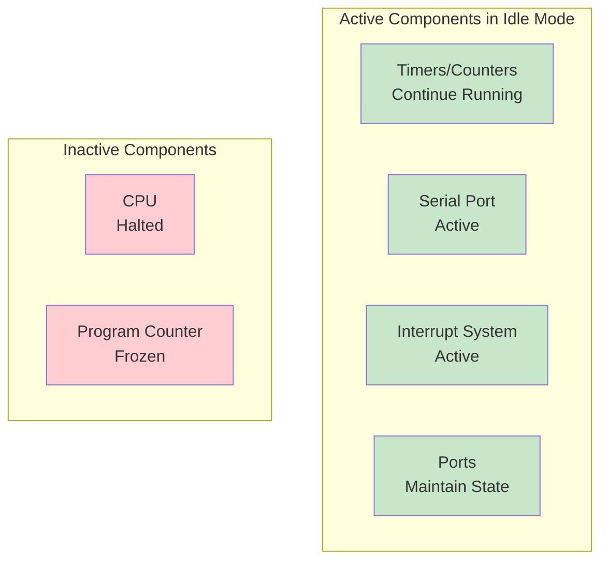
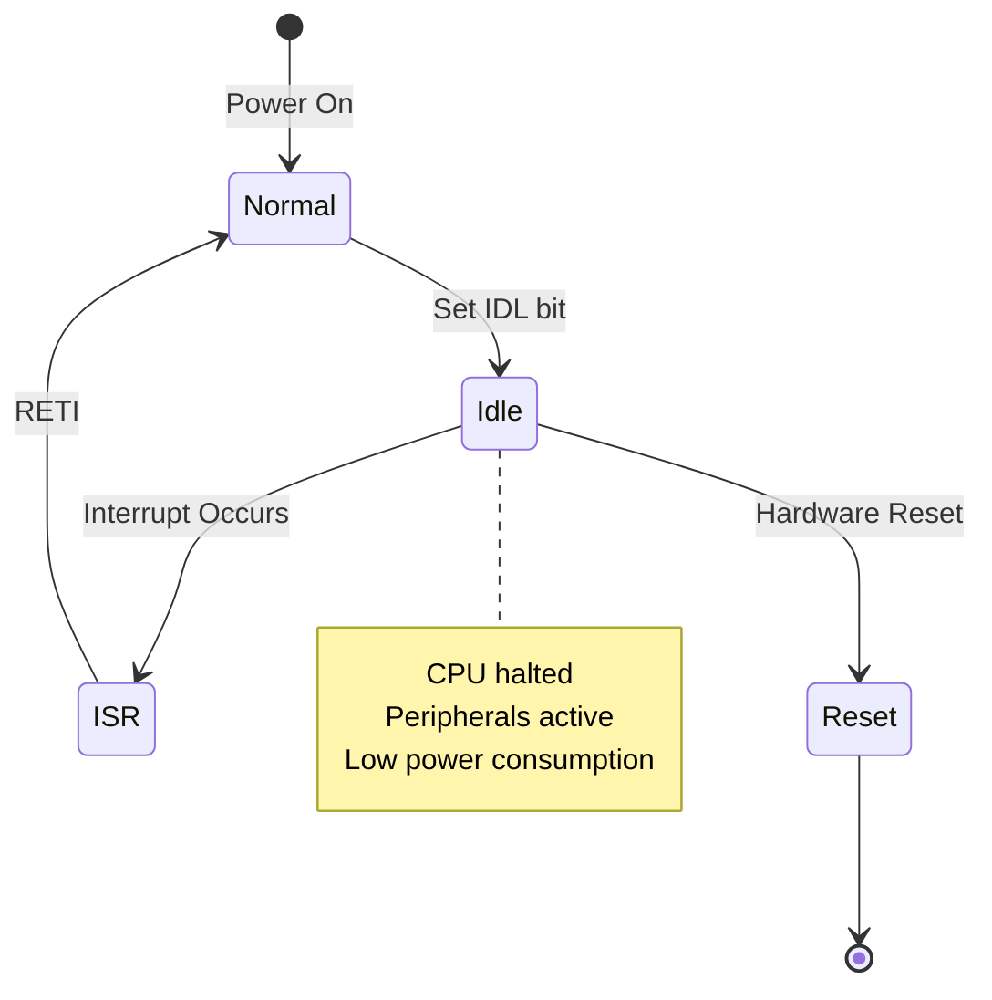
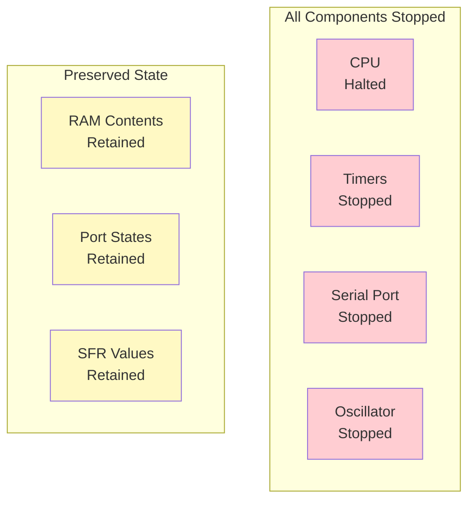
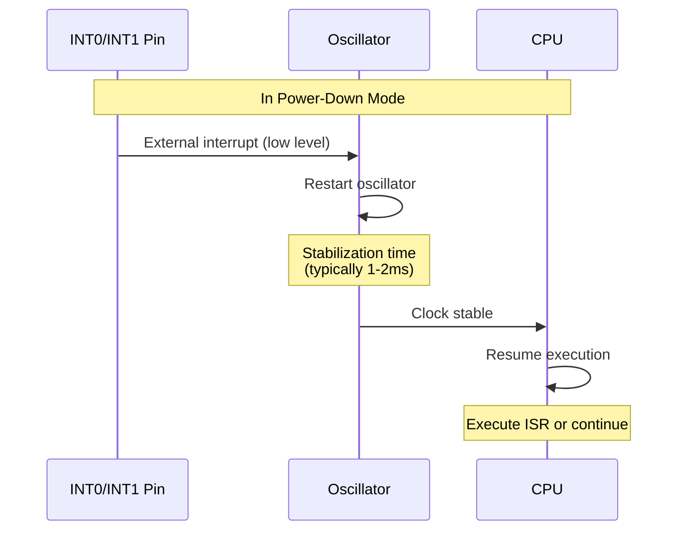

# PCON (Power Control Register) - Special Function Register

## Overview

The Power Control Register (PCON) is an 8-bit Special Function Register that controls power management modes and serial port baud rate doubling in the 8051 microcontroller. It enables low-power operation through Idle and Power-Down modes, and provides baud rate flexibility through the SMOD bit.

**Register Details:**
- **Address**: 87H
- **Bit-Addressable**: No
- **Reset Value**: 0×××××××b (Bit 7 = 0, other bits undefined)
- **Size**: 8-bit
- **Access**: Read/Write

**Primary Functions:**
- Power management (Idle mode, Power-Down mode)
- Serial port baud rate doubling (SMOD bit)
- General-purpose flags (GF1, GF0)
- Power-on detection (POF bit in some variants)

## Register Structure

```
Address: 87H (PCON - Power Control Register)
Bit:  7    6    5    4    3    2    1    0
     ┌────┬────┬────┬────┬────┬────┬────┬────┐
     │SMOD│ -- │ -- │ -- │ GF1│ GF0│ PD │ IDL│
     └────┴────┴────┴────┴────┴────┴────┴────┘
```

**Bit Definitions:**

| Bit | Symbol | Name | Description | Reset Value |
|-----|--------|------|-------------|-------------|
| 7 | SMOD | Serial Mode | Baud rate doubler for serial port modes 1, 2, 3 | 0 |
| 6 | -- | Reserved | Reserved for future use | × |
| 5 | -- | Reserved | Reserved for future use | × |
| 4 | -- | Reserved | Reserved for future use | × |
| 3 | GF1 | General Flag 1 | User-defined general-purpose flag | × |
| 2 | GF0 | General Flag 0 | User-defined general-purpose flag | × |
| 1 | PD | Power Down | Set to enter Power-Down mode | × |
| 0 | IDL | Idle | Set to enter Idle mode | × |

**Note:** × indicates undefined value after reset (implementation-dependent)

## SMOD Bit - Baud Rate Doubler

### Overview

The SMOD (Serial Mode) bit in PCON.7 doubles the baud rate for serial port modes 1, 2, and 3 when set to 1.

**Operation:**
- **SMOD = 0**: Normal baud rate (default after reset)
- **SMOD = 1**: Baud rate doubled

### Baud Rate Formulas

**Mode 0 (Shift Register):**
```
Baud Rate = Oscillator Frequency / 12
SMOD has no effect on Mode 0
```

**Mode 1 & 3 (8-bit/9-bit UART, Variable Baud):**
```
Baud Rate = (2^SMOD / 32) × (Timer 1 Overflow Rate)

Where Timer 1 Overflow Rate = Oscillator / (12 × [256 - TH1])
```

**Mode 2 (9-bit UART, Fixed Baud):**
```
Baud Rate = (2^SMOD / 64) × Oscillator Frequency
```

### Baud Rate Calculation Examples

**Example 1: 9600 baud @ 11.0592 MHz**

```assembly
; Without SMOD (SMOD = 0)
; Baud = (2^0 / 32) × (11.0592MHz / (12 × [256 - TH1]))
; For 9600 baud: TH1 = 253 (FDH)

MOV TMOD, #20H           ; Timer 1, Mode 2 (8-bit auto-reload)
MOV TH1, #0FDH           ; Reload value for 9600 baud
MOV SCON, #50H           ; Serial Mode 1, REN=1
CLR SMOD                 ; SMOD = 0 (normal baud rate)
SETB TR1                 ; Start Timer 1
```

**Example 2: 19200 baud @ 11.0592 MHz**

```assembly
; With SMOD (SMOD = 1)
; Baud = (2^1 / 32) × (11.0592MHz / (12 × [256 - TH1]))
; For 19200 baud: TH1 = 253 (FDH), SMOD = 1

MOV TMOD, #20H           ; Timer 1, Mode 2
MOV TH1, #0FDH           ; Same reload value as 9600
MOV SCON, #50H           ; Serial Mode 1, REN=1
SETB SMOD                ; SMOD = 1 (double baud rate)
SETB TR1                 ; Start Timer 1
```

**Common Baud Rates Table:**

| Baud Rate | Oscillator | SMOD | Timer 1 Mode | TH1 Value |
|-----------|------------|------|--------------|-----------|
| 1200 | 11.0592 MHz | 0 | 2 | E8H (232) |
| 2400 | 11.0592 MHz | 0 | 2 | F4H (244) |
| 4800 | 11.0592 MHz | 0 | 2 | FAH (250) |
| 9600 | 11.0592 MHz | 0 | 2 | FDH (253) |
| 19200 | 11.0592 MHz | 1 | 2 | FDH (253) |
| 38400 | 11.0592 MHz | 1 | 2 | FAH (250) |
| 57600 | 22.1184 MHz | 1 | 2 | FDH (253) |

## Power Management Modes

The 8051 provides two low-power modes controlled by the IDL and PD bits in PCON: Idle mode and Power-Down mode.

### Idle Mode (IDL = 1)

**Overview:**
Idle mode halts the CPU while keeping peripherals (timers, serial port, interrupts) active. This reduces power consumption while maintaining peripheral operation.

**Entering Idle Mode:**
```assembly
ORL PCON, #01H           ; Set IDL bit (PCON.0 = 1)
; CPU stops here, peripherals continue
```

**Idle Mode Characteristics:**



**Exiting Idle Mode:**

Idle mode can be terminated by:
1. **Any enabled interrupt** - CPU resumes, executes ISR, continues from next instruction
2. **Hardware reset** - CPU resets, starts from 0000H

**Idle Mode Flow:**



### Power-Down Mode (PD = 1)

**Overview:**
Power-Down mode stops the oscillator, halting all functions including CPU and peripherals. This provides the lowest power consumption mode.

**Entering Power-Down Mode:**
```assembly
ORL PCON, #02H           ; Set PD bit (PCON.1 = 1)
; Everything stops here
```

**Power-Down Mode Characteristics:**



**Exiting Power-Down Mode:**

Power-Down mode can only be terminated by:
1. **Hardware reset** - CPU resets, starts from 0000H
2. **External interrupt (INT0 or INT1)** - If enabled before entering Power-Down
   - Requires external interrupt to be level-triggered (IT0/IT1 = 0)
   - Pin must be held low long enough for oscillator to stabilize

**Power-Down Exit Timing:**



**Important Notes:**
- ⚠️ Oscillator restart time varies (1-2ms typical)
- ⚠️ External interrupt must remain low during oscillator stabilization
- ⚠️ All RAM and register contents are preserved
- ⚠️ Power consumption: typically < 50µA

### Power Mode Comparison

| Feature | Normal Mode | Idle Mode | Power-Down Mode |
|---------|-------------|-----------|-----------------|
| CPU | Active | Halted | Halted |
| Oscillator | Running | Running | Stopped |
| Timers | Active | Active | Stopped |
| Serial Port | Active | Active | Stopped |
| Interrupts | Active | Active | External only |
| RAM | Active | Preserved | Preserved |
| Ports | Active | Maintained | Maintained |
| Power Consumption | ~10-30mA | ~2-5mA | <50µA |
| Wake-up Method | N/A | Any interrupt | Reset or INT0/INT1 |
| Wake-up Time | N/A | Immediate | 1-2ms (oscillator) |

## General-Purpose Flags (GF1, GF0)

### Overview

PCON provides two general-purpose flag bits (GF1 and GF0) that can be used by software for any purpose.

**Characteristics:**
- **Location**: PCON.3 (GF1), PCON.2 (GF0)
- **Reset Value**: Undefined
- **Access**: Read/Write via byte operations (PCON not bit-addressable)
- **Purpose**: User-defined

### Usage Examples

```assembly
; Set GF1 flag
ORL PCON, #08H           ; Set bit 3 (GF1 = 1)

; Clear GF0 flag
ANL PCON, #0FBH          ; Clear bit 2 (GF0 = 0)

; Test GF1 flag
MOV A, PCON
ANL A, #08H              ; Mask GF1 bit
JZ GF1_CLEAR             ; Jump if GF1 = 0
; GF1 is set
GF1_CLEAR:
; GF1 is clear
```

**Common Uses:**
- Application state flags
- Mode indicators
- Event flags
- Communication between main loop and ISRs

## Practical Examples

### Example 1: Entering and Exiting Idle Mode

```assembly
; Enter Idle mode and wake up on Timer 0 interrupt
ENTER_IDLE:
    ; Configure Timer 0 for periodic wake-up
    MOV TMOD, #01H           ; Timer 0, Mode 1
    MOV TH0, #3CH            ; 50ms @ 12MHz
    MOV TL0, #0B0H
    SETB ET0                 ; Enable Timer 0 interrupt
    SETB TR0                 ; Start Timer 0
    SETB EA                  ; Enable global interrupts

    ; Enter Idle mode
    ORL PCON, #01H           ; Set IDL bit
    ; CPU halts here, Timer 0 continues
    ; Execution resumes here after interrupt

    ; Clear IDL bit (automatically cleared by hardware)
    ; Continue normal operation
    RET

; Timer 0 ISR
ORG 000BH
    LJMP TIMER0_ISR

TIMER0_ISR:
    ; Reload timer
    MOV TH0, #3CH
    MOV TL0, #0B0H

    ; Perform periodic task
    CPL P1.0                 ; Toggle LED

    RETI                     ; Return, CPU exits Idle mode
```

### Example 2: Entering Power-Down Mode with External Wake-up

```assembly
; Enter Power-Down mode, wake up via INT0
ENTER_POWERDOWN:
    ; Configure INT0 for level-triggered wake-up
    CLR IT0                  ; Level-triggered (required for Power-Down)
    SETB EX0                 ; Enable INT0
    SETB EA                  ; Enable global interrupts

    ; Save critical data if needed
    ; ...

    ; Enter Power-Down mode
    ORL PCON, #02H           ; Set PD bit
    ; Everything stops here
    ; Execution resumes here after wake-up

    ; Delay for oscillator stabilization (if needed)
    ACALL DELAY_2MS

    ; Resume normal operation
    RET

; INT0 ISR
ORG 0003H
    LJMP INT0_ISR

INT0_ISR:
    ; Oscillator is restarting
    ; Perform wake-up tasks
    SETB P1.7                ; Turn on status LED
    RETI
```

### Example 3: Using SMOD for High-Speed Serial Communication

```assembly
; Configure serial port for 57600 baud @ 22.1184 MHz
INIT_SERIAL_HIGHSPEED:
    ; Set SMOD bit for double baud rate
    ORL PCON, #80H           ; Set SMOD (PCON.7 = 1)

    ; Configure Timer 1 for baud rate generation
    MOV TMOD, #20H           ; Timer 1, Mode 2 (8-bit auto-reload)
    MOV TH1, #0FDH           ; Reload value for 57600 baud
    MOV SCON, #50H           ; Serial Mode 1, REN=1
    SETB TR1                 ; Start Timer 1

    RET

; Transmit data
SEND_BYTE:
    MOV SBUF, A              ; Load data
    JNB TI, $                ; Wait for transmission
    CLR TI                   ; Clear flag
    RET
```

### Example 4: Battery-Powered Application with Power Management

```assembly
; Battery-powered sensor application
MAIN:
    MOV SP, #2FH             ; Initialize stack
    ACALL INIT_HARDWARE

MAIN_LOOP:
    ; Read sensor
    ACALL READ_SENSOR
    MOV R0, A                ; Save reading

    ; Transmit data
    ACALL SEND_DATA

    ; Enter Idle mode for 1 second
    ACALL SETUP_TIMER_1SEC
    ORL PCON, #01H           ; Enter Idle mode
    ; Wake up after 1 second

    SJMP MAIN_LOOP

SETUP_TIMER_1SEC:
    ; Configure Timer 0 for 1 second interrupt
    MOV TMOD, #01H
    MOV TH0, #HIGH(-50000)   ; 50ms per interrupt
    MOV TL0, #LOW(-50000)
    MOV R7, #20              ; 20 × 50ms = 1 second
    SETB ET0
    SETB TR0
    SETB EA
    RET
```

## Common Pitfalls and Solutions

### Pitfall 1: Using Edge-Triggered Interrupts for Power-Down Wake-up

**Problem:**
```assembly
; Incorrect: Edge-triggered interrupt for Power-Down
SETB IT0                     ; Edge-triggered (WRONG!)
SETB EX0
ORL PCON, #02H               ; Enter Power-Down
; May not wake up properly!
```

**Solution:**
```assembly
; Correct: Level-triggered interrupt for Power-Down
CLR IT0                      ; Level-triggered (CORRECT)
SETB EX0
ORL PCON, #02H               ; Enter Power-Down
; Will wake up when INT0 is low
```

**Reason:** Power-Down mode requires level-triggered external interrupts because the oscillator needs time to stabilize. The interrupt pin must remain low during this period.

### Pitfall 2: Not Accounting for Oscillator Stabilization Time

**Problem:**
```assembly
; Enter Power-Down and immediately use peripherals
ORL PCON, #02H               ; Enter Power-Down
; Wake up via INT0
; Immediately access peripherals (WRONG!)
MOV SBUF, A                  ; May fail - oscillator not stable!
```

**Solution:**
```assembly
; Add stabilization delay after wake-up
ORL PCON, #02H               ; Enter Power-Down
; Wake up via INT0
ACALL DELAY_2MS              ; Wait for oscillator stabilization
MOV SBUF, A                  ; Now safe to use peripherals
```

### Pitfall 3: Forgetting PCON is Not Bit-Addressable

**Problem:**
```assembly
; Incorrect: Trying to use bit operations
SETB SMOD                    ; ERROR! PCON is not bit-addressable
CLR IDL                      ; ERROR! PCON is not bit-addressable
```

**Solution:**
```assembly
; Correct: Use byte operations with masks
ORL PCON, #80H               ; Set SMOD (bit 7)
ANL PCON, #0FEH              ; Clear IDL (bit 0)

; Or use MOV with accumulator
MOV A, PCON
ORL A, #80H                  ; Set SMOD
MOV PCON, A
```

### Pitfall 4: Setting Both IDL and PD Simultaneously

**Problem:**
```assembly
; Incorrect: Setting both power-down bits
ORL PCON, #03H               ; Sets both IDL and PD (WRONG!)
; Behavior is unpredictable!
```

**Solution:**
```assembly
; Correct: Set only one power mode at a time
ORL PCON, #01H               ; Idle mode only
; OR
ORL PCON, #02H               ; Power-Down mode only
```

**Reason:** Setting both IDL and PD bits simultaneously results in undefined behavior. Only one power mode should be active at a time.

## Best Practices

### 1. Always Use Byte Operations for PCON

✅ **Recommended:**
```assembly
ORL PCON, #80H               ; Set SMOD bit
ANL PCON, #0FEH              ; Clear IDL bit
```

❌ **Not Possible:**
```assembly
SETB SMOD                    ; ERROR - PCON not bit-addressable
```

### 2. Use Level-Triggered Interrupts for Power-Down Wake-up

```assembly
; Correct configuration for Power-Down wake-up
CLR IT0                      ; Level-triggered (required)
SETB EX0                     ; Enable INT0
SETB EA                      ; Enable global interrupts
ORL PCON, #02H               ; Enter Power-Down
```

### 3. Add Oscillator Stabilization Delay After Power-Down

```assembly
; After waking from Power-Down
INT0_ISR:
    ; Add 1-2ms delay for oscillator stabilization
    MOV R7, #200             ; Delay loop
DELAY_LOOP:
    DJNZ R7, DELAY_LOOP

    ; Now safe to use peripherals
    RETI
```

### 4. Enable Interrupts Before Entering Low-Power Modes

```assembly
; Correct sequence
SETB ET0                     ; Enable Timer 0 interrupt
SETB EA                      ; Enable global interrupts
ORL PCON, #01H               ; Enter Idle mode

; Incorrect - no way to wake up!
ORL PCON, #01H               ; Enter Idle (no interrupts enabled)
```

### 5. Calculate SMOD Effect on Baud Rate

```assembly
; Document baud rate calculations
; Target: 19200 baud @ 11.0592 MHz
; Formula: Baud = (2^SMOD / 32) × (Fosc / (12 × [256 - TH1]))
; With SMOD=1: 19200 = (2/32) × (11.0592MHz / (12 × 3))
; TH1 = 253 (FDH)

ORL PCON, #80H               ; Set SMOD
MOV TH1, #0FDH               ; Reload value
```

## Summary

The Power Control Register (PCON) is a critical register for power management and serial communication in the 8051 microcontroller.

**Key Functions:**
- **Power Management**: Idle mode (IDL) and Power-Down mode (PD) for reduced power consumption
- **Baud Rate Control**: SMOD bit doubles serial port baud rate in modes 1, 2, 3
- **General Flags**: GF1 and GF0 for user-defined purposes

**Key Points to Remember:**

1. **Register Properties**:
   - Address: 87H
   - Not bit-addressable (use ORL/ANL for bit manipulation)
   - Reset value: 0×××××××b (SMOD=0, other bits undefined)

2. **SMOD Bit (Bit 7)**:
   - Doubles baud rate when set to 1
   - Formula: Baud Rate = (2^SMOD / 32) × Timer 1 Overflow Rate
   - Essential for high-speed serial communication

3. **Idle Mode (IDL = 1)**:
   - CPU halted, peripherals active
   - Power consumption: ~2-5mA
   - Wake-up: Any enabled interrupt
   - Wake-up time: Immediate

4. **Power-Down Mode (PD = 1)**:
   - Everything stopped (oscillator, CPU, peripherals)
   - Power consumption: <50µA
   - Wake-up: Hardware reset or level-triggered INT0/INT1
   - Wake-up time: 1-2ms (oscillator stabilization)

5. **General-Purpose Flags (GF1, GF0)**:
   - User-defined flags in bits 3 and 2
   - Undefined after reset
   - Useful for application state management

**Critical Rules:**
- ⚠️ PCON is NOT bit-addressable - use ORL/ANL for bit operations
- ⚠️ Use level-triggered interrupts (IT0/IT1=0) for Power-Down wake-up
- ⚠️ Add 1-2ms delay after Power-Down wake-up for oscillator stabilization
- ⚠️ Never set both IDL and PD bits simultaneously (undefined behavior)
- ⚠️ Enable interrupts before entering low-power modes
- ⚠️ Calculate baud rate carefully when using SMOD

**Bit Summary:**

| Bit | Symbol | Function | Reset | Access |
|-----|--------|----------|-------|--------|
| 7 | SMOD | Baud rate doubler | 0 | R/W |
| 6 | -- | Reserved | × | -- |
| 5 | -- | Reserved | × | -- |
| 4 | -- | Reserved | × | -- |
| 3 | GF1 | General flag 1 | × | R/W |
| 2 | GF0 | General flag 0 | × | R/W |
| 1 | PD | Power-Down mode | × | R/W |
| 0 | IDL | Idle mode | × | R/W |

**Power Mode Selection Guide:**

| Requirement | Recommended Mode | Power Savings | Wake-up Time |
|-------------|------------------|---------------|--------------|
| Timers must run | Idle mode | Moderate (~80%) | Immediate |
| Serial port active | Idle mode | Moderate (~80%) | Immediate |
| Maximum power savings | Power-Down | Maximum (>99%) | 1-2ms |
| Quick response needed | Idle mode | Moderate (~80%) | Immediate |
| Battery-powered | Power-Down | Maximum (>99%) | 1-2ms |

By properly using PCON, you can implement efficient power management and flexible serial communication in 8051 applications.

## Related Topics

- **Serial Port (SCON, SBUF)**: SMOD affects serial port baud rate
- **Timer 1**: Used for baud rate generation with SMOD
- **Interrupt System (IE, IP)**: Required for waking from low-power modes
- **External Interrupts (INT0, INT1)**: Used to wake from Power-Down mode
- **Oscillator Circuit**: Stabilization time affects Power-Down wake-up

---

**Reference:** This document covers the Power Control Register (PCON) at address 87H in the 8051 microcontroller architecture.
