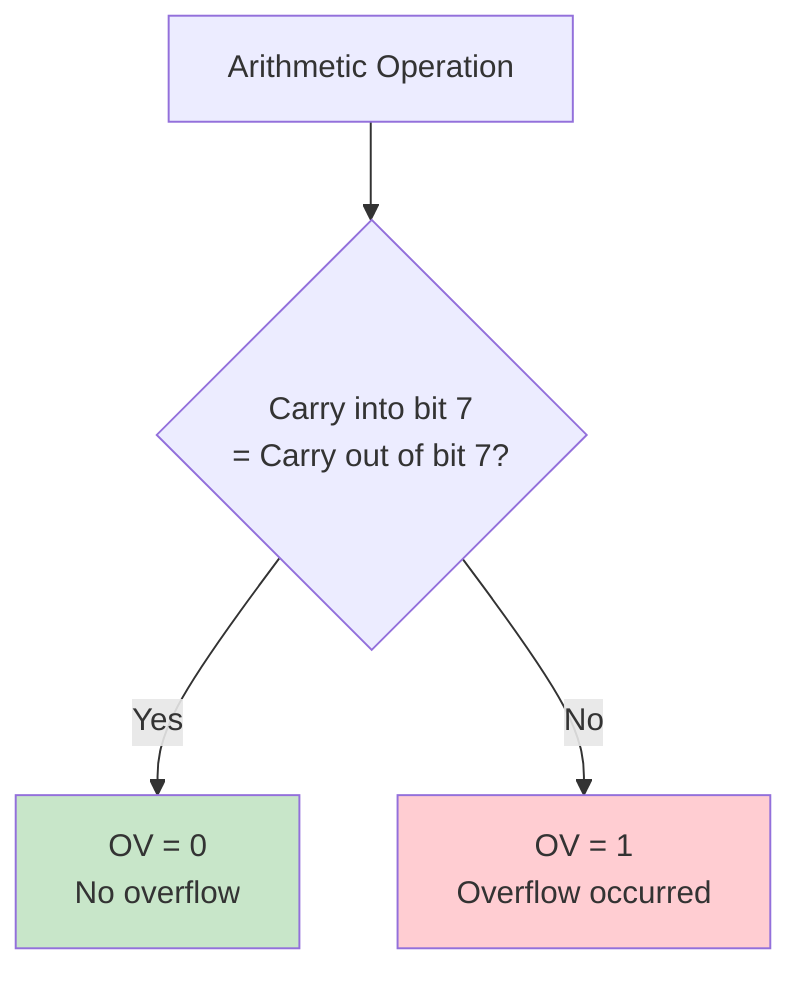

# PSW, ACC, and B Registers - Core Processing Registers

## Overview

The 8051 microcontroller has three fundamental Special Function Registers that form the core of its processing capabilities: PSW (Program Status Word), ACC (Accumulator), and B register. These registers work together to perform arithmetic operations, logical operations, and maintain processor status information.

**Register Details:**

| Register | Address | Name | Bit-Addressable | Reset Value | Function |
|----------|---------|------|-----------------|-------------|----------|
| PSW | 0D0H | Program Status Word | Yes | 00H | Processor status flags and register bank selection |
| ACC (A) | 0E0H | Accumulator | Yes | 00H | Primary arithmetic and logic register |
| B | 0F0H | B Register | Yes | 00H | Secondary register for multiplication and division |

**Primary Functions:**

**PSW (Program Status Word):**
- Carry flag (CY) for arithmetic operations
- Auxiliary carry (AC) for BCD operations
- Overflow flag (OV) for signed arithmetic
- Parity flag (P) for error detection
- Register bank selection (RS1, RS0)
- User-defined flag (F0)

**ACC (Accumulator):**
- Primary operand for arithmetic operations (ADD, SUBB, INC, DEC)
- Primary operand for logical operations (ANL, ORL, XRL, CPL)
- Data transfer operations (MOV, MOVX, MOVC)
- Rotate and swap operations (RL, RR, RLC, RRC, SWAP)
- Comparison operations (CJNE)

**B Register:**
- Multiplier/multiplicand for MUL operation
- Divisor for DIV operation
- General-purpose register for temporary storage
- Can be used as a second accumulator

## PSW - Program Status Word Register (0D0H)

### Register Structure

```
Address: 0D0H (PSW - Program Status Word)
Bit:  7    6    5    4    3    2    1    0
     ┌────┬────┬────┬────┬────┬────┬────┬────┐
     │ CY │ AC │ F0 │ RS1│ RS0│ OV │ -- │ P  │
     └────┴────┴────┴────┴────┴────┴────┴────┘
      Carry Aux  User Register  Over Reserved Parity
            Carry Flag  Bank    flow
```

**Bit Definitions:**

| Bit | Symbol | Name | Description | Set By | Cleared By |
|-----|--------|------|-------------|--------|------------|
| 7 | CY | Carry Flag | Carry out from bit 7 in arithmetic operations | Hardware/Software | Software |
| 6 | AC | Auxiliary Carry | Carry out from bit 3 (for BCD operations) | Hardware | Software |
| 5 | F0 | User Flag 0 | General-purpose user-defined flag | Software | Software |
| 4 | RS1 | Register Bank Select 1 | Register bank selection bit 1 | Software | Software |
| 3 | RS0 | Register Bank Select 0 | Register bank selection bit 0 | Software | Software |
| 2 | OV | Overflow Flag | Overflow in signed arithmetic operations | Hardware | Software |
| 1 | -- | Reserved | Reserved for future use | -- | -- |
| 0 | P | Parity Flag | Even parity of accumulator (read-only) | Hardware | Hardware |

**Note:** PSW is bit-addressable, allowing direct bit operations like `SETB CY` or `CLR OV`.

### Carry Flag (CY) - Bit 7

The Carry flag is the most frequently used flag in the PSW register.

**Set By:**
- ADD, ADDC instructions when carry out from bit 7
- SUBB instruction when borrow is required
- RLC, RRC instructions (rotate through carry)
- SETB CY instruction (software)
- CPL CY instruction (complement carry)

**Cleared By:**
- CLR CY instruction (software)
- Arithmetic operations that don't generate carry

**Uses:**
- Multi-byte arithmetic (16-bit, 32-bit addition/subtraction)
- Conditional branching (JC, JNC instructions)
- Bit manipulation and testing
- Shift operations with carry

**Example - 16-bit Addition:**

```assembly
; Add two 16-bit numbers
; Number 1: R2:R3 (high:low)
; Number 2: R4:R5 (high:low)
; Result: R2:R3

ADD_16BIT:
    MOV A, R3                    ; Load low byte of number 1
    ADD A, R5                    ; Add low byte of number 2
    MOV R3, A                    ; Save low byte result

    MOV A, R2                    ; Load high byte of number 1
    ADDC A, R4                   ; Add high byte with carry
    MOV R2, A                    ; Save high byte result
    ; CY flag indicates overflow beyond 16 bits
    RET
```

### Auxiliary Carry Flag (AC) - Bit 6

The Auxiliary Carry flag is used primarily for BCD (Binary Coded Decimal) arithmetic.

**Set By:**
- ADD, ADDC instructions when carry out from bit 3 to bit 4
- SUBB instruction when borrow from bit 4 to bit 3

**Uses:**
- BCD arithmetic correction (DA A instruction)
- Detecting half-byte overflow

**Example - BCD Addition:**

```assembly
; Add two BCD numbers with decimal adjust
; Input: A = first BCD digit, R0 = second BCD digit
; Output: A = BCD sum

BCD_ADD:
    ADD A, R0                    ; Add BCD digits
    DA A                         ; Decimal adjust (uses AC and CY)
    ; A now contains correct BCD result
    RET

; Example: 09H + 08H = 11H (BCD)
; Without DA: 09H + 08H = 11H (correct)
; Example: 09H + 09H = 12H (BCD)
; Without DA: 09H + 09H = 12H (wrong, should be 18H)
; With DA: 09H + 09H → 12H → 18H (correct BCD)
```

### User Flag (F0) - Bit 5

F0 is a general-purpose flag that can be used by software for any purpose.

**Characteristics:**
- Set and cleared only by software
- Not affected by any hardware operations
- Can be used for application-specific flags

**Example:**

```assembly
; Use F0 as a mode indicator
SETB F0                          ; Set mode flag
; ... some operations
JB F0, MODE_A                    ; Jump if F0 is set
; Mode B code
SJMP DONE
MODE_A:
; Mode A code
DONE:
CLR F0                           ; Clear mode flag
```

### Register Bank Selection (RS1, RS0) - Bits 4-3

The RS1 and RS0 bits select one of four register banks in the internal RAM.

**Register Bank Mapping:**

| RS1 | RS0 | Bank | Address Range | Registers |
|-----|-----|------|---------------|-----------|
| 0 | 0 | Bank 0 | 00H - 07H | R0-R7 (default) |
| 0 | 1 | Bank 1 | 08H - 0FH | R0-R7 |
| 1 | 0 | Bank 2 | 10H - 17H | R0-R7 |
| 1 | 1 | Bank 3 | 18H - 1FH | R0-R7 |

**Memory Layout:**

```
Internal RAM (Lower 32 bytes):
┌──────────┬─────────────────────────────────┐
│ Address  │ Register Bank                   │
├──────────┼─────────────────────────────────┤
│ 00H-07H  │ Bank 0: R0 R1 R2 R3 R4 R5 R6 R7 │
│ 08H-0FH  │ Bank 1: R0 R1 R2 R3 R4 R5 R6 R7 │
│ 10H-17H  │ Bank 2: R0 R1 R2 R3 R4 R5 R6 R7 │
│ 18H-1FH  │ Bank 3: R0 R1 R2 R3 R4 R5 R6 R7 │
│ 20H-2FH  │ Bit-addressable RAM             │
└──────────┴─────────────────────────────────┘
```

**Use Cases:**
- Fast context switching in ISRs
- Separate register sets for different tasks
- Protecting register values during function calls

**Example - Register Bank Switching:**

```assembly
; Main program uses Bank 0
MAIN:
    MOV PSW, #00H                ; Select Bank 0 (RS1=0, RS0=0)
    MOV R0, #10H                 ; R0 in Bank 0
    MOV R1, #20H                 ; R1 in Bank 0
    ; ... main code

; ISR uses Bank 1 to avoid saving registers
ORG 000BH
    LJMP TIMER0_ISR

TIMER0_ISR:
    PUSH PSW                     ; Save PSW (includes bank selection)
    MOV PSW, #08H                ; Select Bank 1 (RS1=0, RS0=1)

    ; Use R0-R7 in Bank 1 freely
    MOV R0, #30H
    MOV R1, #40H
    ; ... ISR code

    POP PSW                      ; Restore PSW (back to Bank 0)
    RETI
```

### Overflow Flag (OV) - Bit 2

The Overflow flag indicates overflow in signed arithmetic operations.

**Set By:**
- ADD, ADDC, SUBB when result exceeds signed range (-128 to +127)
- Specifically: when carry into bit 7 ≠ carry out of bit 7

**Cleared By:**
- CLR OV instruction (software)
- Arithmetic operations that don't cause overflow

**Overflow Detection Logic:**



**Example - Signed Arithmetic:**

```assembly
; Add two signed numbers and check overflow
; Input: A = first number, R0 = second number
; Output: A = sum, OV flag indicates overflow

SIGNED_ADD:
    ADD A, R0                    ; Add numbers
    JB OV, OVERFLOW_ERROR        ; Check overflow flag
    ; No overflow, result is valid
    RET

OVERFLOW_ERROR:
    ; Handle overflow condition
    CLR OV                       ; Clear overflow flag
    ; ... error handling
    RET

; Example 1: 100 + 50 = 150 (overflow in signed 8-bit)
; 100 (64H) + 50 (32H) = 150 (96H) = -106 in signed
; OV = 1 (overflow occurred)

; Example 2: -100 + (-50) = -150 (overflow in signed 8-bit)
; -100 (9CH) + (-50) (CEH) = -150 (6AH) = 106 in signed
; OV = 1 (overflow occurred)

; Example 3: 50 + 30 = 80 (no overflow)
; 50 (32H) + 30 (1EH) = 80 (50H)
; OV = 0 (no overflow)
```

### Parity Flag (P) - Bit 0

The Parity flag indicates the parity (even or odd) of the accumulator.

**Characteristics:**
- **Read-only**: Set by hardware, cannot be modified by software
- **Even parity**: P = 1 if accumulator has odd number of 1s
- **Odd parity**: P = 0 if accumulator has even number of 1s
- Updated automatically whenever accumulator changes

**Parity Calculation:**

```
P = ACC.0 ⊕ ACC.1 ⊕ ACC.2 ⊕ ACC.3 ⊕ ACC.4 ⊕ ACC.5 ⊕ ACC.6 ⊕ ACC.7

Where ⊕ is XOR operation
```

**Use Cases:**
- Serial communication error detection
- Data integrity checking
- Simple checksum verification

**Example - Parity Check:**

```assembly
; Check parity of received data
RECEIVE_DATA:
    MOV A, SBUF                  ; Read received byte
    ; P flag automatically updated
    JB P, PARITY_ODD             ; Jump if odd number of 1s
    ; Even number of 1s
    SJMP PROCESS_DATA
PARITY_ODD:
    ; Odd number of 1s
PROCESS_DATA:
    ; ... process data

; Example values:
; A = 00H (00000000b): 0 ones → P = 0 (even)
; A = 01H (00000001b): 1 one  → P = 1 (odd)
; A = 03H (00000011b): 2 ones → P = 0 (even)
; A = 07H (00000111b): 3 ones → P = 1 (odd)
; A = FFH (11111111b): 8 ones → P = 0 (even)
```

## ACC - Accumulator Register (0E0H)

### Register Structure

```
Address: 0E0H (ACC or A - Accumulator)
Bit:  7    6    5    4    3    2    1    0
     ┌────┬────┬────┬────┬────┬────┬────┬────┐
     │ A7 │ A6 │ A5 │ A4 │ A3 │ A2 │ A1 │ A0 │
     └────┴────┴────┴────┴────┴────┴────┴────┘
      8-bit Data Register
```

**Characteristics:**
- **Address**: 0E0H
- **Alternate Name**: A (can use either ACC or A in assembly)
- **Size**: 8-bit
- **Bit-Addressable**: Yes (ACC.0 to ACC.7)
- **Reset Value**: 00H
- **Access**: Read/Write

**Primary Functions:**
- Source and destination for arithmetic operations
- Source and destination for logical operations
- Data transfer between memory and I/O
- Rotate and swap operations
- Comparison operations

### Arithmetic Operations

The accumulator is the primary register for all arithmetic operations.

**Arithmetic Instructions:**

| Instruction | Operation | Flags Affected | Description |
|-------------|-----------|----------------|-------------|
| ADD A, src | A ← A + src | CY, AC, OV | Add without carry |
| ADDC A, src | A ← A + src + CY | CY, AC, OV | Add with carry |
| SUBB A, src | A ← A - src - CY | CY, AC, OV | Subtract with borrow |
| INC A | A ← A + 1 | None | Increment |
| DEC A | A ← A - 1 | None | Decrement |
| MUL AB | A:B ← A × B | CY=0, OV | Multiply (result in A:B) |
| DIV AB | A ← A ÷ B, B ← remainder | CY=0, OV | Divide |
| DA A | Decimal adjust | CY | BCD correction |

**Example - Multi-byte Subtraction:**

```assembly
; Subtract two 16-bit numbers
; Number 1: R2:R3 (high:low) - minuend
; Number 2: R4:R5 (high:low) - subtrahend
; Result: R2:R3

SUB_16BIT:
    CLR C                        ; Clear carry (borrow)
    MOV A, R3                    ; Load low byte of minuend
    SUBB A, R5                   ; Subtract low byte with borrow
    MOV R3, A                    ; Save low byte result

    MOV A, R2                    ; Load high byte of minuend
    SUBB A, R4                   ; Subtract high byte with borrow
    MOV R2, A                    ; Save high byte result
    ; CY flag indicates borrow (result negative)
    RET
```

### Logical Operations

The accumulator is used for all logical operations.

**Logical Instructions:**

| Instruction | Operation | Description |
|-------------|-----------|-------------|
| ANL A, src | A ← A AND src | Logical AND |
| ORL A, src | A ← A OR src | Logical OR |
| XRL A, src | A ← A XOR src | Logical XOR |
| CPL A | A ← NOT A | Complement (invert all bits) |
| CLR A | A ← 00H | Clear accumulator |

**Example - Bit Masking:**

```assembly
; Extract specific bits from a byte
; Input: A = data byte (e.g., 10110101b)
; Extract bits 4-6

EXTRACT_BITS:
    ANL A, #01110000b            ; Mask bits 4-6
    ; A = 01110000b AND 10110101b = 00110000b
    SWAP A                       ; Swap nibbles
    ; A = 00000011b
    ANL A, #00001111b            ; Clear upper nibble
    ; A = 00000011b (extracted value = 3)
    RET
```

### Rotate and Swap Operations

The accumulator supports various rotate and swap operations.

**Rotate Instructions:**

| Instruction | Operation | Description |
|-------------|-----------|-------------|
| RL A | Rotate left | A7→A0, A6→A7, ..., A0→A1 |
| RLC A | Rotate left through carry | CY→A0, A7→CY, A6→A7, ... |
| RR A | Rotate right | A0→A7, A1→A0, ..., A7→A6 |
| RRC A | Rotate right through carry | CY→A7, A0→CY, A1→A0, ... |
| SWAP A | Swap nibbles | A3-0 ↔ A7-4 |

**Example - Rotate Operations:**

```assembly
; Demonstrate rotate operations
ROTATE_DEMO:
    MOV A, #10110001b            ; Initial value

    ; Rotate left (RL)
    RL A                         ; A = 01100011b (shifted left, bit 7 → bit 0)

    ; Rotate left through carry (RLC)
    CLR C                        ; Clear carry
    MOV A, #10110001b
    RLC A                        ; A = 01100010b, CY = 1

    ; Rotate right (RR)
    MOV A, #10110001b
    RR A                         ; A = 11011000b (shifted right, bit 0 → bit 7)

    ; Swap nibbles (SWAP)
    MOV A, #10110001b
    SWAP A                       ; A = 00011011b (high ↔ low nibble)
    RET
```

## B Register (0F0H)

### Register Structure

```
Address: 0F0H (B Register)
Bit:  7    6    5    4    3    2    1    0
     ┌────┬────┬────┬────┬────┬────┬────┬────┐
     │ B7 │ B6 │ B5 │ B4 │ B3 │ B2 │ B1 │ B0 │
     └────┴────┴────┴────┴────┴────┴────┴────┘
      8-bit Data Register
```

**Characteristics:**
- **Address**: 0F0H
- **Size**: 8-bit
- **Bit-Addressable**: Yes (B.0 to B.7)
- **Reset Value**: 00H
- **Access**: Read/Write

**Primary Functions:**
- Holds multiplier/multiplicand for MUL AB instruction
- Holds divisor for DIV AB instruction
- Stores high byte of multiplication result
- General-purpose register for temporary storage

### Multiplication Operation (MUL AB)

The MUL AB instruction multiplies the accumulator by the B register.

**Operation:**
```
MUL AB: A × B → A:B (16-bit result)
- Low byte of result → A
- High byte of result → B
- CY flag cleared (always 0)
- OV flag set if result > 255 (high byte ≠ 0)
```

**Example - 8-bit Multiplication:**

```assembly
; Multiply two 8-bit numbers
; Input: A = multiplicand, B = multiplier
; Output: A:B = 16-bit product

MULTIPLY_8BIT:
    ; Example: 25 × 10 = 250
    MOV A, #25                   ; Multiplicand
    MOV B, #10                   ; Multiplier
    MUL AB                       ; A × B
    ; Result: A = 250 (0FAH), B = 0 (high byte)
    ; OV = 0 (result fits in 8 bits)

    ; Example: 50 × 100 = 5000
    MOV A, #50                   ; Multiplicand
    MOV B, #100                  ; Multiplier
    MUL AB                       ; A × B
    ; Result: A = 136 (88H), B = 19 (13H)
    ; 5000 = 1388H = 0001 0011 1000 1000b
    ; OV = 1 (result exceeds 8 bits)
    RET
```

### Division Operation (DIV AB)

The DIV AB instruction divides the accumulator by the B register.

**Operation:**
```
DIV AB: A ÷ B → A (quotient), B (remainder)
- Quotient → A
- Remainder → B
- CY flag cleared (always 0)
- OV flag set if B = 0 (division by zero)
```

**Example - 8-bit Division:**

```assembly
; Divide two 8-bit numbers
; Input: A = dividend, B = divisor
; Output: A = quotient, B = remainder

DIVIDE_8BIT:
    ; Example: 100 ÷ 7 = 14 remainder 2
    MOV A, #100                  ; Dividend
    MOV B, #7                    ; Divisor
    DIV AB                       ; A ÷ B
    ; Result: A = 14 (quotient), B = 2 (remainder)
    ; OV = 0 (valid division)

    ; Example: Division by zero
    MOV A, #50                   ; Dividend
    MOV B, #0                    ; Divisor = 0
    DIV AB                       ; A ÷ B
    ; Result: A = undefined, B = undefined
    ; OV = 1 (division by zero error)
    JB OV, DIV_ERROR             ; Check for error
    RET

DIV_ERROR:
    ; Handle division by zero
    CLR OV
    ; ... error handling
    RET
```

### B Register as General-Purpose Register

The B register can be used as a general-purpose register when not performing MUL or DIV operations.

**Example - Using B for Temporary Storage:**

```assembly
; Use B register for temporary storage
TEMP_STORAGE:
    MOV A, #55H                  ; Load value into A
    MOV B, A                     ; Save A in B

    ; Perform operations on A
    ADD A, #10H
    MOV R0, A

    ; Restore original value from B
    MOV A, B                     ; A = 55H (original value)
    RET
```

## Practical Examples

### Example 1: 32-bit Addition Using Carry Flag

Perform addition of two 32-bit numbers using the carry flag for multi-byte arithmetic.

```assembly
; Add two 32-bit numbers
; Number 1: R0:R1:R2:R3 (MSB to LSB)
; Number 2: R4:R5:R6:R7 (MSB to LSB)
; Result: R0:R1:R2:R3

ADD_32BIT:
    CLR C                        ; Clear carry flag

    ; Add byte 0 (LSB)
    MOV A, R3                    ; Load LSB of number 1
    ADDC A, R7                   ; Add LSB of number 2 with carry
    MOV R3, A                    ; Save result

    ; Add byte 1
    MOV A, R2
    ADDC A, R6                   ; Add with carry from previous byte
    MOV R2, A

    ; Add byte 2
    MOV A, R1
    ADDC A, R5                   ; Add with carry
    MOV R1, A

    ; Add byte 3 (MSB)
    MOV A, R0
    ADDC A, R4                   ; Add with carry
    MOV R0, A

    ; CY flag indicates overflow beyond 32 bits
    JC OVERFLOW_32BIT            ; Jump if overflow
    RET

OVERFLOW_32BIT:
    ; Handle 32-bit overflow
    ; ... error handling
    RET

; Example: 0x12345678 + 0xABCDEF01 = 0xBE02457A (with carry)
; R0:R1:R2:R3 = 12H:34H:56H:78H
; R4:R5:R6:R7 = ABH:CDH:EFH:01H
; Result: R0:R1:R2:R3 = BEH:02H:45H:79H, CY = 0
```

### Example 2: BCD Calculator with Decimal Adjust

Implement a BCD (Binary Coded Decimal) calculator for adding two 2-digit BCD numbers.

```assembly
; Add two 2-digit BCD numbers
; Input: R0 = first BCD number (00-99), R1 = second BCD number (00-99)
; Output: R2:R3 = BCD result (R2 = tens, R3 = ones)

BCD_CALCULATOR:
    CLR C                        ; Clear carry

    ; Add ones digits (lower nibbles)
    MOV A, R0                    ; First number
    ANL A, #0FH                  ; Extract ones digit
    MOV R4, A                    ; Save ones digit

    MOV A, R1                    ; Second number
    ANL A, #0FH                  ; Extract ones digit
    ADD A, R4                    ; Add ones digits
    DA A                         ; Decimal adjust
    MOV R3, A                    ; Save ones result
    MOV C, ACC.4                 ; Save carry to tens

    ; Add tens digits (upper nibbles)
    MOV A, R0                    ; First number
    SWAP A                       ; Get tens digit
    ANL A, #0FH
    MOV R4, A

    MOV A, R1                    ; Second number
    SWAP A                       ; Get tens digit
    ANL A, #0FH
    ADDC A, R4                   ; Add tens digits with carry
    DA A                         ; Decimal adjust
    MOV R2, A                    ; Save tens result

    RET

; Example: 47 + 38 = 85
; R0 = 47H (BCD), R1 = 38H (BCD)
; Result: R2 = 08H (tens), R3 = 05H (ones) = 85 (BCD)
```

### Example 3: Fast Context Switching with Register Banks

Use register bank switching for fast context switching in interrupt service routines.

```assembly
; Main program uses Bank 0
; Timer ISR uses Bank 1
; External interrupt ISR uses Bank 2

ORG 0000H
    LJMP MAIN

; Timer 0 interrupt vector
ORG 000BH
    LJMP TIMER0_ISR

; External interrupt 0 vector
ORG 0003H
    LJMP INT0_ISR

ORG 0100H
MAIN:
    MOV SP, #2FH                 ; Initialize stack
    MOV PSW, #00H                ; Select Bank 0 (RS1=0, RS0=0)

    ; Initialize variables in Bank 0
    MOV R0, #10H
    MOV R1, #20H
    MOV R2, #30H

    ; Configure interrupts
    SETB ET0                     ; Enable Timer 0
    SETB EX0                     ; Enable INT0
    SETB EA                      ; Enable global interrupts

MAIN_LOOP:
    ; Main program uses Bank 0 registers
    INC R0
    MOV A, R1
    ADD A, R2
    ; ... main code
    SJMP MAIN_LOOP

; Timer 0 ISR - Uses Bank 1
TIMER0_ISR:
    PUSH PSW                     ; Save PSW (Bank 0 selection)
    MOV PSW, #08H                ; Switch to Bank 1 (RS1=0, RS0=1)

    ; Use Bank 1 registers freely (no need to save R0-R7)
    MOV R0, #50H
    MOV R1, #60H
    MOV A, R0
    ADD A, R1
    MOV R2, A

    ; Reload timer
    MOV TH0, #3CH
    MOV TL0, #0B0H

    POP PSW                      ; Restore PSW (back to Bank 0)
    RETI

; INT0 ISR - Uses Bank 2
INT0_ISR:
    PUSH PSW                     ; Save PSW
    MOV PSW, #10H                ; Switch to Bank 2 (RS1=1, RS0=0)

    ; Use Bank 2 registers freely
    MOV R0, #70H
    MOV R1, #80H
    CPL P1.0                     ; Toggle LED

    POP PSW                      ; Restore PSW
    RETI
```

### Example 4: 16-bit Multiplication Using MUL and Shifts

Implement 16-bit multiplication using 8-bit MUL instruction and bit shifts.

```assembly
; Multiply two 16-bit numbers
; Input: R2:R3 = multiplicand (high:low)
;        R4:R5 = multiplier (high:low)
; Output: R0:R1:R2:R3 = 32-bit product (MSB to LSB)

MUL_16BIT:
    ; Clear result registers
    MOV R0, #00H
    MOV R1, #00H

    ; Step 1: R3 × R5 (low × low)
    MOV A, R3
    MOV B, R5
    MUL AB                       ; A:B = R3 × R5
    MOV R3, A                    ; Save low byte
    MOV R6, B                    ; Save high byte (partial result)

    ; Step 2: R3 × R4 (low × high)
    MOV A, R3
    MOV B, R4
    MUL AB                       ; A:B = R3 × R4
    ADD A, R6                    ; Add to partial result
    MOV R2, A                    ; Save to R2
    MOV A, B
    ADDC A, #00H                 ; Add carry
    MOV R1, A                    ; Save to R1

    ; Step 3: R2 × R5 (high × low)
    MOV A, R2
    MOV B, R5
    MUL AB                       ; A:B = R2 × R5
    ADD A, R2                    ; Add to R2
    MOV R2, A
    MOV A, B
    ADDC A, R1                   ; Add to R1 with carry
    MOV R1, A
    MOV A, #00H
    ADDC A, R0                   ; Add carry to R0
    MOV R0, A

    ; Step 4: R2 × R4 (high × high)
    MOV A, R2
    MOV B, R4
    MUL AB                       ; A:B = R2 × R4
    ADD A, R1                    ; Add to R1
    MOV R1, A
    MOV A, B
    ADDC A, R0                   ; Add to R0 with carry
    MOV R0, A

    RET

; Example: 1000 × 2000 = 2,000,000 (0x1E8480)
; R2:R3 = 03H:E8H (1000)
; R4:R5 = 07H:D0H (2000)
; Result: R0:R1:R2:R3 = 00H:1EH:84H:80H
```

## Common Pitfalls and Solutions

### Pitfall 1: Not Clearing Carry Flag Before Multi-byte Arithmetic

**Problem:**
```assembly
; Incorrect: Carry flag not cleared before subtraction
SUB_16BIT:
    ; Missing CLR C!
    MOV A, R3                    ; Load low byte
    SUBB A, R5                   ; Subtract with unknown carry state
    MOV R3, A
    ; Result may be incorrect if CY was set!
```

**Solution:**
```assembly
; Correct: Always clear carry before first SUBB
SUB_16BIT:
    CLR C                        ; Clear carry flag
    MOV A, R3                    ; Load low byte
    SUBB A, R5                   ; Subtract with borrow (CY=0)
    MOV R3, A

    MOV A, R2                    ; Load high byte
    SUBB A, R4                   ; Subtract with borrow from previous
    MOV R2, A
    RET
```

**Reason:** The SUBB instruction always subtracts the carry flag. If the carry flag is not cleared before the first SUBB, it will subtract an extra 1, producing an incorrect result. Always use CLR C before starting multi-byte subtraction.

### Pitfall 2: Confusing Signed and Unsigned Overflow

**Problem:**
```assembly
; Incorrect: Using CY flag for signed overflow detection
SIGNED_ADD:
    MOV A, #100                  ; Positive number
    ADD A, #50                   ; Add positive number
    JC OVERFLOW                  ; Wrong! CY is for unsigned overflow
    ; Result: 150 (96H) = -106 in signed
    ; CY = 0, but signed overflow occurred!
```

**Solution:**
```assembly
; Correct: Use OV flag for signed overflow, CY for unsigned
SIGNED_ADD:
    MOV A, #100                  ; Positive number
    ADD A, #50                   ; Add positive number
    JB OV, SIGNED_OVERFLOW       ; Check OV for signed overflow
    ; OV = 1 (signed overflow detected)
    RET

SIGNED_OVERFLOW:
    ; Handle signed overflow
    CLR OV
    RET

UNSIGNED_ADD:
    MOV A, #200                  ; Unsigned number
    ADD A, #100                  ; Add unsigned number
    JC UNSIGNED_OVERFLOW         ; Check CY for unsigned overflow
    ; CY = 1 (unsigned overflow: 300 > 255)
    RET
```

**Reason:**
- **CY flag**: Indicates unsigned overflow (result > 255 or borrow in subtraction)
- **OV flag**: Indicates signed overflow (result outside -128 to +127 range)
- Use the correct flag based on whether you're working with signed or unsigned numbers.

### Pitfall 3: Not Checking for Division by Zero

**Problem:**
```assembly
; Incorrect: No check for division by zero
DIVIDE:
    MOV A, #100                  ; Dividend
    MOV B, R0                    ; Divisor (could be 0!)
    DIV AB                       ; Division
    ; If B = 0, result is undefined and OV = 1
    MOV R1, A                    ; Store quotient (undefined!)
    RET
```

**Solution:**
```assembly
; Correct: Always check divisor before DIV
DIVIDE:
    MOV A, #100                  ; Dividend
    MOV B, R0                    ; Divisor

    ; Check for zero divisor
    CJNE R0, #00H, DIV_OK        ; Compare with 0
    ; Division by zero detected
    SJMP DIV_ERROR

DIV_OK:
    DIV AB                       ; Safe to divide
    MOV R1, A                    ; Store quotient
    MOV R2, B                    ; Store remainder
    RET

DIV_ERROR:
    ; Handle division by zero error
    MOV R1, #0FFH                ; Error indicator
    RET

; Alternative: Check OV flag after DIV
DIVIDE_ALT:
    MOV A, #100
    MOV B, R0
    DIV AB
    JB OV, DIV_ERROR             ; OV = 1 if B was 0
    MOV R1, A                    ; Store quotient
    RET
```

**Reason:** When the divisor (B register) is zero, the DIV AB instruction sets the OV flag and produces undefined results in A and B. Always check the divisor before division or check the OV flag after division to detect this error condition.

### Pitfall 4: Forgetting to Save PSW in ISR with Register Bank Switching

**Problem:**
```assembly
; Incorrect: Not saving PSW before changing register bank
TIMER0_ISR:
    ; Missing PUSH PSW!
    MOV PSW, #08H                ; Switch to Bank 1
    ; Use Bank 1 registers
    MOV R0, #50H
    ; Missing POP PSW!
    RETI                         ; Returns with wrong bank selected!
```

**Solution:**
```assembly
; Correct: Always save and restore PSW
TIMER0_ISR:
    PUSH PSW                     ; Save PSW (includes bank selection)
    MOV PSW, #08H                ; Switch to Bank 1

    ; Use Bank 1 registers safely
    MOV R0, #50H
    MOV R1, #60H
    ; ... ISR code

    POP PSW                      ; Restore PSW (back to original bank)
    RETI
```

**Reason:** The PSW register contains the register bank selection bits (RS1, RS0). If you change the register bank in an ISR without saving PSW first, the main program will continue with the wrong register bank after RETI, causing data corruption. Always PUSH PSW before changing banks and POP PSW before RETI.

## Best Practices

### 1. Always Clear Carry Flag Before Multi-byte Arithmetic

✅ **Recommended:**
```assembly
; Clear carry before first operation
CLR C                            ; Clear carry flag
MOV A, R3
SUBB A, R5                       ; First subtraction with CY=0
MOV R3, A
MOV A, R2
SUBB A, R4                       ; Subsequent subtraction uses carry
MOV R2, A
```

❌ **Not Recommended:**
```assembly
; Carry flag state unknown
MOV A, R3
SUBB A, R5                       ; May subtract extra 1 if CY=1
```

### 2. Use Correct Flag for Overflow Detection

```assembly
; For unsigned arithmetic: use CY flag
UNSIGNED_ADD:
    MOV A, #200
    ADD A, #100
    JC UNSIGNED_OVERFLOW         ; CY indicates unsigned overflow

; For signed arithmetic: use OV flag
SIGNED_ADD:
    MOV A, #100
    ADD A, #50
    JB OV, SIGNED_OVERFLOW       ; OV indicates signed overflow
```

### 3. Always Check for Division by Zero

```assembly
; Check divisor before DIV
SAFE_DIVIDE:
    MOV A, dividend
    MOV B, divisor
    CJNE B, #00H, DIV_OK         ; Check for zero
    SJMP DIV_ERROR
DIV_OK:
    DIV AB                       ; Safe to divide
    RET
```

### 4. Save PSW When Using Register Banks in ISRs

```assembly
; Proper register bank switching in ISR
ISR_TEMPLATE:
    PUSH PSW                     ; Save PSW (includes bank selection)
    MOV PSW, #08H                ; Switch to Bank 1

    ; Use Bank 1 registers
    ; ... ISR code

    POP PSW                      ; Restore original bank
    RETI
```

### 5. Use Register Banks for Fast Context Switching

```assembly
; Efficient ISR with register bank switching
; No need to save R0-R7 individually
FAST_ISR:
    PUSH PSW                     ; Only save PSW
    MOV PSW, #08H                ; Switch to Bank 1
    ; Use R0-R7 freely in Bank 1
    POP PSW                      ; Restore Bank 0
    RETI
```

### 6. Use DA A for BCD Arithmetic

```assembly
; Always use DA A after BCD addition
BCD_ADD:
    MOV A, #29H                  ; BCD 29
    ADD A, #15H                  ; Add BCD 15
    DA A                         ; Decimal adjust: 44H (BCD 44)
    ; Without DA: 3EH (incorrect BCD)
```

## Summary

The PSW (Program Status Word), ACC (Accumulator), and B registers are the core processing registers of the 8051 microcontroller. These three registers work together to perform arithmetic operations, logical operations, and maintain processor status information, forming the foundation of all computational tasks in the 8051.

**Register Summary:**

| Register | Address | Bit-Addressable | Reset Value | Primary Function |
|----------|---------|-----------------|-------------|------------------|
| PSW | 0D0H | Yes | 00H | Processor status flags and register bank selection |
| ACC (A) | 0E0H | Yes | 00H | Primary arithmetic and logic register |
| B | 0F0H | Yes | 00H | Multiplication/division and general-purpose register |

**PSW Bit Summary:**

| Bit | Symbol | Function | Set By | Cleared By |
|-----|--------|----------|--------|------------|
| 7 | CY | Carry flag for arithmetic operations | Hardware/Software | Software |
| 6 | AC | Auxiliary carry for BCD operations | Hardware | Software |
| 5 | F0 | User-defined general-purpose flag | Software | Software |
| 4 | RS1 | Register bank select bit 1 | Software | Software |
| 3 | RS0 | Register bank select bit 0 | Software | Software |
| 2 | OV | Overflow flag for signed arithmetic | Hardware | Software |
| 1 | -- | Reserved | -- | -- |
| 0 | P | Parity flag (read-only, even parity) | Hardware | Hardware |

**Register Bank Selection:**

| RS1 | RS0 | Bank | Address Range | Use Case |
|-----|-----|------|---------------|----------|
| 0 | 0 | Bank 0 | 00H-07H | Default, main program |
| 0 | 1 | Bank 1 | 08H-0FH | ISR context switching |
| 1 | 0 | Bank 2 | 10H-17H | ISR context switching |
| 1 | 1 | Bank 3 | 18H-1FH | ISR context switching |

**Key Points to Remember:**

1. **PSW Register Functions**:
   - CY flag: Carry/borrow for unsigned arithmetic and multi-byte operations
   - AC flag: Auxiliary carry for BCD arithmetic (used by DA A)
   - OV flag: Overflow detection for signed arithmetic (-128 to +127)
   - P flag: Read-only parity flag (even parity of accumulator)
   - RS1, RS0: Select one of four register banks (00H-1FH)
   - F0: User-defined general-purpose flag

2. **Accumulator (ACC) Operations**:
   - Primary register for all arithmetic operations (ADD, SUBB, INC, DEC)
   - Primary register for all logical operations (ANL, ORL, XRL, CPL)
   - Used in data transfer operations (MOV, MOVX, MOVC)
   - Supports rotate operations (RL, RR, RLC, RRC) and SWAP
   - Can be accessed as ACC or A in assembly code

3. **B Register Functions**:
   - Required for MUL AB: A × B → A:B (16-bit result)
   - Required for DIV AB: A ÷ B → A (quotient), B (remainder)
   - MUL sets OV if result > 255 (high byte ≠ 0)
   - DIV sets OV if divisor = 0 (division by zero error)
   - Can be used as general-purpose register when not doing MUL/DIV

4. **Multi-byte Arithmetic**:
   - Always clear carry (CLR C) before first SUBB operation
   - Use ADDC for multi-byte addition (propagates carry)
   - Use SUBB for multi-byte subtraction (propagates borrow)
   - Check CY flag after final operation for overflow

5. **Register Bank Switching**:
   - Four banks provide fast context switching in ISRs
   - Always save PSW before changing banks
   - Always restore PSW before RETI
   - Each bank has its own R0-R7 registers

**Critical Rules:**

- ⚠️ Always clear carry flag (CLR C) before multi-byte subtraction
- ⚠️ Use CY flag for unsigned overflow, OV flag for signed overflow
- ⚠️ Always check for division by zero before DIV AB or check OV after
- ⚠️ Save PSW when changing register banks in ISRs
- ⚠️ Use DA A instruction after BCD addition for correct results
- ⚠️ Parity flag (P) is read-only, cannot be modified by software
- ⚠️ MUL AB and DIV AB always clear CY flag
- ⚠️ INC A and DEC A do not affect any flags (including CY)
- ⚠️ All three registers (PSW, ACC, B) are bit-addressable

**Common Applications:**

- Multi-byte arithmetic operations (16-bit, 32-bit addition/subtraction)
- BCD arithmetic for decimal calculations and displays
- Multiplication and division operations for mathematical computations
- Fast context switching in interrupt service routines using register banks
- Bit manipulation and masking operations
- Data encryption and checksum calculations using rotate operations
- Parity checking for serial communication error detection
- Signed and unsigned arithmetic with overflow detection
- Calculator implementations with BCD support
- Fixed-point arithmetic for embedded control systems

By understanding and properly using the PSW, ACC, and B registers, you can implement efficient arithmetic operations, manage processor status, and optimize interrupt handling in 8051 applications.

## Related Topics

- **Interrupt System (IE, IP)**: PSW must be saved in ISRs to preserve flags and register bank selection
- **Timer Registers (TMOD, TCON, TH0/TL0, TH1/TL1)**: Timer operations often use accumulator for calculations
- **Serial Port (SCON, SBUF)**: Parity flag (P) used for serial communication error detection
- **Internal RAM**: Register banks (00H-1FH) selected by PSW.RS1 and PSW.RS0
- **Stack Pointer (SP)**: Used for PUSH PSW and POP PSW operations in ISRs
- **Addressing Modes**: Accumulator used in various addressing modes (immediate, direct, indirect)
- **Instruction Set**: Most arithmetic and logical instructions operate on accumulator

---

**Reference:** This document covers the PSW (0D0H), ACC (0E0H), and B (0F0H) registers in the 8051 microcontroller architecture.

