# 8051 Hardware Architecture

## Block Diagram Overview

The 8051 microcontroller is a complete computer system on a single chip, integrating all essential components needed for embedded applications.

### Main Components

#### Architecture Diagram (Mermaid)

The following diagram shows the 8051 microcontroller architecture with all major components and their interconnections:


**Diagram Notes:**
- **External Clock**: Crystal oscillator with load capacitors (C1, C2) connects to CPU via XTAL1/XTAL2 pins
- **CPU**: Central processing unit with ALU and clock generation circuitry
- **Internal Bus**: All components communicate through the address and data bus system
- **SFR Region**: Special Function Registers mapped at 80H-FFH contain peripheral control registers
- **Port Latches**: Port registers in SFR control physical I/O ports through latches
- **Color Coding**: CPU (red), Bus (blue), Memory (green), SFR (yellow), Ports (purple), External (gray)

### Core Features

- **8-bit CPU**: Harvard architecture with separate program and data memory
- **Memory**: 4KB ROM, 128 bytes RAM (expandable to 64KB each)
- **I/O Ports**: Four 8-bit bidirectional ports (32 I/O lines)
- **Timers**: Two 16-bit programmable timers/counters
- **Serial Port**: Full-duplex UART
- **Interrupts**: 5 interrupt sources (2 external, 3 internal)
- **Clock**: 12 MHz typical (up to 40 MHz in modern variants)
- **Power**: 5V operation (3.3V in modern variants)
- **Instruction Set**: 111 instructions (49 single-byte, 45 two-byte, 17 three-byte)

## Memory Organization

### Program Memory (ROM/EPROM)

The 8051 uses Harvard architecture with separate address spaces for program and data memory.

**Characteristics:**
- **Size**: 4KB internal (0000H-0FFFH) in standard 8051
- **Expandable**: Up to 64KB external (0000H-FFFFH)
- **Access**: Read-only during normal operation
- **Purpose**: Stores executable code and constant data
- **Types**: ROM, EPROM, EEPROM, or Flash (depending on variant)

**Memory Map:**
```
0000H ┌─────────────────┐
      │  Reset Vector   │  (Program starts here)
0003H ├─────────────────┤
      │  INT0 Vector    │  (External Interrupt 0)
000BH ├─────────────────┤
      │  Timer 0 Vector │
0013H ├─────────────────┤
      │  INT1 Vector    │  (External Interrupt 1)
001BH ├─────────────────┤
      │  Timer 1 Vector │
0023H ├─────────────────┤
      │  Serial Vector  │
      ├─────────────────┤
      │                 │
      │  User Program   │
      │     Space       │
      │                 │
0FFFH └─────────────────┘  (4KB internal ROM end)
1000H ┌─────────────────┐
      │                 │
      │  External ROM   │
      │  (if present)   │
      │                 │
FFFFH └─────────────────┘  (64KB maximum)
```

**EA Pin (External Access):**
- **EA = 1**: Execute from internal ROM (0000H-0FFFH), then external if needed
- **EA = 0**: Execute only from external ROM (bypasses internal ROM)

### Data Memory (RAM)

The 8051 has a complex RAM organization with multiple addressing modes.

**Internal RAM Structure (128 bytes):**
```
FFH  ┌─────────────────┐
     │                 │
     │  Special        │
     │  Function       │
     │  Registers      │
     │  (SFR)          │
     │                 │
80H  ├─────────────────┤
7FH  │                 │
     │  General        │
     │  Purpose        │
     │  RAM            │
     │  (80 bytes)     │
30H  ├─────────────────┤
2FH  │  Bit-           │
     │  Addressable    │
     │  Area           │
     │  (16 bytes =    │
     │   128 bits)     │
20H  ├─────────────────┤
1FH  │  Register       │
     │  Bank 3         │
     │  (R0-R7)        │
18H  ├─────────────────┤
17H  │  Register       │
     │  Bank 2         │
     │  (R0-R7)        │
10H  ├─────────────────┤
0FH  │  Register       │
     │  Bank 1         │
     │  (R0-R7)        │
08H  ├─────────────────┤
07H  │  Register       │
     │  Bank 0         │
     │  (R0-R7)        │
00H  └─────────────────┘
```

**Register Banks (00H-1FH):**
- Four banks of 8 registers each (R0-R7)
- Selected by RS0 and RS1 bits in PSW register
- Useful for context switching in interrupts

| RS1 | RS0 | Bank | Address Range |
|-----|-----|------|---------------|
| 0   | 0   | 0    | 00H-07H       |
| 0   | 1   | 1    | 08H-0FH       |
| 1   | 0   | 2    | 10H-17H       |
| 1   | 1   | 3    | 18H-1FH       |

**Memory Usage Visualization:**


**Legend:**
- 🟢 **Register Banks**: Fast context switching for interrupts
- 🔵 **Bit-Addressable**: Individual bit access (SETB, CLR, JB)
- 🟡 **General Purpose**: Variables, stack, buffers
- 🟠 **SFR**: Control and status registers

**Bit-Addressable Area (20H-2FH):**
- 16 bytes = 128 individually addressable bits
- Bit addresses: 00H to 7FH
- Useful for flags and boolean operations
- Example: Bit 00H = Byte 20H.0, Bit 7FH = Byte 2FH.7

**General Purpose RAM (30H-7FH):**
- 80 bytes of scratchpad memory
- Used for variables, arrays, and stack
- Stack grows upward from SP (default SP = 07H)

**Special Function Registers (SFR) (80H-FFH):**
- Control registers for peripherals
- Only specific addresses are used (not all 128 locations)
- Many are bit-addressable (addresses ending in 0H or 8H)

### External Memory

The 8051 can access external memory for both program and data.

**External Program Memory:**
- Accessed automatically when PC exceeds internal ROM size
- Uses PSEN (Program Store Enable) signal
- Shares address/data bus with Port 0 and Port 2

**External Data Memory:**
- Accessed using MOVX instruction
- Uses RD and WR signals
- Can coexist with external program memory
- Address range: 0000H-FFFFH (64KB)

**Memory Expansion Signals:**
- **P0**: Multiplexed low-order address (A0-A7) and data (D0-D7)
- **P2**: High-order address (A8-A15)
- **ALE**: Address Latch Enable (latches address from P0)
- **PSEN**: Program Store Enable (read from program memory)
- **RD**: Read strobe for external data memory
- **WR**: Write strobe for external data memory

### External Memory Access Timing

#### External Program Memory Read Cycle


**Timing Sequence:**
1. **T1 (0-3)**: ALE goes high, P0 outputs low address (A0-A7), P2 outputs high address (A8-A15)
2. **T2 (3-4)**: ALE goes low, address latched by external latch
3. **T3 (4-10)**: PSEN goes low, external memory outputs data on P0
4. **T4 (7-12)**: CPU reads data from P0, PSEN returns high

#### External Data Memory Read Cycle


**Read Timing (MOVX A, @DPTR):**
- ALE latches address from P0
- RD signal goes low
- External memory drives data onto P0
- CPU reads data before RD goes high

#### External Data Memory Write Cycle


**Write Timing (MOVX @DPTR, A):**
- ALE latches address from P0
- CPU outputs data on P0
- WR signal goes low to strobe data into memory
- WR returns high after data is stable

**Key Timing Parameters:**
- **Machine Cycle**: 12 oscillator periods
- **ALE Pulse Width**: ~3 oscillator periods
- **PSEN/RD/WR Active Time**: ~6 oscillator periods
- **Data Setup Time**: Data must be valid before control signal goes inactive
- **Data Hold Time**: Data must remain valid after control signal goes inactive

## CPU Architecture

### CPU Core Components

The 8051 CPU consists of:
- **ALU (Arithmetic Logic Unit)**: Performs arithmetic and logical operations
- **Registers**: Working registers for data manipulation
- **Control Unit**: Decodes and executes instructions
- **Timing and Control**: Generates timing signals for synchronization

### Registers

**1. Accumulator (A) - Address: E0H**
- 8-bit register, bit-addressable
- Primary register for arithmetic and logical operations
- Used in most data manipulation instructions
- Can be accessed as A or ACC

**2. B Register - Address: F0H**
- 8-bit register, bit-addressable
- Used with A in multiplication (MUL AB) and division (DIV AB)
- Can be used as general-purpose register
- MUL AB: A × B → A (low byte), B (high byte)
- DIV AB: A ÷ B → A (quotient), B (remainder)

**3. Program Counter (PC)**
- 16-bit register (not directly accessible)
- Points to next instruction to be executed
- Range: 0000H-FFFFH (64KB address space)
- Automatically incremented after fetching instruction
- Modified by jump, call, and return instructions

**4. Data Pointer (DPTR) - Address: 82H (DPL), 83H (DPH)**
- 16-bit register for addressing external memory
- Consists of DPL (low byte) and DPH (high byte)
- Used with MOVX and MOVC instructions
- Can be loaded as 16-bit (MOV DPTR, #data16) or 8-bit (MOV DPL/DPH, #data8)

**5. Stack Pointer (SP) - Address: 81H**
- 8-bit register pointing to top of stack
- Default value: 07H (after reset)
- Stack grows upward (increments on PUSH, decrements on POP)
- Recommended to initialize SP to 30H or higher to avoid register banks
- Used by PUSH, POP, CALL, and RET instructions

**6. Program Status Word (PSW) - Address: D0H**
- 8-bit register, bit-addressable
- Contains status flags and register bank selection

| Bit | Symbol | Description |
|-----|--------|-------------|
| 7   | CY     | Carry flag (set by arithmetic operations) |
| 6   | AC     | Auxiliary Carry (for BCD operations) |
| 5   | F0     | User-defined flag 0 |
| 4   | RS1    | Register bank select bit 1 |
| 3   | RS0    | Register bank select bit 0 |
| 2   | OV     | Overflow flag (signed arithmetic) |
| 1   | --     | Reserved |
| 0   | P      | Parity flag (even parity of A) |

### Register Banks

The 8051 has four banks of 8 registers each (R0-R7), located at addresses 00H-1FH.

**Bank Selection:**
```
PSW.4 (RS1) | PSW.3 (RS0) | Active Bank | Address Range
------------|-------------|-------------|---------------
     0      |      0      |   Bank 0    | 00H-07H
     0      |      1      |   Bank 1    | 08H-0FH
     1      |      0      |   Bank 2    | 10H-17H
     1      |      1      |   Bank 3    | 18H-1FH
```

**Usage:**
- Default bank after reset: Bank 0
- Useful for interrupt service routines (ISR can use different bank)
- Fast context switching without saving registers
- Example: `SETB PSW.3` switches to Bank 1

### Instruction Execution Cycle

The 8051 uses a 12-clock machine cycle for most instructions.

**Instruction Execution Flow:**


**Cycle Breakdown:**

**Machine Cycle:**
- 1 Machine Cycle = 12 Oscillator Periods
- At 12 MHz: 1 Machine Cycle = 1 µs
- Most instructions: 1 or 2 machine cycles
- MUL and DIV: 4 machine cycles

**Instruction Timing Examples:**
```
Instruction          | Machine Cycles | Time @ 12MHz
---------------------|----------------|-------------
MOV A, R0            | 1              | 1 µs
MOV A, @R0           | 1              | 1 µs
MOV A, direct        | 1              | 1 µs
MOV A, #data         | 1              | 1 µs
MOVX A, @DPTR        | 2              | 2 µs
MUL AB               | 4              | 4 µs
DIV AB               | 4              | 4 µs
```

### Addressing Modes

The 8051 supports multiple addressing modes for flexible data access:

**1. Immediate Addressing**
```assembly
MOV A, #55H          ; Load immediate value 55H into A
MOV R0, #0AAH        ; Load immediate value AAH into R0
```

**2. Direct Addressing**
```assembly
MOV A, 30H           ; Load contents of address 30H into A
MOV 40H, A           ; Store A into address 40H
```

**3. Register Addressing**
```assembly
MOV A, R0            ; Move R0 to A
ADD A, R7            ; Add R7 to A
```

**4. Register Indirect Addressing**
```assembly
MOV A, @R0           ; Load A with contents of address in R0
MOV @R1, A           ; Store A at address in R1
```

**5. Indexed Addressing**
```assembly
MOVC A, @A+DPTR      ; Load A with code byte at address A+DPTR
MOVC A, @A+PC        ; Load A with code byte at address A+PC
```

**6. Bit Addressing**
```assembly
SETB P1.0            ; Set bit 0 of Port 1
CLR C                ; Clear carry flag
MOV C, 20H.3         ; Move bit 3 of address 20H to carry
```

## Special Function Registers (SFR)

Complete list of SFRs with addresses:

The 8051 SFRs can be categorized into: **CPU Core Registers**, **I/O Port Registers**, **Timer/Counter Registers**, **Serial Port Registers**, **Interrupt Control Registers**, and **Power Control Registers**.

| Address | Symbol | Category | Name | Bit-Addressable | Reset Value | Purpose |
|---------|--------|----------|------|-----------------|-------------|---------|
| 80H | P0 | I/O Port | Port 0 | Yes | FFH | Address/Data multiplexed I/O or low byte bus |
| 81H | SP | CPU Core Register | Stack Pointer | No | 07H | Points to top of stack (grows upward) |
| 82H | DPL | CPU Core Register | Data Pointer Low | No | 00H | Low byte of external memory address pointer |
| 83H | DPH | CPU Core Register | Data Pointer High | No | 00H | High byte of external memory address pointer |
| 87H | PCON | Power Control | Power Control Register | No | 0××××××× | Power modes, SMOD baud rate doubler |
| 88H | TCON | Timer/Counter | Timer Control Register | Yes | 00H | Timer run control, overflow flags, ext interrupt edge flags |
| 89H | TMOD | Timer/Counter | Timer Mode Register | No | 00H | Timer mode selection (gate, C/T, M1, M0) |
| 8AH | TL0 | Timer/Counter | Timer 0 Low Byte | No | 00H | Timer 0 low byte counter |
| 8BH | TL1 | Timer/Counter | Timer 1 Low Byte | No | 00H | Timer 1 low byte counter |
| 8CH | TH0 | Timer/Counter | Timer 0 High Byte | No | 00H | Timer 0 high byte counter |
| 8DH | TH1 | Timer/Counter | Timer 1 High Byte | No | 00H | Timer 1 high byte counter or baud rate generator |
| 90H | P1 | I/O Port | Port 1 | Yes | FFH | General-purpose I/O (user port) |
| 98H | SCON | Serial Port | Serial Control Register | Yes | 00H | Serial mode, receive enable, interrupt flags |
| 99H | SBUF | Serial Port | Serial Data Buffer | No | — | Transmit/receive data buffer (indeterminate at reset) |
| A0H | P2 | I/O Port | Port 2 | Yes | FFH | General I/O or high byte address bus (A8-A15) |
| A8H | IE | Interrupt Control | Interrupt Enable Register | Yes | 00H | Global enable (EA) and individual interrupt enables |
| B0H | P3 | I/O Port | Port 3 | Yes | FFH | General I/O with alternate functions (RXD, TXD, INT0-1, T0-1, WR, RD) |
| B8H | IP | Interrupt Control | Interrupt Priority Register | Yes | ×××00000 | Interrupt priority levels (high/low) |
| D0H | PSW | CPU Status Register | Program Status Word | Yes | 00H | Flags (CY, AC, OV, P) and register bank selection (RS1, RS0) |
| E0H | ACC(A) | CPU Core Register | Accumulator | Yes | 00H | Primary arithmetic/logic register |
| F0H | B | CPU Core Register | B Register | Yes | 00H | Multiplication/division, general-purpose |

### Bit-Addressable SFRs

SFRs at addresses ending in 0H or 8H are bit-addressable:
- P0 (80H): Bits 80H-87H
- TCON (88H): Bits 88H-8FH
- P1 (90H): Bits 90H-97H
- SCON (98H): Bits 98H-9FH
- P2 (A0H): Bits A0H-A7H
- IE (A8H): Bits A8H-AFH
- P3 (B0H): Bits B0H-B7H
- IP (B8H): Bits B8H-BFH
- PSW (D0H): Bits D0H-D7H
- ACC (E0H): Bits E0H-E7H
- B (F0H): Bits F0H-F7H

## I/O Ports

The 8051 has four 8-bit I/O ports (P0, P1, P2, P3), providing 32 I/O lines. Each port can be configured for input or output operations.

### Port Structure Types

**1. Quasi-Bidirectional (P1, P2, P3)**
- Internal pull-up transistors
- Can source and sink current
- Writing '1' enables weak pull-up
- Writing '0' enables strong pull-down

**2. Open-Drain (P0)**
- No internal pull-ups
- Requires external pull-up resistors (typically 10kΩ)
- Can only sink current
- Used for address/data multiplexing

### Port 0 (P0) - Address: 80H

**Characteristics:**
- 8-bit open-drain bidirectional port
- Bit-addressable (P0.0 to P0.7)
- Dual function: I/O or multiplexed address/data bus
- Requires external pull-up resistors for I/O operation
- No internal pull-ups

**Functions:**
1. **General I/O Mode** (when not using external memory)
   - Requires 10kΩ pull-up resistors
   - Can drive LEDs, relays, etc.

2. **Multiplexed Address/Data Bus** (when using external memory)
   - Lower 8 bits of address (A0-A7) during first half of cycle
   - 8 bits of data (D0-D7) during second half of cycle
   - ALE signal latches address

**Electrical Characteristics:**
- Output LOW voltage: < 0.45V @ 1.6mA
- Output HIGH voltage: Open-drain (needs pull-up)
- Input LOW voltage: < 0.2VDD
- Input HIGH voltage: > 0.8VDD

**Example Usage:**
```assembly
; Configure P0 as output (with external pull-ups)
MOV P0, #0FFH        ; Set all pins high
MOV P0, #00H         ; Set all pins low
SETB P0.0            ; Set bit 0 high
CLR P0.7             ; Clear bit 7 low
```

### Port 1 (P1) - Address: 90H

**Characteristics:**
- 8-bit quasi-bidirectional port
- Bit-addressable (P1.0 to P1.7)
- Internal pull-ups (no external resistors needed)
- General-purpose I/O only (no alternate functions)
- Best choice for simple I/O operations

**Functions:**
- Pure I/O port with no alternate functions
- Ideal for connecting switches, LEDs, sensors
- Each pin can source ~60µA or sink ~10mA
  - **Note**: The 60µA "source" capability is NOT active drive capability
  - In quasi-bidirectional mode, writing '1' enables a weak pull-up resistor (~50kΩ)
  - The ~60µA is leakage current through this pull-up when pin is pulled low externally
  - For driving external loads HIGH, add external pull-up or buffer circuit
  - Writing '0' provides strong sink capability (~10mA) with active pull-down transistor

**Electrical Characteristics:**
- Output LOW voltage: < 0.45V @ 1.6mA (strong pull-down)
- Output HIGH voltage: > 2.4V @ 60µA (weak pull-up, not suitable for driving loads)
- Input LOW voltage: < 0.2VDD
- Input HIGH voltage: > 0.8VDD
- Internal pull-up: ~50kΩ (weak, for maintaining logic HIGH only)

**Example Usage:**
```assembly
; Read switch on P1.0, control LED on P1.7
MOV P1, #0FFH        ; Configure all as input (write 1)
JNB P1.0, LED_ON     ; Jump if P1.0 is low (switch pressed)
CLR P1.7             ; LED off
SJMP DONE
LED_ON:
SETB P1.7            ; LED on
DONE:
```

### Port 2 (P2) - Address: A0H

**Characteristics:**
- 8-bit quasi-bidirectional port
- Bit-addressable (P2.0 to P2.7)
- Internal pull-ups
- Dual function: I/O or high-order address bus

**Functions:**
1. **General I/O Mode** (when not using external memory)
   - Same as Port 1
   - Internal pull-ups

2. **High-Order Address Bus** (when using external memory)
   - Outputs A8-A15 (upper 8 bits of 16-bit address)
   - Automatically controlled by hardware
   - Cannot be used for I/O when accessing external memory

**Example Usage:**
```assembly
; Use P2 for I/O (no external memory)
MOV P2, #55H         ; Output pattern 01010101
SETB P2.3            ; Set bit 3
```

### Port 3 (P3) - Address: B0H

**Characteristics:**
- 8-bit quasi-bidirectional port
- Bit-addressable (P3.0 to P3.7)
- Internal pull-ups
- Multiple alternate functions

**Pin Functions:**

| Pin  | Primary I/O | Alternate Function | Description |
|------|-------------|-------------------|-------------|
| P3.0 | I/O         | RXD               | Serial port receive |
| P3.1 | I/O         | TXD               | Serial port transmit |
| P3.2 | I/O         | INT0              | External interrupt 0 (active low) |
| P3.3 | I/O         | INT1              | External interrupt 1 (active low) |
| P3.4 | I/O         | T0                | Timer 0 external input |
| P3.5 | I/O         | T1                | Timer 1 external input |
| P3.6 | I/O         | WR                | External data memory write strobe |
| P3.7 | I/O         | RD                | External data memory read strobe |

**Usage Notes:**
- When alternate function is used, pin cannot be used for general I/O
- Alternate functions are automatically activated by peripheral configuration
- Must write '1' to pin before using as input or alternate function

**Example Usage:**
```assembly
; Configure P3.2 for external interrupt
SETB P3.2            ; Must write 1 first
SETB EX0             ; Enable external interrupt 0
SETB EA              ; Enable global interrupts

; Use P3.4 and P3.5 for general I/O (if timers not used)
SETB P3.4            ; Set P3.4 high
CLR P3.5             ; Set P3.5 low
```

### Port Read-Modify-Write

All port operations use read-modify-write sequence:
1. Read port latch value
2. Modify the value
3. Write back to port

**Read-Modify-Write Flow:**


**The Problem Visualization:**


**Example Problem:**
```assembly
; If external device pulls P1.0 low after writing 1
SETB P1.0            ; Write 1 to P1.0
; External device pulls P1.0 low
SETB P1.1            ; This reads P1 (sees P1.0=0), sets P1.1, writes back
                     ; Result: P1.0 becomes 0 in latch!
```

**Solutions:**
1. Use separate variables to track intended port states
2. Use bit-oriented instructions when possible (directly modify latch bit)
3. Read pins instead of latch for input operations
4. Avoid external circuits that can override port outputs

## Timers/Counters

The 8051 has two 16-bit programmable timers/counters (Timer 0 and Timer 1) that can operate as timers or event counters.

### Timer Modes

Both timers support four operating modes controlled by TMOD register:

**Mode 0: 13-bit Timer/Counter**
- 8-bit timer (TH) with 5-bit prescaler (lower 5 bits of TL)
- Compatible with 8048 microcontroller
- Rarely used in modern applications

**Mode 1: 16-bit Timer/Counter**
- Full 16-bit timer/counter
- Most commonly used mode
- Range: 0000H to FFFFH
- Overflow sets TF flag

**Mode 2: 8-bit Auto-Reload**
- 8-bit timer with automatic reload
- TH holds reload value
- TL is the actual counter
- Useful for baud rate generation

**Mode 3: Split Timer Mode**
- Only for Timer 0
- TL0 becomes 8-bit timer (uses Timer 0 control bits)
- TH0 becomes separate 8-bit timer (uses Timer 1 control bits)
- Timer 1 can still be used in modes 0, 1, or 2

**Timer Mode Visualization:**

```mermaid
graph TB
    subgraph Mode0 ["Mode 0: 13-bit Timer"]
        direction LR
        M0_TH[THx<br/>8 bits]
        M0_TL[TLx<br/>Lower 5 bits]
        M0_TH --> M0_TL
        M0_TL -->|Overflow| M0_Flag[TFx Flag Set]
    end

    subgraph Mode1 ["Mode 1: 16-bit Timer (Most Common)"]
        direction LR
        M1_TH[THx<br/>High 8 bits]
        M1_TL[TLx<br/>Low 8 bits]
        M1_TH --> M1_TL
        M1_TL -->|Overflow FFFFH → 0000H| M1_Flag[TFx Flag Set<br/>Must Reload]
    end

    subgraph Mode2 ["Mode 2: 8-bit Auto-Reload"]
        direction LR
        M2_TH[THx<br/>Reload Value<br/>Static]
        M2_TL[TLx<br/>Counter 8 bits]
        M2_TH -->|Auto Reload| M2_TL
        M2_TL -->|Overflow FFH → 00H| M2_TL
        M2_TL -->|Overflow| M2_Flag[TFx Flag Set<br/>Auto Reloads]
    end

    subgraph Mode3 ["Mode 3: Split Timer (Timer 0 Only)"]
        direction TB
        M3_TL[TL0<br/>8-bit Timer<br/>Uses T0 Control]
        M3_TH[TH0<br/>8-bit Timer<br/>Uses T1 Control]
        M3_TL -->|Overflow| M3_F0[TF0 Flag]
        M3_TH -->|Overflow| M3_F1[TF1 Flag]
    end

    style Mode1 fill:#c8e6c9
    style Mode2 fill:#fff9c4
    style M1_Flag fill:#ffccbc
    style M2_Flag fill:#ffccbc
```



**Timer Operation Flow (Mode 1 - 16-bit):**

```mermaid
stateDiagram-v2
    [*] --> Stopped: TR0 = 0
    Stopped --> Running: TR0 = 1
    Running --> Counting: TH0:TL0 increment every machine cycle
    Counting --> Counting: TH0:TL0 < 65536
    Counting --> Overflow: TH0:TL0 = 65536 (rolls to 0000H)
    Overflow --> TF_Set: TF0 flag set by hardware
    TF_Set --> Interrupt: ET0 = 1 & EA = 1
    TF_Set --> Polling: ET0 = 0 or EA = 0
    Interrupt --> ISR_Execute: Timer0 ISR executes
    ISR_Execute --> Reload: Software reloads TH0:TL0
    Polling --> Reload: Software clears TF0 and reloads
    Reload --> Counting: TR0 still = 1
    Running --> Stopped: TR0 = 0

    note right of Counting: At 12MHz:<br/>1 count = 1µs
    note right of Reload: Required in Mode 1<br/>Automatic in Mode 2
```

### Timer Control Registers

**TMOD (Timer Mode) - Address: 89H (Not bit-addressable)**

```
Bit:  7    6    5    4    3    2    1    0
     ┌────┬────┬────┬────┬────┬────┬────┬────┐
     │GATE│ C/T│ M1 │ M0 │GATE│ C/T│ M1 │ M0 │
     └────┴────┴────┴────┴────┴────┴────┴────┘
      Timer 1 Control    Timer 0 Control
```

| Bit | Name | Description |
|-----|------|-------------|
| 7   | GATE | Timer 1 gating control (1=enabled by INT1 pin) |
| 6   | C/T  | Timer 1 mode (0=timer, 1=counter) |
| 5-4 | M1-M0| Timer 1 mode select |
| 3   | GATE | Timer 0 gating control (1=enabled by INT0 pin) |
| 2   | C/T  | Timer 0 mode (0=timer, 1=counter) |
| 1-0 | M1-M0| Timer 0 mode select |

**Mode Selection:**
- M1=0, M0=0: Mode 0 (13-bit)
- M1=0, M0=1: Mode 1 (16-bit)
- M1=1, M0=0: Mode 2 (8-bit auto-reload)
- M1=1, M0=1: Mode 3 (split timer)

**TCON (Timer Control) - Address: 88H (Bit-addressable)**

```
Bit:  7    6    5    4    3    2    1    0
     ┌────┬────┬────┬────┬────┬────┬────┬────┐
     │ TF1│ TR1│ TF0│ TR0│ IE1│ IT1│ IE0│ IT0│
     └────┴────┴────┴────┴────┴────┴────┴────┘
```

| Bit | Name | Description |
|-----|------|-------------|
| 7   | TF1  | Timer 1 overflow flag (set by hardware, cleared by software) |
| 6   | TR1  | Timer 1 run control (1=start, 0=stop) |
| 5   | TF0  | Timer 0 overflow flag |
| 4   | TR0  | Timer 0 run control |
| 3   | IE1  | External interrupt 1 edge flag |
| 2   | IT1  | External interrupt 1 type (1=edge, 0=level) |
| 1   | IE0  | External interrupt 0 edge flag |
| 0   | IT0  | External interrupt 0 type |

### Timer Registers

**Timer 0:**
- TL0 (8AH): Timer 0 low byte
- TH0 (8CH): Timer 0 high byte

**Timer 1:**
- TL1 (8BH): Timer 1 low byte
- TH1 (8DH): Timer 1 high byte

### Timer Operation Examples

**Example 1: Timer 0 in Mode 1 (16-bit timer)**
```assembly
; Generate 50ms delay @ 12MHz (1µs per cycle)
; 50ms = 50,000 cycles
; Timer value = 65536 - 50000 = 15536
; High byte: 3CH (60), Low byte: B0H (176)

MOV TMOD, #01H       ; Timer 0, Mode 1
MOV TH0, #3CH        ; Load high byte
MOV TL0, #0B0H       ; Load low byte
SETB TR0             ; Start timer

WAIT:
JNB TF0, WAIT        ; Wait for overflow
CLR TF0              ; Clear overflow flag
CLR TR0              ; Stop timer
```

**Example 2: Timer 1 in Mode 2 (8-bit auto-reload for baud rate)**
```assembly
; Configure Timer 1 for 9600 baud @ 11.0592MHz
; Baud rate = (2^SMOD / 32) × (Oscillator / (12 × [256 - TH1]))
; For 9600 baud: TH1 = 253 (FDH)

MOV TMOD, #20H       ; Timer 1, Mode 2
MOV TH1, #0FDH       ; Reload value for 9600 baud
SETB TR1             ; Start timer
```

**Example 3: Event Counter**
```assembly
; Count external events on T0 pin (P3.4)
MOV TMOD, #05H       ; Timer 0, Mode 1, Counter mode
MOV TL0, #00H        ; Clear counter
MOV TH0, #00H
SETB TR0             ; Start counting

; Read count later
MOV A, TH0           ; Read high byte
MOV R0, A
MOV A, TL0           ; Read low byte
MOV R1, A
```

### Timer Calculations

**Timer Mode 1 (16-bit):**
```
Timer Value = 65536 - (Desired Delay / Machine Cycle Time)
Machine Cycle Time = 12 / Oscillator Frequency

Example @ 12MHz:
Machine Cycle = 12 / 12MHz = 1µs
For 10ms delay: Timer Value = 65536 - 10000 = 55536 = D8F0H
```

**Timer Mode 2 (8-bit auto-reload):**
```
Timer Value = 256 - (Desired Delay / Machine Cycle Time)

Example @ 12MHz:
For 250µs delay: Timer Value = 256 - 250 = 6
```

## Serial Port (UART)

The 8051 has a full-duplex serial port for asynchronous communication. It can operate in four modes with programmable baud rates.

### Serial Port Modes

**Mode 0: Shift Register**
- 8-bit synchronous mode
- Fixed baud rate = Oscillator / 12
- Used for serial expansion (shift registers, etc.)
- TXD outputs clock, RXD handles data

**Mode 1: 8-bit UART (Most Common)**
- 10-bit frame: 1 start + 8 data + 1 stop
- Variable baud rate (set by Timer 1)
- Full-duplex operation
- Most commonly used for PC communication

**Mode 2: 9-bit UART**
- 11-bit frame: 1 start + 8 data + 1 programmable 9th bit + 1 stop
- Fixed baud rate = Oscillator / 32 or / 64
- Used for multiprocessor communication

**Mode 3: 9-bit UART**
- Same as Mode 2 but with variable baud rate
- Baud rate set by Timer 1

### Serial Communication Timing

**Mode 1 (8-bit UART) Data Frame Timing:**


**Timing Parameters:**
- **Start Bit**: Logic 0, marks beginning of frame
- **Data Bits**: 8 bits (D0-D7), LSB first
- **Stop Bit**: Logic 1, marks end of frame
- **TI Flag**: Set by hardware at the beginning of stop bit transmission
- **Bit Time**: 1/Baud Rate (e.g., 104μs @ 9600 baud)
- **Frame Time**: 10 bit times for complete frame

**Mode 1 Reception Timing:**


**Reception Notes:**
- **Start Bit Detection**: RXD line transition from 1 to 0
- **Sampling**: Each bit sampled at mid-bit time
- **RI Flag**: Set by hardware when stop bit received
- **Data Available**: Read SBUF after RI flag set
- **Error Detection**: Stop bit must be 1, otherwise framing error

### Serial Control Registers

**SCON (Serial Control) - Address: 98H (Bit-addressable)**

```
Bit:  7    6    5    4    3    2    1    0
     ┌────┬────┬────┬────┬────┬────┬────┬────┐
     │ SM0│ SM1│ SM2│ REN│ TB8│ RB8│ TI │ RI │
     └────┴────┴────┴────┴────┴────┴────┴────┘
```

| Bit | Name | Description |
|-----|------|-------------|
| 7   | SM0  | Serial mode bit 0 |
| 6   | SM1  | Serial mode bit 1 |
| 5   | SM2  | Multiprocessor communication enable |
| 4   | REN  | Receive enable (1=enable reception) |
| 3   | TB8  | 9th data bit to transmit (modes 2 & 3) |
| 2   | RB8  | 9th data bit received (modes 2 & 3) |
| 1   | TI   | Transmit interrupt flag (set by hardware, clear by software) |
| 0   | RI   | Receive interrupt flag (set by hardware, clear by software) |

**Mode Selection:**
- SM0=0, SM1=0: Mode 0 (shift register)
- SM0=0, SM1=1: Mode 1 (8-bit UART, variable baud)
- SM0=1, SM1=0: Mode 2 (9-bit UART, fixed baud)
- SM0=1, SM1=1: Mode 3 (9-bit UART, variable baud)

**SBUF (Serial Buffer) - Address: 99H**
- Single address for both transmit and receive
- Writing to SBUF initiates transmission
- Reading from SBUF retrieves received data
- Physically two separate registers

**PCON (Power Control) - Address: 87H**
- Bit 7 (SMOD): Baud rate doubler
- SMOD=1 doubles the baud rate in modes 1, 2, 3

### Baud Rate Generation

**Mode 0:**
```
Baud Rate = Oscillator Frequency / 12
Example @ 12MHz: Baud Rate = 1 MHz
```

**Mode 1 & 3 (Variable Baud Rate using Timer 1):**
```
Baud Rate = (2^SMOD / 32) × (Timer 1 Overflow Rate)
Timer 1 Overflow Rate = Oscillator / (12 × [256 - TH1])

For Mode 2 (8-bit auto-reload):
Baud Rate = (2^SMOD / 32) × (Oscillator / (12 × [256 - TH1]))
```

**Common Baud Rates @ 11.0592 MHz:**

| Baud Rate | SMOD | Timer 1 Mode | TH1 Value |
|-----------|------|--------------|-----------|
| 9600      | 0    | 2            | FDH (253) |
| 4800      | 0    | 2            | FAH (250) |
| 2400      | 0    | 2            | F4H (244) |
| 1200      | 0    | 2            | E8H (232) |
| 19200     | 1    | 2            | FDH (253) |

**Mode 2 (Fixed Baud Rate):**
```
Baud Rate = (2^SMOD / 64) × Oscillator Frequency

Examples @ 12MHz:
- SMOD=0: Baud Rate = (1/64) × 12MHz = 187.5 kbaud
- SMOD=1: Baud Rate = (2/64) × 12MHz = 375 kbaud
```

### Serial Communication Examples

**Example 1: Transmit a byte (Mode 1)**
```assembly
; Initialize serial port for Mode 1, 9600 baud @ 11.0592MHz
MOV TMOD, #20H       ; Timer 1, Mode 2 (8-bit auto-reload)
MOV TH1, #0FDH       ; 9600 baud
MOV SCON, #50H       ; Mode 1, REN=1
SETB TR1             ; Start Timer 1

; Transmit character 'A'
MOV SBUF, #'A'       ; Load data into SBUF
WAIT_TX:
JNB TI, WAIT_TX      ; Wait for transmission complete
CLR TI               ; Clear transmit flag
```

**Example 2: Receive a byte (Mode 1)**
```assembly
; Wait for reception
WAIT_RX:
JNB RI, WAIT_RX      ; Wait for reception complete
CLR RI               ; Clear receive flag
MOV A, SBUF          ; Read received data
```

**Example 3: Serial interrupt-driven communication**
```assembly
; Initialize with interrupts
MOV TMOD, #20H
MOV TH1, #0FDH
MOV SCON, #50H
SETB TR1
SETB ES              ; Enable serial interrupt
SETB EA              ; Enable global interrupts

; Serial interrupt service routine
SERIAL_ISR:
JNB RI, CHECK_TI     ; Check if receive interrupt
CLR RI
MOV A, SBUF          ; Read received data
; Process received data
RETI

CHECK_TI:
JNB TI, EXIT_ISR
CLR TI
; Transmission complete
EXIT_ISR:
RETI
```

**Example 4: String transmission**
```assembly
; Transmit a string
MOV DPTR, #STRING    ; Point to string
NEXT_CHAR:
CLR A
MOVC A, @A+DPTR      ; Read character from code memory
JZ DONE              ; If null terminator, done
MOV SBUF, A          ; Transmit character
WAIT:
JNB TI, WAIT
CLR TI
INC DPTR             ; Next character
SJMP NEXT_CHAR
DONE:
RET

STRING:
DB "Hello World", 0  ; Null-terminated string
```

## Interrupt System

The 8051 has 5 interrupt sources with two priority levels. Interrupts allow the CPU to respond to events without continuous polling.

### Interrupt Sources

| Interrupt | Vector Address | Description | Flag |
|-----------|----------------|-------------|------|
| INT0      | 0003H          | External interrupt 0 (P3.2) | IE0 |
| Timer 0   | 000BH          | Timer 0 overflow | TF0 |
| INT1      | 0013H          | External interrupt 1 (P3.3) | IE1 |
| Timer 1   | 001BH          | Timer 1 overflow | TF1 |
| Serial    | 0023H          | Serial port (RI or TI) | RI/TI |

### Interrupt Control Registers

**IE (Interrupt Enable) - Address: A8H (Bit-addressable)**

```
Bit:  7    6    5    4    3    2    1    0
     ┌────┬────┬────┬────┬────┬────┬────┬────┐
     │ EA │ -- │ ET2│ ES │ ET1│ EX1│ ET0│ EX0│
     └────┴────┴────┴────┴────┴────┴────┴────┘
```

| Bit | Name | Description |
|-----|------|-------------|
| 7   | EA   | Enable all interrupts (master enable) |
| 6   | --   | Reserved |
| 5   | ET2  | Enable Timer 2 interrupt (8052 only) |
| 4   | ES   | Enable Serial port interrupt |
| 3   | ET1  | Enable Timer 1 interrupt |
| 2   | EX1  | Enable External interrupt 1 |
| 1   | ET0  | Enable Timer 0 interrupt |
| 0   | EX0  | Enable External interrupt 0 |

**IP (Interrupt Priority) - Address: B8H (Bit-addressable)**

```
Bit:  7    6    5    4    3    2    1    0
     ┌────┬────┬────┬────┬────┬────┬────┬────┐
     │ -- │ -- │ PT2│ PS │ PT1│ PX1│ PT0│ PX0│
     └────┴────┴────┴────┴────┴────┴────┴────┘
```

| Bit | Name | Description |
|-----|------|-------------|
| 7-6 | --   | Reserved |
| 5   | PT2  | Timer 2 priority (8052 only) |
| 4   | PS   | Serial port priority |
| 3   | PT1  | Timer 1 priority |
| 2   | PX1  | External interrupt 1 priority |
| 1   | PT0  | Timer 0 priority |
| 0   | PX0  | External interrupt 0 priority |

**Priority Levels:**
- 0 = Low priority
- 1 = High priority
- High priority interrupts can interrupt low priority ISRs
- Same priority interrupts cannot interrupt each other

### Interrupt Response Flow

**Complete Interrupt Handling Process:**


**Interrupt Priority Decision Tree:**


### Interrupt Priority Order

When multiple interrupts occur simultaneously, they are serviced in this order:
1. External Interrupt 0 (INT0) - Highest
2. Timer 0 (TF0)
3. External Interrupt 1 (INT1)
4. Timer 1 (TF1)
5. Serial Port (RI/TI) - Lowest

### External Interrupt Configuration

External interrupts can be level-triggered or edge-triggered:

**TCON Register (bits for external interrupts):**
- **IT0 (TCON.0)**: INT0 type (0=level, 1=edge)
- **IT1 (TCON.2)**: INT1 type (0=level, 1=edge)

**Level-Triggered (IT=0):**
- Interrupt active when pin is low
- Must be high for at least one machine cycle before going low again
- ISR executes repeatedly while pin is low

**Edge-Triggered (IT=1):**
- Interrupt on falling edge (high to low transition)
- Flag (IE0/IE1) set by hardware, cleared when ISR executes
- Preferred for most applications

### Interrupt Examples

**Example 1: External Interrupt 0 (edge-triggered)**
```assembly
; Configure INT0 for edge-triggered interrupt
SETB IT0             ; Edge-triggered mode
SETB EX0             ; Enable INT0
SETB EA              ; Enable global interrupts

; Main program
MAIN:
    ; Your code here
    SJMP MAIN

; INT0 ISR at address 0003H
ORG 0003H
    LJMP INT0_ISR

ORG 0030H
INT0_ISR:
    ; Save registers if needed
    PUSH ACC
    PUSH PSW

    ; Handle interrupt
    CPL P1.0         ; Toggle LED

    ; Restore registers
    POP PSW
    POP ACC
    RETI             ; Return from interrupt
```

**Example 2: Timer 0 interrupt for periodic task**
```assembly
; Configure Timer 0 for 50ms interrupt @ 12MHz
; Timer value = 65536 - 50000 = 15536
; High byte: 3CH, Low byte: B0H
MOV TMOD, #01H       ; Timer 0, Mode 1
MOV TH0, #3CH        ; Load high byte
MOV TL0, #0B0H       ; Load low byte
SETB ET0             ; Enable Timer 0 interrupt
SETB TR0             ; Start timer
SETB EA              ; Enable global interrupts

; Timer 0 ISR at address 000BH
ORG 000BH
    LJMP TIMER0_ISR

ORG 0040H
TIMER0_ISR:
    ; Reload timer values for next 50ms
    MOV TH0, #3CH    ; Reload high byte
    MOV TL0, #0B0H   ; Reload low byte

    ; Periodic task (every 50ms)
    CPL P1.7         ; Toggle LED

    RETI
```

**Example 3: Multiple interrupts with priorities**
```assembly
; Configure interrupts with different priorities
SETB IT0             ; INT0 edge-triggered
SETB IT1             ; INT1 edge-triggered
SETB EX0             ; Enable INT0
SETB EX1             ; Enable INT1
SETB ET0             ; Enable Timer 0
SETB PX0             ; INT0 high priority
CLR PX1              ; INT1 low priority
CLR PT0              ; Timer 0 low priority
SETB EA              ; Enable global interrupts

; INT0 ISR (high priority)
ORG 0003H
    LJMP INT0_ISR

; Timer 0 ISR (low priority)
ORG 000BH
    LJMP TIMER0_ISR

; INT1 ISR (low priority)
ORG 0013H
    LJMP INT1_ISR
```

## Clock and Timing

### Oscillator Circuit

The 8051 requires an external clock source to operate.

**Clock Options:**
1. **Crystal Oscillator** (most common)
   - Connect crystal between XTAL1 and XTAL2
   - Add two load capacitors (C1, C2) to ground
   - Capacitor values: typically 18-30pF (18pF, 20pF, 22pF, or 30pF)
   - Value depends on crystal's load capacitance specification (CL)
   - Typical frequencies: 11.0592 MHz, 12 MHz, 16 MHz

2. **External Clock Source**
   - Apply clock signal to XTAL1
   - Leave XTAL2 unconnected

**Crystal Circuit:**
```
         C1
XTAL1 ──┤├──┬──[Crystal]──┬──┤├── XTAL2
            │              │   C2
           GND            GND

Note: C1 = C2 = 18-30pF (typically 20-22pF for 12MHz crystal)
      Actual value depends on crystal's load capacitance (CL)
```

### Machine Cycle

The 8051 divides the oscillator frequency by 12 to generate the machine cycle.

**Timing Relationships:**
```
Oscillator Period = 1 / Oscillator Frequency
Machine Cycle = 12 × Oscillator Period
Instruction Time = 1 or 2 Machine Cycles (most instructions)
```

**Examples:**
- @ 12 MHz: Machine Cycle = 1 µs, Instruction = 1-2 µs
- @ 11.0592 MHz: Machine Cycle = 1.085 µs
- @ 24 MHz: Machine Cycle = 0.5 µs

### Machine Cycle Timing Diagram

**One Machine Cycle = 12 Oscillator Periods = 6 States (S1-S6):**


**State Functions:**
- **S1 (P1-P2)**: Sample interrupt inputs, ALE goes high
- **S2 (P3-P4)**: Address setup on P0/P2, ALE goes low at end
- **S3 (P5-P6)**: Address latched by external latch on ALE falling edge
- **S4 (P7-P8)**: Read/Write control signals activated (RD/WR/PSEN)
- **S5 (P9-P10)**: Data transfer occurs, read data sampled
- **S6 (P11-P12)**: Control signals deactivated, prepare for next cycle

**Timing Notes:**
- Each state = 2 oscillator periods
- ALE pulse width = 2 states (4 oscillator periods)
- Most instructions execute in 1 or 2 machine cycles
- MUL and DIV instructions take 4 machine cycles

### ALE (Address Latch Enable)

- Pulses at 1/6 of oscillator frequency
- Used to latch low-order address from P0
- Can be used as clock output for external devices

## Pin Configuration (40-Pin DIP)

### Pin Diagram

```
        ┌─────────────────────────────┐
   P1.0 │1                          40│ VCC
   P1.1 │2                          39│ P0.0 (AD0)
   P1.2 │3                          38│ P0.1 (AD1)
   P1.3 │4                          37│ P0.2 (AD2)
   P1.4 │5                          36│ P0.3 (AD3)
   P1.5 │6                          35│ P0.4 (AD4)
   P1.6 │7                          34│ P0.5 (AD5)
   P1.7 │8        8051              33│ P0.6 (AD6)
    RST │9                          32│ P0.7 (AD7)
(RXD)P3.0│10                         31│ EA/VPP
(TXD)P3.1│11                         30│ ALE/PROG
(INT0)P3.2│12                        29│ PSEN
(INT1)P3.3│13                        28│ P2.7 (A15)
(T0)P3.4│14                         27│ P2.6 (A14)
(T1)P3.5│15                         26│ P2.5 (A13)
(WR)P3.6│16                         25│ P2.4 (A12)
(RD)P3.7│17                         24│ P2.3 (A11)
  XTAL2 │18                         23│ P2.2 (A10)
  XTAL1 │19                         22│ P2.1 (A9)
    GND │20                         21│ P2.0 (A8)
        └─────────────────────────────┘
```

### Pin Descriptions

| Pin | Name | Type | Description |
|-----|------|------|-------------|
| 1-8 | P1.0-P1.7 | I/O | Port 1: 8-bit I/O with internal pull-ups |
| 9 | RST | Input | Reset (active high) |
| 10-17 | P3.0-P3.7 | I/O | Port 3: 8-bit I/O with alternate functions |
| 18 | XTAL2 | Output | Crystal oscillator output (leave unconnected when using external clock) |
| 19 | XTAL1 | Input | Crystal oscillator input |
| 20 | GND | Power | Ground (0V) |
| 21-28 | P2.0-P2.7 | I/O | Port 2: 8-bit I/O or high-order address |
| 29 | PSEN | Output | Program Store Enable (active low) |
| 30 | ALE/PROG | Output | Address Latch Enable / Programming pulse |
| 31 | EA/VPP | Input | External Access / Programming voltage |
| 32-39 | P0.0-P0.7 | I/O | Port 0: 8-bit I/O or address/data bus |
| 40 | VCC | Power | Power supply (+5V) |

### Control Pins

**RST (Reset):**
- Active high reset
- Hold high for at least 2 machine cycles
- Typical circuit: 10µF capacitor + 10kΩ resistor

**Reset Process Flow:**

```mermaid
flowchart TD
    A[Power On OR External Reset Triggered] --> B[RST Pin Goes HIGH]
    B --> C{RST HIGH ≥ 2<br/>Machine Cycles?}
    C -->|No| D[Wait for Reset Condition]
    C -->|Yes| E[CPU Initiates Reset Sequence]
    E --> F[All SFRs Reset to Default Values]
    F --> G[PC = 0000H]
    G --> H[SP = 07H]
    H --> I[Port Latches = FFH<br/>All ports as inputs]
    I --> J[All Registers Cleared<br/>Except SP]
    J --> K[All Interrupts Disabled<br/>EA = 0]
    K --> L[All Timers Stopped<br/>TR0 = TR1 = 0]
    L --> M[RST Pin Goes LOW]
    M --> N[CPU Fetches First<br/>Instruction from 0000H]
    N --> O[Normal Execution Begins]

    style B fill:#ffcdd2
    style E fill:#fff9c4
    style F fill:#c8e6c9
    style N fill:#b3e5fc
    style O fill:#e1ffe1
```



**Reset Values Visualization:**

```mermaid
graph TB
    subgraph ResetState ["8051 Reset State Summary"]
        direction TB

        subgraph PC_SP ["Program Control"]
            PC[PC = 0000H<br/>🔄 Execution starts here]
            SP[SP = 07H<br/>📊 Stack pointer default]
        end

        subgraph Ports ["I/O Ports"]
            P0L[P0 Latch = FFH<br/>Input mode]
            P1L[P1 Latch = FFH<br/>Input mode]
            P2L[P2 Latch = FFH<br/>Input mode]
            P3L[P3 Latch = FFH<br/>Input mode]
        end

        subgraph Registers ["Registers"]
            ACC[ACC = 00H<br/>B = 00H<br/>PSW = 00H]
            DPTR[DPH = 00H<br/>DPL = 00H]
            TMOD[TMOD = 00H<br/>TCON = 00H<br/>All timers stopped]
        end

        subgraph Interrupts ["Interrupt System"]
            IE[IE = 00H<br/>All interrupts disabled]
            IP[IP = ×××00000<br/>All low priority]
            Flags[All interrupt flags cleared]
        end
    end

    style PC fill:#e1f5ff
    style SP fill:#fff4e1
    style P0L fill:#c8e6c9
    style P1L fill:#c8e6c9
    style P2L fill:#c8e6c9
    style P3L fill:#c8e6c9
    style IE fill:#ffcdd2
```



**Key Reset Values to Remember:**
- **PC = 0000H**: Program execution starts from address 0
- **SP = 07H**: Stack starts above Register Bank 0 (⚠️ Move to 30H if using Bank 0)
- **Ports = FFH**: All ports configured as inputs initially
- **IE = 00H**: All interrupts disabled (must set EA = 1 to enable)
- **Timers stopped**: Must set TR0/TR1 to start timing

**EA (External Access):**
- EA = 1: Execute from internal ROM
- EA = 0: Execute from external ROM only

**PSEN (Program Store Enable):**
- Active low output
- Enables external program memory

**ALE (Address Latch Enable):**
- Pulses at 1/6 oscillator frequency
- Latches low-order address from P0

## Summary

The 8051 microcontroller is a powerful and versatile 8-bit processor with:
- Harvard architecture with separate program and data memory
- 4KB internal ROM, 128 bytes internal RAM (expandable)
- 32 I/O lines organized as four 8-bit ports
- Two 16-bit timers/counters with multiple modes
- Full-duplex serial port with variable baud rate
- 5 interrupt sources with two priority levels
- Rich instruction set with 111 instructions
- Simple external interface for memory expansion

This architecture has made the 8051 one of the most popular microcontrollers for embedded systems, with countless variants and derivatives still in use today.
