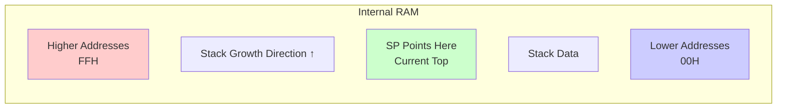
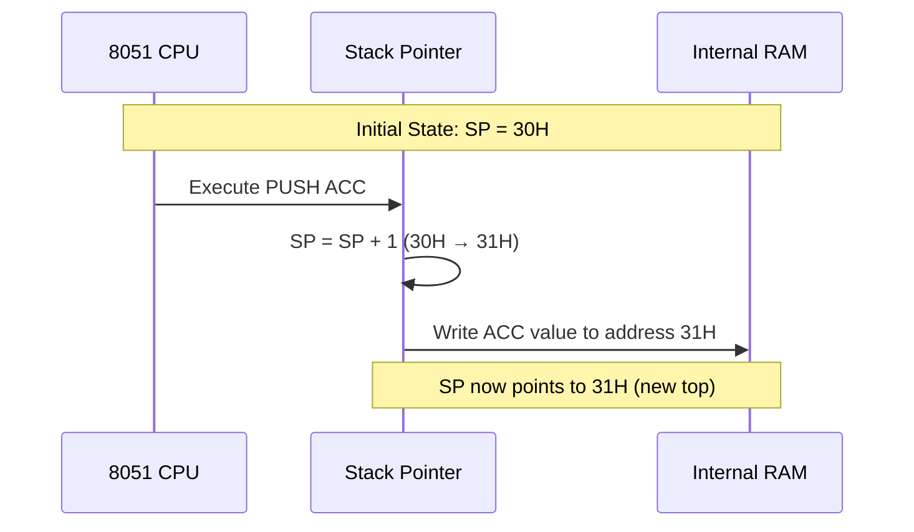
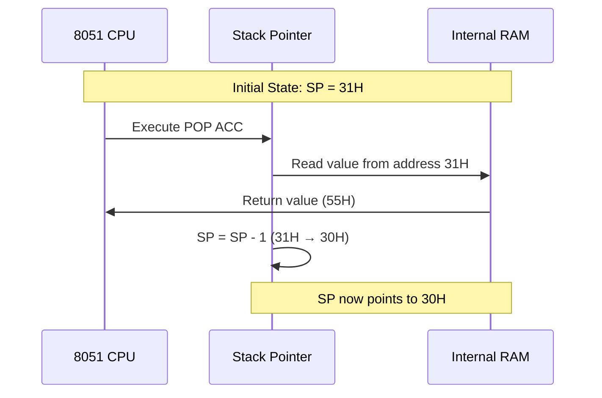
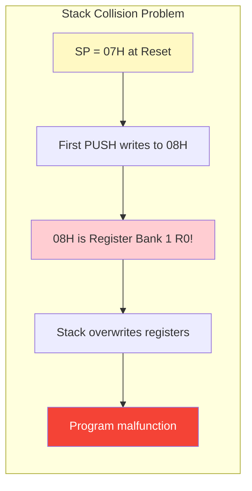
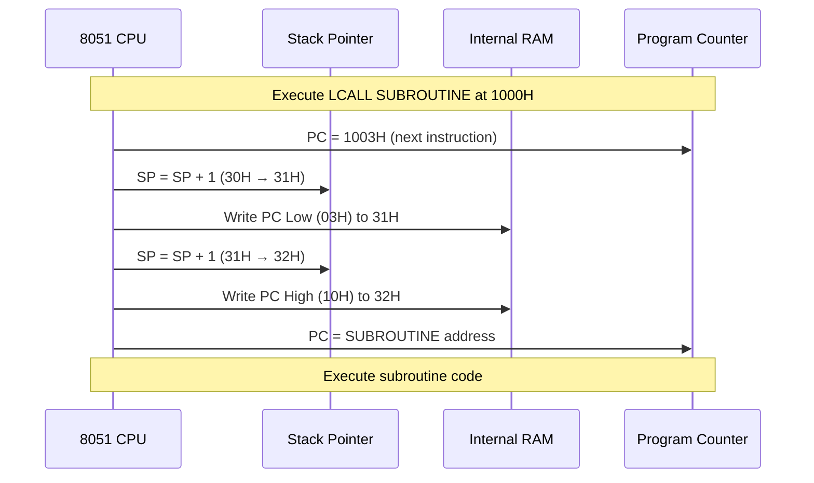
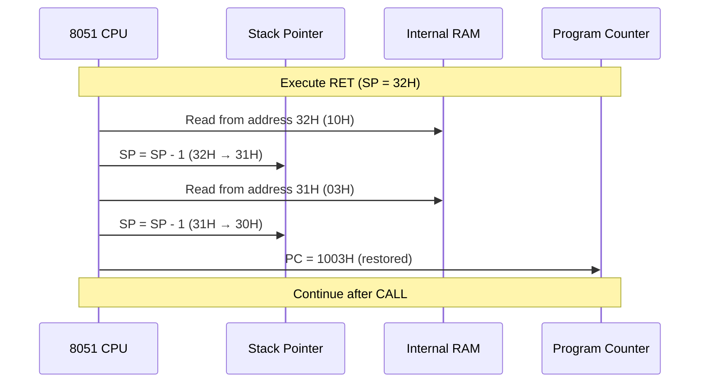
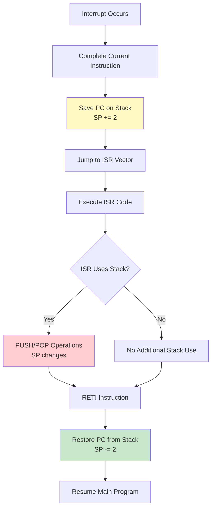

# Stack Pointer (SP) - Special Function Register

## Overview

The Stack Pointer (SP) is an 8-bit Special Function Register that manages the stack in the 8051 microcontroller. It points to the current top of the stack in the internal RAM and is crucial for subroutine calls, interrupt handling, and temporary data storage.

**Register Details:**
- **Address**: 81H
- **Bit-Addressable**: No
- **Reset Value**: 07H
- **Size**: 8-bit (can address 00H-FFH)
- **Access**: Read/Write

## Register Structure

```
Address: 81H (SP - Stack Pointer)
Bit:  7    6    5    4    3    2    1    0
     ┌────┬────┬────┬────┬────┬────┬────┬────┐
     │ SP7│ SP6│ SP5│ SP4│ SP3│ SP2│ SP1│ SP0│
     └────┴────┴────┴────┴────┴────┴────┴────┘
      MSB                                  LSB
```

**Bit Description:**
- **Bits 7-0**: 8-bit address pointing to the current top of stack
- **Range**: 00H to FFH (entire internal RAM address space)
- **Default**: 07H after reset (points to address 07H)

## Stack Operation Principle

The 8051 stack operates on a **Last-In-First-Out (LIFO)** principle and grows **upward** in memory.

### Stack Growth Direction



**Key Characteristics:**
- **PUSH Operation**: SP increments first, then data is written
- **POP Operation**: Data is read first, then SP decrements
- **Growth**: Stack grows from lower to higher addresses
- **Collision Risk**: Stack can overwrite data if not properly initialized

## Stack Operations

### PUSH Operation

The PUSH instruction saves data onto the stack. The operation follows these steps:

**PUSH Sequence:**
1. SP = SP + 1 (increment stack pointer)
2. Write data to address pointed by SP
3. SP now points to the new top of stack

**Syntax:**
```assembly
PUSH direct          ; Push direct address contents onto stack
```

**PUSH Operation Flow:**



**Memory State Example:**

```
Before PUSH ACC (A = 55H, SP = 30H):
┌──────┬─────────┐
│ Addr │ Content │
├──────┼─────────┤
│ 32H  │   --    │
│ 31H  │   --    │  ← Will be written
│ 30H  │  Data   │  ← SP points here
│ 2FH  │  Data   │
└──────┴─────────┘

After PUSH ACC:
┌──────┬─────────┐
│ Addr │ Content │
├──────┼─────────┤
│ 32H  │   --    │
│ 31H  │  55H    │  ← SP points here (new top)
│ 30H  │  Data   │
│ 2FH  │  Data   │
└──────┴─────────┘
```

### POP Operation

The POP instruction retrieves data from the stack. The operation follows these steps:

**POP Sequence:**
1. Read data from address pointed by SP
2. SP = SP - 1 (decrement stack pointer)
3. SP now points to the previous item

**Syntax:**
```assembly
POP direct           ; Pop top of stack to direct address
```

**POP Operation Flow:**



**Memory State Example:**

```
Before POP ACC (SP = 31H):
┌──────┬─────────┐
│ Addr │ Content │
├──────┼─────────┤
│ 32H  │   --    │
│ 31H  │  55H    │  ← SP points here, will be read
│ 30H  │  Data   │
│ 2FH  │  Data   │
└──────┴─────────┘

After POP ACC (A = 55H):
┌──────┬─────────┐
│ Addr │ Content │
├──────┼─────────┤
│ 32H  │   --    │
│ 31H  │  55H    │  ← Data still here (not erased)
│ 30H  │  Data   │  ← SP points here now
│ 2FH  │  Data   │
└──────┴─────────┘
```

**Important Note:** POP does not erase the data from memory; it only moves the SP. The data remains until overwritten by a future PUSH.

## Default Reset Value and Initialization

### Why is the Reset Value 07H?

The 8051's default stack pointer value of **07H** after reset is a deliberate design choice with historical reasons.

**Memory Layout at Reset:**

```
┌──────┬─────────────────────────────┐
│ Addr │ Content                     │
├──────┼─────────────────────────────┤
│ 1FH  │ Register Bank 3 (R0-R7)     │
│ 18H  │                             │
├──────┼─────────────────────────────┤
│ 17H  │ Register Bank 2 (R0-R7)     │
│ 10H  │                             │
├──────┼─────────────────────────────┤
│ 0FH  │ Register Bank 1 (R0-R7)     │
│ 08H  │                             │
├──────┼─────────────────────────────┤
│ 07H  │ Register Bank 0 (R7)        │ ← SP reset value
│ 06H  │ Register Bank 0 (R6)        │
│ 05H  │ Register Bank 0 (R5)        │
│ 04H  │ Register Bank 0 (R4)        │
│ 03H  │ Register Bank 0 (R3)        │
│ 02H  │ Register Bank 0 (R2)        │
│ 01H  │ Register Bank 0 (R1)        │
│ 00H  │ Register Bank 0 (R0)        │
└──────┴─────────────────────────────┘
```

**Design Rationale:**

| Reason | Explanation |
|--------|-------------|
| **Register Bank 0 Alignment** | Reset activates Register Bank 0 (RS1=0, RS0=0) which occupies 00H-07H. SP is initialized to point to the last register (R7 at 07H). |
| **Minimal Initialization** | Early 8051 programs (1980s) were often simple and only used R0-R7. Minimal stack space was needed. |
| **Backward Compatibility** | Maintains compatibility with original Intel 8051 designs. Changing the default would break legacy code. |
| **Programmer Responsibility** | The design assumes programmers will reinitialize SP based on their stack requirements. |

**Historical Context:**

When the Intel 8051 was designed in the early 1980s:
- Programs were typically small and simple
- Many applications used only the default Register Bank 0
- Stack depth requirements were minimal (few subroutine calls, no nested interrupts)
- The 07H value provided a small buffer above the working registers

**How PUSH Works with SP = 07H:**

```
Initial State:     SP = 07H
After PUSH ACC:    1. SP increments: 07H → 08H
                   2. ACC value written to address 08H

Result: First stack item at 08H (start of Register Bank 1!)
```

This design creates a potential problem for modern programs that require deeper stacks, which is explained in the next section.

### The Problem with Default SP = 07H

After reset, the Stack Pointer is initialized to **07H**. This creates a potential problem:

**Memory Layout at Reset:**

```
┌──────┬─────────────────────────────┐
│ Addr │ Content                     │
├──────┼─────────────────────────────┤
│ 1FH  │ Register Bank 3 (R0-R7)     │
│ 18H  │                             │
├──────┼─────────────────────────────┤
│ 17H  │ Register Bank 2 (R0-R7)     │
│ 10H  │                             │
├──────┼─────────────────────────────┤
│ 0FH  │ Register Bank 1 (R0-R7)     │
│ 08H  │                             │
├──────┼─────────────────────────────┤
│ 07H  │ Register Bank 0 (R7)        │ ← SP points here!
│ 06H  │ Register Bank 0 (R6)        │
│ 05H  │ Register Bank 0 (R5)        │
│ 04H  │ Register Bank 0 (R4)        │
│ 03H  │ Register Bank 0 (R3)        │
│ 02H  │ Register Bank 0 (R2)        │
│ 01H  │ Register Bank 0 (R1)        │
│ 00H  │ Register Bank 0 (R0)        │
└──────┴─────────────────────────────┘
```

**The Issue:**
- First PUSH will write to address **08H** (SP increments to 08H)
- Address 08H is the start of **Register Bank 1**
- Stack operations will **overwrite register banks**!

**Collision Visualization:**



### Recommended Stack Initialization

**Best Practice:** Initialize SP to **2FH** or higher before using the stack.

```assembly
; Initialize stack pointer at program start
ORG 0000H
    LJMP MAIN

ORG 0030H
MAIN:
    MOV SP, #2FH         ; Initialize SP to 2FH
    ; Now safe to use stack
    ; Your program continues here
```

**Why 2FH?**

```
┌──────┬─────────────────────────────┐
│ Addr │ Content                     │
├──────┼─────────────────────────────┤
│ 7FH  │ General Purpose RAM         │
│ ...  │ (Available for stack)       │
│ 30H  │                             │
├──────┼─────────────────────────────┤
│ 2FH  │ Bit-Addressable Area        │ ← SP initialized here
│ ...  │ (16 bytes, 128 bits)        │
│ 20H  │                             │
├──────┼─────────────────────────────┤
│ 1FH  │ Register Banks              │
│ ...  │ (4 banks × 8 registers)     │
│ 00H  │                             │
└──────┴─────────────────────────────┘
```

**Benefits:**
- First PUSH writes to **30H** (start of general-purpose RAM)
- Avoids overwriting register banks (00H-1FH)
- Avoids overwriting bit-addressable area (20H-2FH)
- Provides maximum stack space (30H-7FH = 80 bytes)

## Stack Usage in Subroutine Calls

### CALL Instruction

The CALL instruction automatically uses the stack to save the return address.

**CALL Operation Sequence:**
1. PC is incremented to point to the instruction after CALL
2. Low byte of PC is pushed onto stack (SP increments, then write)
3. High byte of PC is pushed onto stack (SP increments, then write)
4. PC is loaded with the subroutine address
5. Execution continues at subroutine

**CALL Types:**
```assembly
ACALL addr11         ; Absolute call (2KB range, 2 bytes)
LCALL addr16         ; Long call (64KB range, 3 bytes)
```

**CALL Stack Operation:**



**Memory State During CALL:**

```
Before LCALL (PC = 1000H, SP = 30H):
┌──────┬─────────┐
│ Addr │ Content │
├──────┼─────────┤
│ 33H  │   --    │
│ 32H  │   --    │
│ 31H  │   --    │
│ 30H  │  Data   │  ← SP
└──────┴─────────┘

After LCALL (PC = Subroutine, SP = 32H):
┌──────┬─────────┐
│ Addr │ Content │
├──────┼─────────┤
│ 33H  │   --    │
│ 32H  │  10H    │  ← SP (PC High byte)
│ 31H  │  03H    │  ← PC Low byte
│ 30H  │  Data   │
└──────┴─────────┘
```

### RET Instruction

The RET instruction retrieves the return address from the stack.

**RET Operation Sequence:**
1. Pop high byte of PC from stack (read, then SP decrements)
2. Pop low byte of PC from stack (read, then SP decrements)
3. PC now contains return address
4. Execution continues after the CALL instruction

**Syntax:**
```assembly
RET                  ; Return from subroutine
RETI                 ; Return from interrupt (also restores interrupt logic)
```

**RET Stack Operation:**



## Stack Usage in Interrupts

### Interrupt Stack Behavior

When an interrupt occurs, the 8051 automatically saves the return address on the stack, similar to CALL.

**Interrupt Sequence:**
1. Current instruction completes
2. PC is incremented to next instruction
3. Low byte of PC is pushed onto stack
4. High byte of PC is pushed onto stack
5. PC is loaded with interrupt vector address
6. Interrupt Service Routine (ISR) executes

**RETI Instruction:**
- Pops return address from stack (like RET)
- Restores interrupt logic state
- Allows same-priority interrupts to be recognized again

**Interrupt Stack Usage:**



### Nested Interrupts and Stack Depth

When interrupts can nest (high-priority interrupting low-priority), stack depth increases.

**Stack Depth Calculation:**

```
Stack Depth = (Nesting Level × 2) + Local Variables + Saved Registers
```

**Example Scenario:**

```
Main Program (SP = 30H)
  ↓ LCALL Subroutine (SP = 32H, +2 bytes)
    ↓ Interrupt occurs (SP = 34H, +2 bytes)
      ↓ ISR pushes ACC, PSW (SP = 36H, +2 bytes)
        ↓ ISR calls function (SP = 38H, +2 bytes)
          Maximum depth: 38H - 30H = 8 bytes
```

**Stack Depth Visualization:**

```
┌──────┬─────────────────────────────┐
│ Addr │ Content                     │
├──────┼─────────────────────────────┤
│ 38H  │ Function Return High        │ ← SP (deepest)
│ 37H  │ Function Return Low         │
│ 36H  │ Saved PSW                   │
│ 35H  │ Saved ACC                   │
│ 34H  │ ISR Return High             │
│ 33H  │ ISR Return Low              │
│ 32H  │ Subroutine Return High      │
│ 31H  │ Subroutine Return Low       │
│ 30H  │ (Initial SP)                │
└──────┴─────────────────────────────┘
```

## Practical Examples

### Example 1: Basic Stack Initialization

```assembly
; Proper program initialization
ORG 0000H
    LJMP MAIN           ; Jump to main program

; Interrupt vectors
ORG 0003H
    LJMP INT0_ISR       ; External interrupt 0

ORG 000BH
    LJMP TIMER0_ISR     ; Timer 0 interrupt

; Main program
ORG 0030H
MAIN:
    MOV SP, #2FH        ; Initialize stack pointer
    ; Stack now starts at 30H
    ; Safe to use CALL, interrupts, PUSH/POP

    ; Your program code here
    LCALL INIT_HARDWARE
    LCALL INIT_TIMERS

LOOP:
    ; Main loop
    SJMP LOOP
```

### Example 2: Saving and Restoring Registers in ISR

```assembly
; Interrupt Service Routine with register preservation
TIMER0_ISR:
    ; Save registers that will be modified
    PUSH ACC            ; SP: 30H → 31H, save accumulator
    PUSH PSW            ; SP: 31H → 32H, save status word
    PUSH DPL            ; SP: 32H → 33H, save DPTR low
    PUSH DPH            ; SP: 33H → 34H, save DPTR high

    ; ISR code here
    MOV A, #55H
    MOV DPTR, #1234H
    ; ... perform interrupt tasks

    ; Restore registers in reverse order
    POP DPH             ; SP: 34H → 33H, restore DPTR high
    POP DPL             ; SP: 33H → 32H, restore DPTR low
    POP PSW             ; SP: 32H → 31H, restore status word
    POP ACC             ; SP: 31H → 30H, restore accumulator

    RETI                ; Return from interrupt
                        ; SP: 30H (back to initial value)
```

### Example 3: Nested Subroutine Calls

```assembly
; Main program
MAIN:
    MOV SP, #2FH        ; SP = 2FH
    LCALL FUNC_A        ; Call first function
    ; ... continue

; First level function
FUNC_A:
    ; SP = 31H (return address saved)
    PUSH ACC            ; SP = 32H

    MOV A, #10H
    LCALL FUNC_B        ; Call nested function

    POP ACC             ; SP = 32H → 31H
    RET                 ; SP = 31H → 2FH

; Second level function (nested)
FUNC_B:
    ; SP = 33H (return address saved)
    PUSH ACC            ; SP = 34H
    PUSH B              ; SP = 35H

    ; Function code here
    MOV A, #20H
    MOV B, #30H

    POP B               ; SP = 35H → 34H
    POP ACC             ; SP = 34H → 33H
    RET                 ; SP = 33H → 31H
```

**Stack State During Execution:**

```
Initial:        After FUNC_A:   After FUNC_B:   After FUNC_B RET:
SP = 2FH        SP = 32H        SP = 35H        SP = 31H
┌──────┐        ┌──────┐        ┌──────┐        ┌──────┐
│  --  │        │  --  │        │  B   │ 35H    │  --  │
│  --  │        │  --  │        │ ACC  │ 34H    │  --  │
│  --  │        │ ACC  │ 32H    │ RET_H│ 33H    │  --  │
│  --  │        │ RET_H│ 31H    │ RET_L│ 32H    │  --  │
│  --  │ 2FH    │ RET_L│ 30H    │ ACC  │ 31H    │ RET_H│ 31H
└──────┘        └──────┘        │ RET_H│ 30H    │ RET_L│ 30H
                                └──────┘        └──────┘
```

### Example 4: Stack Overflow Detection

```assembly
; Simple stack overflow check
CHECK_STACK:
    MOV A, SP           ; Read current SP value
    CJNE A, #70H, STACK_OK  ; Compare with threshold
    SJMP STACK_OVERFLOW     ; SP >= 70H, overflow!

STACK_OK:
    RET

STACK_OVERFLOW:
    ; Handle stack overflow
    CLR EA              ; Disable interrupts
    ; Signal error (LED, serial output, etc.)
    SETB P1.0           ; Turn on error LED
    SJMP $              ; Halt system
```

## Common Pitfalls and Solutions

### Pitfall 1: Forgetting to Initialize SP

**Problem:**
```assembly
ORG 0000H
MAIN:
    ; SP still at default 07H!
    LCALL SUBROUTINE    ; Writes to 08H-09H (Register Bank 1!)
```

**Solution:**
```assembly
ORG 0000H
MAIN:
    MOV SP, #2FH        ; Always initialize SP first!
    LCALL SUBROUTINE    ; Now writes to 30H-31H (safe)
```

### Pitfall 2: Unbalanced PUSH/POP

**Problem:**
```assembly
FUNCTION:
    PUSH ACC            ; SP = 31H
    PUSH B              ; SP = 32H
    ; ... code ...
    POP ACC             ; Wrong! Pops B value into ACC
    RET                 ; Wrong return address!
```

**Solution:**
```assembly
FUNCTION:
    PUSH ACC            ; SP = 31H
    PUSH B              ; SP = 32H
    ; ... code ...
    POP B               ; Correct order (reverse of PUSH)
    POP ACC
    RET                 ; Correct return address
```

### Pitfall 3: Stack Overflow

**Problem:**
```assembly
; Deep nesting without checking stack space
MAIN:
    MOV SP, #2FH        ; Only 80 bytes available (30H-7FH)
    LCALL LEVEL1
    ; ...

LEVEL1:
    PUSH ACC
    PUSH B
    LCALL LEVEL2        ; Each level uses more stack
    ; ... (many nested calls)
    ; Stack may exceed 7FH and wrap to SFR area!
```

**Solution:**
```assembly
; Limit nesting depth or use external RAM for stack
; Calculate maximum stack depth:
; Max Depth = (Max Nesting × 2) + (Max PUSH per function × Nesting)

; For critical applications, monitor SP:
CHECK_STACK_MACRO:
    MOV A, SP
    CJNE A, #70H, STACK_OK  ; Warning threshold
    LCALL STACK_WARNING
STACK_OK:
```

### Pitfall 4: Interrupt Corruption

**Problem:**
```assembly
; ISR modifies registers without saving
TIMER_ISR:
    MOV A, #55H         ; Corrupts main program's ACC!
    MOV DPTR, #1234H    ; Corrupts main program's DPTR!
    RETI
```

**Solution:**
```assembly
; Always save/restore modified registers
TIMER_ISR:
    PUSH ACC            ; Save registers
    PUSH DPL
    PUSH DPH
    PUSH PSW            ; Save status flags too!

    MOV A, #55H         ; Now safe to modify
    MOV DPTR, #1234H

    POP PSW             ; Restore in reverse order
    POP DPH
    POP DPL
    POP ACC
    RETI
```

## Stack Pointer Best Practices

### Initialization Checklist

✅ **Always initialize SP at program start**
```assembly
MOV SP, #2FH        ; First instruction in MAIN
```

✅ **Calculate maximum stack depth**
```
Max Stack = (Nesting Levels × 2) + (Registers Saved × Levels) + Local Variables
```

✅ **Reserve adequate stack space**
- Minimum: 10-20 bytes for simple programs
- Typical: 30-40 bytes for moderate complexity
- Complex: 50+ bytes with deep nesting and interrupts

✅ **Save/restore registers in ISRs**
```assembly
PUSH ACC, PSW, DPL, DPH (and any others modified)
POP in reverse order
```

✅ **Match PUSH/POP operations**
- Every PUSH must have a corresponding POP
- POP in reverse order of PUSH

### Stack Space Allocation

**Recommended SP Initialization Values:**

| Application Type | SP Init | Stack Space | Notes |
|-----------------|---------|-------------|-------|
| Simple (no interrupts) | 2FH | 30H-7FH (80 bytes) | Maximum available space |
| With interrupts | 2FH | 30H-7FH (80 bytes) | Monitor depth carefully |
| Deep nesting | 1FH | 20H-7FH (96 bytes) | Uses bit-addressable area |
| External stack | Custom | External RAM | For complex applications |

**Warning:** Using SP < 20H will overwrite register banks!

## Summary

The Stack Pointer (SP) is a critical register in the 8051 microcontroller that manages the stack for:
- **Subroutine calls** (CALL/RET): Automatic return address storage
- **Interrupts** (ISR/RETI): Context preservation
- **Temporary storage** (PUSH/POP): Register and data saving

**Key Points to Remember:**

1. **Default Value**: SP = 07H after reset (UNSAFE - will overwrite register banks)
2. **Recommended Init**: SP = 2FH (provides 80 bytes of stack space)
3. **Growth Direction**: Stack grows upward (increments on PUSH)
4. **Operation Order**:
   - PUSH: Increment SP first, then write
   - POP: Read first, then decrement SP
5. **Stack Range**: 30H-7FH (80 bytes) when SP initialized to 2FH
6. **Automatic Usage**: CALL, RET, RETI, and interrupts use stack automatically
7. **Manual Usage**: PUSH and POP for explicit stack operations

**Critical Rules:**
- ⚠️ Always initialize SP before using CALL, interrupts, or PUSH/POP
- ⚠️ Always balance PUSH/POP operations (same count, reverse order)
- ⚠️ Always save/restore registers in ISRs
- ⚠️ Monitor stack depth to prevent overflow (SP > 7FH)
- ⚠️ Never let SP exceed 7FH (enters SFR region)

**Stack Pointer Register Summary:**

| Property | Value |
|----------|-------|
| Address | 81H |
| Size | 8-bit |
| Reset Value | 07H |
| Bit-Addressable | No |
| Access | Read/Write |
| Range | 00H-FFH |
| Recommended Init | 2FH |
| Safe Stack Range | 30H-7FH |

By following these guidelines and understanding stack operation, you can write robust 8051 programs that properly manage memory and avoid stack-related bugs.

## Related Topics

- **Program Status Word (PSW)**: Contains register bank selection bits
- **Subroutine Instructions**: ACALL, LCALL, RET, RETI
- **Interrupt System**: Automatic stack usage during interrupt handling
- **Memory Organization**: Understanding RAM layout (register banks, bit-addressable, general-purpose)
- **Register Banks**: Four banks that can be corrupted by improper SP initialization

---

**Reference:** This document covers the Stack Pointer (SP) register at address 81H in the 8051 microcontroller architecture.
