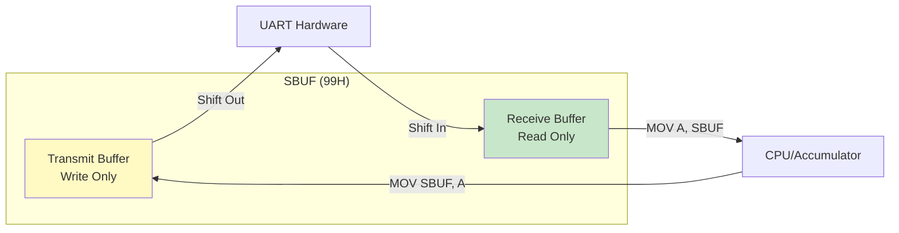
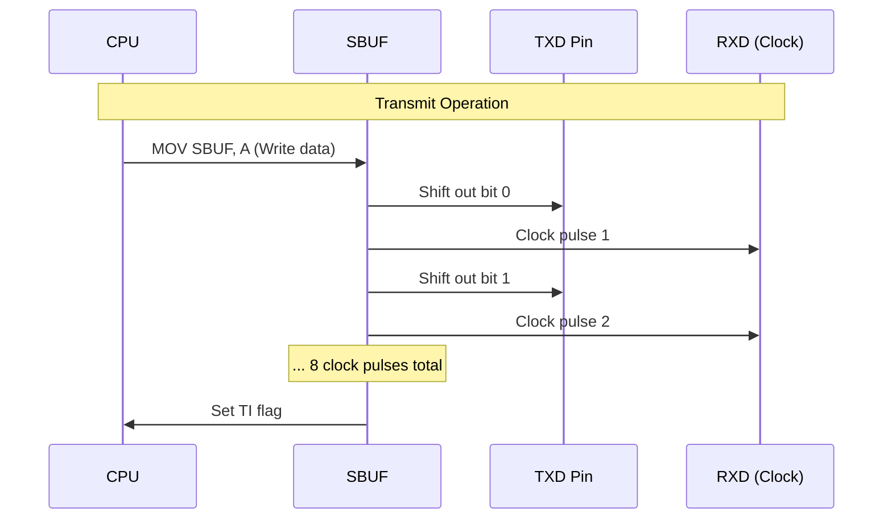
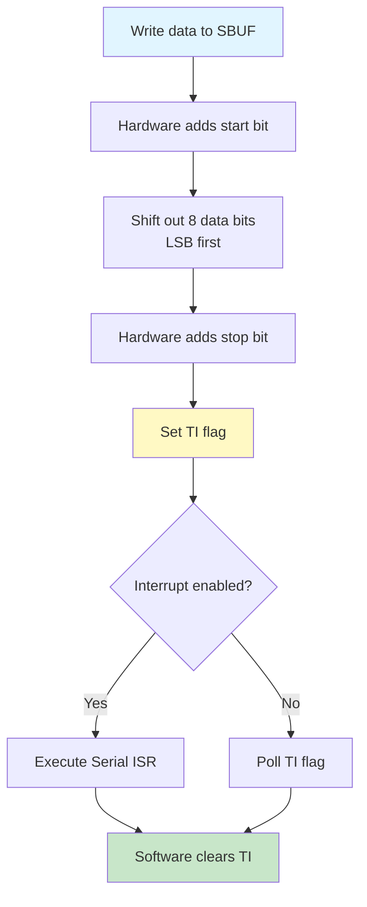
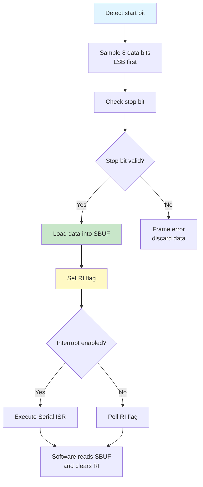

# Serial Port Registers - SCON & SBUF

## Overview

The 8051 microcontroller has a full-duplex serial port that enables asynchronous communication with external devices. The serial port is controlled by two Special Function Registers: SCON (Serial Control) and SBUF (Serial Buffer). This serial port supports multiple operating modes and can be used for UART communication, multiprocessor communication, and shift register operations.

**Register Details:**

| Register | Address | Name | Bit-Addressable | Reset Value | Function |
|----------|---------|------|-----------------|-------------|----------|
| SCON | 98H | Serial Control | Yes | 00H | Serial port mode and control |
| SBUF | 99H | Serial Buffer | No | Undefined | Transmit/Receive buffer |

**Primary Functions:**
- Full-duplex asynchronous serial communication (UART)
- Synchronous shift register mode
- Multiprocessor communication support
- Variable or fixed baud rate
- 8-bit or 9-bit data transmission
- Interrupt-driven or polled operation

**Key Features:**
- **Full-Duplex**: Simultaneous transmit and receive
- **Dual Buffers**: Separate transmit and receive buffers at same address
- **Four Operating Modes**: Mode 0 (shift register), Mode 1 (8-bit UART), Mode 2 (9-bit UART), Mode 3 (9-bit UART)
- **Baud Rate Generation**: Timer 1 or internal oscillator
- **Interrupt Support**: TI (transmit) and RI (receive) interrupt flags

## SCON - Serial Control Register (98H)

### Register Structure

```
Address: 98H (SCON - Serial Control Register)
Bit:  7    6    5    4    3    2    1    0
     ┌────┬────┬────┬────┬────┬────┬────┬────┐
     │ SM0│ SM1│ SM2│ REN│ TB8│ RB8│ TI │ RI │
     └────┴────┴────┴────┴────┴────┴────┴────┘
      Mode Select  Multi  Rcv  9th Bit  Flags
                   Proc   En   Tx  Rx
```

**Bit Definitions:**

| Bit | Symbol | Name | Description | Set By | Cleared By |
|-----|--------|------|-------------|--------|------------|
| 7 | SM0 | Serial Mode bit 0 | Mode select bit 0 (see mode table) | Software | Software |
| 6 | SM1 | Serial Mode bit 1 | Mode select bit 1 (see mode table) | Software | Software |
| 5 | SM2 | Serial Mode bit 2 | Multiprocessor communication enable | Software | Software |
| 4 | REN | Receive Enable | 1=Enable reception, 0=Disable reception | Software | Software |
| 3 | TB8 | Transmit Bit 8 | 9th data bit to transmit (Modes 2 & 3) | Software | Software |
| 2 | RB8 | Receive Bit 8 | 9th data bit received (Modes 2 & 3) | Hardware | Software |
| 1 | TI | Transmit Interrupt | Set when transmission complete | Hardware | Software |
| 0 | RI | Receive Interrupt | Set when reception complete | Hardware | Software |

**Note:** SCON is bit-addressable, allowing direct bit operations like `SETB REN` or `CLR TI`.

### Serial Port Modes (SM0, SM1)

| SM0 | SM1 | Mode | Description | Baud Rate | Data Bits |
|-----|-----|------|-------------|-----------|-----------|
| 0 | 0 | 0 | Shift Register | Fosc/12 | 8 bits |
| 0 | 1 | 1 | 8-bit UART | Variable (Timer 1) | 8 bits |
| 1 | 0 | 2 | 9-bit UART | Fosc/64 or Fosc/32 | 9 bits |
| 1 | 1 | 3 | 9-bit UART | Variable (Timer 1) | 9 bits |

## SBUF - Serial Buffer Register (99H)

### Register Structure

```
Address: 99H (SBUF - Serial Buffer Register)
Bit:  7    6    5    4    3    2    1    0
     ┌────┬────┬────┬────┬────┬────┬────┬────┐
     │ D7 │ D6 │ D5 │ D4 │ D3 │ D2 │ D1 │ D0 │
     └────┴────┴────┴────┴────┴────┴────┴────┘
      8-bit Data (Transmit or Receive)
```

**Characteristics:**
- **Address**: 99H
- **Size**: 8-bit
- **Bit-Addressable**: No
- **Reset Value**: Undefined
- **Access**: Read/Write

**Dual Buffer Architecture:**

SBUF is actually two separate physical registers at the same address:
- **Transmit Buffer**: Written when you execute `MOV SBUF, A`
- **Receive Buffer**: Read when you execute `MOV A, SBUF`



**Operation:**
- **Write to SBUF**: Loads data into transmit buffer and starts transmission
- **Read from SBUF**: Retrieves data from receive buffer
- **No Conflict**: Simultaneous transmit and receive possible (full-duplex)

## Serial Port Operating Modes

### Mode 0: Synchronous Shift Register

**Configuration:** SM0=0, SM1=0

**Characteristics:**
- **Data Bits**: 8 bits
- **Baud Rate**: Fixed at Fosc/12
- **Clock**: Synchronous (clock output on RXD pin)
- **Data**: Transmitted/received on TXD pin
- **Use Case**: Shift register expansion, simple serial I/O

**Pin Functions in Mode 0:**
- **TXD (P3.1)**: Serial data input/output
- **RXD (P3.0)**: Shift clock output

**Operation:**



**Transmit Example:**

```assembly
; Mode 0 transmit example
INIT_MODE0_TX:
    MOV SCON, #00H               ; Mode 0, REN=0 (transmit)
    RET

SEND_BYTE_MODE0:
    MOV SBUF, A                  ; Load data, start transmission
    JNB TI, $                    ; Wait for transmission complete
    CLR TI                       ; Clear flag
    RET
```

**Receive Example:**

```assembly
; Mode 0 receive example
INIT_MODE0_RX:
    MOV SCON, #10H               ; Mode 0, REN=1 (receive enable)
    CLR RI                       ; Clear receive flag
    RET

RECEIVE_BYTE_MODE0:
    CLR RI                       ; Clear flag to start reception
    JNB RI, $                    ; Wait for reception complete
    MOV A, SBUF                  ; Read received data
    RET
```

**Timing Diagram:**

```
Mode 0 Transmission (8 bits):
         ___     ___     ___     ___     ___     ___     ___     ___
RXD:  __|   |___|   |___|   |___|   |___|   |___|   |___|   |___|   |___
      (Clock output, 8 pulses)

TXD:  ___D0___D1___D2___D3___D4___D5___D6___D7___
      (Data bits shifted out)

TI:   __________________________________________________________|‾‾‾‾‾
      (Set after 8th bit transmitted)
```

### Mode 1: 8-bit UART (Variable Baud Rate)

**Configuration:** SM0=0, SM1=1

**Characteristics:**
- **Data Bits**: 8 bits
- **Start Bit**: 1 bit (0)
- **Stop Bit**: 1 bit (1)
- **Total Frame**: 10 bits (1 start + 8 data + 1 stop)
- **Baud Rate**: Variable, controlled by Timer 1
- **Use Case**: Standard asynchronous serial communication (UART)

**Frame Format:**

```
UART Frame (Mode 1):
     Start                                    Stop
      Bit    D0   D1   D2   D3   D4   D5   D6   D7    Bit
     ┌───┬────┬────┬────┬────┬────┬────┬────┬────┬────┐
     │ 0 │ D0 │ D1 │ D2 │ D3 │ D4 │ D5 │ D6 │ D7 │ 1  │
     └───┴────┴────┴────┴────┴────┴────┴────┴────┴────┘
      LSB                                    MSB
```

**Baud Rate Formula:**

```
Baud Rate = (2^SMOD / 32) × (Timer 1 Overflow Rate)

Where:
- SMOD: Bit in PCON register (0 or 1)
- Timer 1 Overflow Rate = Fosc / (12 × [256 - TH1])
```

**Common Baud Rates (11.0592 MHz):**

| Baud Rate | SMOD | Timer 1 Mode | TH1 Value | Calculation |
|-----------|------|--------------|-----------|-------------|
| 9600 | 0 | 2 | FDH (253) | (1/32) × (11.0592M / 12 / 3) = 9600 |
| 19200 | 1 | 2 | FDH (253) | (2/32) × (11.0592M / 12 / 3) = 19200 |
| 4800 | 0 | 2 | FAH (250) | (1/32) × (11.0592M / 12 / 6) = 4800 |
| 2400 | 0 | 2 | F4H (244) | (1/32) × (11.0592M / 12 / 12) = 2400 |

**Initialization Example (9600 baud @ 11.0592 MHz):**

```assembly
; Initialize serial port Mode 1, 9600 baud
INIT_SERIAL_9600:
    ; Configure Timer 1 for baud rate generation
    MOV TMOD, #20H               ; Timer 1, Mode 2 (8-bit auto-reload)
    MOV TH1, #0FDH               ; Reload value for 9600 baud
    MOV TL1, #0FDH               ; Initial value
    SETB TR1                     ; Start Timer 1

    ; Configure serial port
    MOV SCON, #50H               ; Mode 1 (8-bit UART), REN=1
                                 ; SCON = 0101 0000b
                                 ; SM0=0, SM1=1, REN=1

    ; Clear flags
    CLR TI                       ; Clear transmit flag
    CLR RI                       ; Clear receive flag

    RET
```

**Transmit Operation:**



**Transmit Example:**

```assembly
; Transmit a byte in Mode 1
SEND_BYTE:
    MOV SBUF, A                  ; Load data, start transmission
    JNB TI, $                    ; Wait for transmission complete
    CLR TI                       ; Clear transmit flag
    RET
```

**Receive Operation:**



**Receive Example:**

```assembly
; Receive a byte in Mode 1
RECEIVE_BYTE:
    JNB RI, $                    ; Wait for reception complete
    MOV A, SBUF                  ; Read received data
    CLR RI                       ; Clear receive flag
    RET
```

### Mode 2: 9-bit UART (Fixed Baud Rate)

**Configuration:** SM0=1, SM1=0

**Characteristics:**
- **Data Bits**: 9 bits (8 data + 1 programmable 9th bit)
- **Start Bit**: 1 bit (0)
- **Stop Bit**: 1 bit (1)
- **Total Frame**: 11 bits
- **Baud Rate**: Fixed at Fosc/64 (SMOD=0) or Fosc/32 (SMOD=1)
- **Use Case**: Multiprocessor communication

**Frame Format:**

```
UART Frame (Mode 2):
     Start                                         Stop
      Bit    D0   D1   D2   D3   D4   D5   D6   D7   D8   Bit
     ┌───┬────┬────┬────┬────┬────┬────┬────┬────┬────┬────┐
     │ 0 │ D0 │ D1 │ D2 │ D3 │ D4 │ D5 │ D6 │ D7 │TB8 │ 1  │
     └───┴────┴────┴────┴────┴────┴────┴────┴────┴────┴────┘
      LSB                                    9th bit
```

**9th Bit Usage:**
- **TB8**: Set by software before transmission (SCON.3)
- **RB8**: Received 9th bit, read by software (SCON.2)
- **Common Use**: Address/data indicator in multiprocessor systems

**Baud Rate:**
```
SMOD = 0: Baud Rate = Fosc / 64
SMOD = 1: Baud Rate = Fosc / 32

Example @ 11.0592 MHz:
SMOD = 0: 11.0592M / 64 = 172,800 baud
SMOD = 1: 11.0592M / 32 = 345,600 baud
```

**Example:**

```assembly
; Mode 2 initialization
INIT_MODE2:
    MOV SCON, #90H               ; Mode 2, REN=1
                                 ; SCON = 1001 0000b
    CLR TI
    CLR RI
    RET

; Transmit with 9th bit = 1 (address byte)
SEND_ADDRESS:
    SETB TB8                     ; Set 9th bit
    MOV SBUF, A                  ; Send address
    JNB TI, $
    CLR TI
    RET

; Transmit with 9th bit = 0 (data byte)
SEND_DATA:
    CLR TB8                      ; Clear 9th bit
    MOV SBUF, A                  ; Send data
    JNB TI, $
    CLR TI
    RET
```

### Mode 3: 9-bit UART (Variable Baud Rate)

**Configuration:** SM0=1, SM1=1

**Characteristics:**
- **Data Bits**: 9 bits (8 data + 1 programmable 9th bit)
- **Start Bit**: 1 bit (0)
- **Stop Bit**: 1 bit (1)
- **Total Frame**: 11 bits
- **Baud Rate**: Variable, controlled by Timer 1 (same as Mode 1)
- **Use Case**: Multiprocessor communication with flexible baud rate

**Baud Rate Formula:**
```
Same as Mode 1:
Baud Rate = (2^SMOD / 32) × (Timer 1 Overflow Rate)
```

**Difference from Mode 2:**
- Mode 2: Fixed baud rate (Fosc/64 or Fosc/32)
- Mode 3: Variable baud rate (Timer 1 controlled)

**Example:**

```assembly
; Mode 3 initialization (9600 baud @ 11.0592 MHz)
INIT_MODE3:
    ; Configure Timer 1
    MOV TMOD, #20H               ; Timer 1, Mode 2
    MOV TH1, #0FDH               ; 9600 baud
    MOV TL1, #0FDH
    SETB TR1

    ; Configure serial port
    MOV SCON, #0D0H              ; Mode 3, REN=1
                                 ; SCON = 1101 0000b
    CLR TI
    CLR RI
    RET
```

## Practical Examples

### Example 1: Simple UART Echo Program

Echo back any received character via serial port.

```assembly
; UART echo program (9600 baud @ 11.0592 MHz)
ORG 0000H
    LJMP MAIN

; Serial interrupt vector
ORG 0023H
    LJMP SERIAL_ISR

ORG 0030H
MAIN:
    MOV SP, #2FH                 ; Initialize stack

    ; Configure Timer 1 for baud rate
    MOV TMOD, #20H               ; Timer 1, Mode 2
    MOV TH1, #0FDH               ; 9600 baud
    MOV TL1, #0FDH
    SETB TR1                     ; Start Timer 1

    ; Configure serial port
    MOV SCON, #50H               ; Mode 1, REN=1

    ; Enable serial interrupt
    SETB ES                      ; Enable serial interrupt
    SETB EA                      ; Enable global interrupts

LOOP:
    SJMP LOOP                    ; Wait for interrupts

; Serial interrupt service routine
SERIAL_ISR:
    JNB RI, CHECK_TI             ; Check if receive interrupt

    ; Receive interrupt
    CLR RI                       ; Clear receive flag
    MOV A, SBUF                  ; Read received data
    MOV SBUF, A                  ; Echo back (transmit)
    SJMP ISR_EXIT

CHECK_TI:
    JNB TI, ISR_EXIT             ; Check if transmit interrupt
    CLR TI                       ; Clear transmit flag

ISR_EXIT:
    RETI
```

### Example 2: Sending a String via UART

Transmit a null-terminated string stored in code memory.

```assembly
; String transmission example
ORG 2000H
MESSAGE:
    DB "Hello, 8051!", 0DH, 0AH, 0  ; String with CR, LF, null terminator

ORG 0100H
MAIN:
    MOV SP, #2FH

    ; Initialize serial port (9600 baud)
    ACALL INIT_SERIAL

    ; Send string
    MOV DPTR, #MESSAGE
    ACALL SEND_STRING

    SJMP $                       ; Halt

; Initialize serial port
INIT_SERIAL:
    MOV TMOD, #20H               ; Timer 1, Mode 2
    MOV TH1, #0FDH               ; 9600 baud @ 11.0592 MHz
    MOV TL1, #0FDH
    SETB TR1
    MOV SCON, #50H               ; Mode 1, REN=1
    CLR TI
    CLR RI
    RET

; Send null-terminated string
SEND_STRING:
    CLR A                        ; Index = 0
SEND_LOOP:
    MOVC A, @A+DPTR              ; Read character from code memory
    JZ SEND_DONE                 ; If null, done
    ACALL SEND_CHAR              ; Send character
    INC DPTR                     ; Next character
    CLR A                        ; Reset index
    SJMP SEND_LOOP

SEND_DONE:
    RET

; Send single character
SEND_CHAR:
    MOV SBUF, A                  ; Load data
    JNB TI, $                    ; Wait for transmission
    CLR TI                       ; Clear flag
    RET
```

### Example 3: Receiving Data with Circular Buffer

Implement a circular buffer for receiving serial data.

```assembly
; Circular buffer for serial reception
BUF_SIZE    EQU 16               ; Buffer size (must be power of 2)
BUF_MASK    EQU 0FH              ; Mask for circular indexing

; Buffer in internal RAM
BUFFER      EQU 30H              ; Buffer start address (16 bytes: 30H-3FH)
WR_PTR      EQU 40H              ; Write pointer
RD_PTR      EQU 41H              ; Read pointer

ORG 0000H
    LJMP MAIN

; Serial interrupt vector
ORG 0023H
    LJMP SERIAL_ISR

ORG 0100H
MAIN:
    MOV SP, #2FH

    ; Initialize buffer pointers
    MOV WR_PTR, #00H
    MOV RD_PTR, #00H

    ; Initialize serial port
    MOV TMOD, #20H
    MOV TH1, #0FDH               ; 9600 baud
    MOV TL1, #0FDH
    SETB TR1
    MOV SCON, #50H               ; Mode 1, REN=1

    SETB ES                      ; Enable serial interrupt
    SETB EA                      ; Enable global interrupts

MAIN_LOOP:
    ; Check if data available in buffer
    ACALL BUFFER_AVAILABLE
    JZ MAIN_LOOP                 ; If empty, wait

    ; Read from buffer
    ACALL BUFFER_READ
    ; Process received data in A
    ; ... (your processing code here)

    SJMP MAIN_LOOP

; Serial ISR - Store received data in buffer
SERIAL_ISR:
    JNB RI, ISR_EXIT
    CLR RI

    MOV A, SBUF                  ; Read received data
    ACALL BUFFER_WRITE           ; Store in buffer

ISR_EXIT:
    RETI

; Write byte to circular buffer
; Input: A = data to write
BUFFER_WRITE:
    PUSH ACC
    PUSH 00H                     ; Save R0

    MOV R0, WR_PTR               ; Get write pointer
    MOV A, R0
    ANL A, #BUF_MASK             ; Apply mask for circular
    ADD A, #BUFFER               ; Calculate address
    MOV R0, A                    ; R0 = buffer address

    POP ACC                      ; Restore data
    PUSH ACC
    MOV @R0, A                   ; Write to buffer

    MOV A, WR_PTR
    INC A
    ANL A, #BUF_MASK             ; Wrap around
    MOV WR_PTR, A                ; Update write pointer

    POP 00H
    POP ACC
    RET

; Read byte from circular buffer
; Output: A = data read
BUFFER_READ:
    PUSH 00H

    MOV R0, RD_PTR               ; Get read pointer
    MOV A, R0
    ANL A, #BUF_MASK
    ADD A, #BUFFER
    MOV R0, A

    MOV A, @R0                   ; Read from buffer

    MOV R0, RD_PTR
    INC R0
    MOV A, R0
    ANL A, #BUF_MASK
    MOV RD_PTR, A                ; Update read pointer

    MOV A, @R0                   ; Return data in A

    POP 00H
    RET

; Check if data available
; Output: A = number of bytes available (0 if empty)
BUFFER_AVAILABLE:
    MOV A, WR_PTR
    CLR C
    SUBB A, RD_PTR
    ANL A, #BUF_MASK
    RET
```

### Example 4: Hexadecimal Display via UART

Convert and transmit hexadecimal values via serial port.

```assembly
; Hexadecimal display via UART
ORG 0100H
MAIN:
    MOV SP, #2FH

    ; Initialize serial port
    ACALL INIT_SERIAL

    ; Display hex value 0A5H
    MOV A, #0A5H
    ACALL SEND_HEX_BYTE

    SJMP $

; Initialize serial port (9600 baud)
INIT_SERIAL:
    MOV TMOD, #20H
    MOV TH1, #0FDH
    MOV TL1, #0FDH
    SETB TR1
    MOV SCON, #50H
    CLR TI
    CLR RI
    RET

; Send byte as 2 hex digits
; Input: A = byte to display
SEND_HEX_BYTE:
    PUSH ACC

    ; Send high nibble
    SWAP A                       ; Swap nibbles
    ANL A, #0FH                  ; Mask low nibble
    ACALL NIBBLE_TO_ASCII
    ACALL SEND_CHAR

    ; Send low nibble
    POP ACC
    PUSH ACC
    ANL A, #0FH                  ; Mask low nibble
    ACALL NIBBLE_TO_ASCII
    ACALL SEND_CHAR

    POP ACC
    RET

; Convert nibble (0-F) to ASCII character
; Input: A = nibble (0-15)
; Output: A = ASCII character ('0'-'9' or 'A'-'F')
NIBBLE_TO_ASCII:
    CJNE A, #0AH, CHECK_RANGE
CHECK_RANGE:
    JC IS_DIGIT                  ; If < 10, it's a digit

    ; It's A-F
    ADD A, #37H                  ; 'A' - 10 = 55H (37H + 0AH)
    RET

IS_DIGIT:
    ; It's 0-9
    ADD A, #30H                  ; '0' = 30H
    RET

; Send single character
SEND_CHAR:
    MOV SBUF, A
    JNB TI, $
    CLR TI
    RET
```

## Common Pitfalls and Solutions

### Pitfall 1: Forgetting to Clear TI/RI Flags

**Problem:**
```assembly
; Incorrect: Flags not cleared
SEND_BYTE:
    MOV SBUF, A                  ; Send data
    JNB TI, $                    ; Wait for TI
    ; Missing CLR TI!
    RET
; Next transmission will immediately pass because TI still set!
```

**Solution:**
```assembly
; Correct: Always clear flags
SEND_BYTE:
    MOV SBUF, A                  ; Send data
    JNB TI, $                    ; Wait for TI
    CLR TI                       ; Clear transmit flag
    RET

RECEIVE_BYTE:
    JNB RI, $                    ; Wait for RI
    MOV A, SBUF                  ; Read data
    CLR RI                       ; Clear receive flag
    RET
```

**Reason:** TI and RI flags are set by hardware but must be cleared by software. Forgetting to clear them causes incorrect behavior on subsequent operations.

### Pitfall 2: Not Enabling Receive (REN=0)

**Problem:**
```assembly
; Incorrect: REN not set
INIT_SERIAL:
    MOV TMOD, #20H
    MOV TH1, #0FDH
    SETB TR1
    MOV SCON, #40H               ; Mode 1, but REN=0!
    ; Reception will not work!
```

**Solution:**
```assembly
; Correct: Set REN bit to enable reception
INIT_SERIAL:
    MOV TMOD, #20H
    MOV TH1, #0FDH
    SETB TR1
    MOV SCON, #50H               ; Mode 1, REN=1
    ; SCON = 0101 0000b
    ; SM0=0, SM1=1, SM2=0, REN=1
```

**Reason:** The REN (Receive Enable) bit must be set to 1 to enable serial reception. Without it, the serial port will only transmit, not receive.

### Pitfall 3: Incorrect Baud Rate Calculation

**Problem:**
```assembly
; Incorrect: Wrong TH1 value for desired baud rate
; Trying to get 9600 baud @ 12 MHz (not 11.0592 MHz)
INIT_SERIAL:
    MOV TMOD, #20H
    MOV TH1, #0FDH               ; Wrong! This is for 11.0592 MHz
    SETB TR1
    MOV SCON, #50H
; Actual baud rate will be incorrect!
```

**Solution:**
```assembly
; Correct: Calculate TH1 for specific oscillator
; For 9600 baud @ 12 MHz with SMOD=0:
; Baud = (1/32) × (12M / (12 × [256 - TH1]))
; 9600 = (1/32) × (12M / (12 × [256 - TH1]))
; TH1 = 256 - (12M / (32 × 12 × 9600)) = 256 - 3.255 ≈ 253 (FDH)
; But this gives 9615 baud (0.16% error)

; Better: Use 11.0592 MHz crystal for standard baud rates
MOV TH1, #0FDH               ; Exact 9600 baud @ 11.0592 MHz
```

**Reason:** Baud rate depends on oscillator frequency. Always calculate TH1 value for your specific crystal frequency. Use 11.0592 MHz for exact standard baud rates.

### Pitfall 4: Reading SBUF Before Checking RI

**Problem:**
```assembly
; Incorrect: Reading SBUF without checking RI
RECEIVE_BYTE:
    MOV A, SBUF                  ; May read old/invalid data!
    CLR RI
    RET
```

**Solution:**
```assembly
; Correct: Always check RI before reading SBUF
RECEIVE_BYTE:
    JNB RI, $                    ; Wait for new data
    MOV A, SBUF                  ; Read received data
    CLR RI                       ; Clear flag
    RET
```

**Reason:** Reading SBUF before RI is set may return old or invalid data. Always wait for RI flag before reading received data.

## Best Practices

### 1. Always Initialize Serial Port Properly

✅ **Recommended:**
```assembly
INIT_SERIAL:
    ; Configure Timer 1 for baud rate
    MOV TMOD, #20H               ; Timer 1, Mode 2
    MOV TH1, #0FDH               ; 9600 baud @ 11.0592 MHz
    MOV TL1, #0FDH
    SETB TR1                     ; Start Timer 1

    ; Configure serial port
    MOV SCON, #50H               ; Mode 1, REN=1

    ; Clear flags
    CLR TI
    CLR RI

    RET
```

### 2. Use 11.0592 MHz Crystal for Standard Baud Rates

✅ **Recommended:** 11.0592 MHz provides exact standard baud rates
- 9600, 4800, 2400, 1200 baud with 0% error
- TH1 values are simple and accurate

❌ **Not Ideal:** 12 MHz requires approximation
- Small errors accumulate over long transmissions
- May cause communication failures

### 3. Always Clear Flags After Checking

```assembly
; Transmit
MOV SBUF, A
JNB TI, $
CLR TI                           ; Always clear

; Receive
JNB RI, $
MOV A, SBUF
CLR RI                           ; Always clear
```

### 4. Use Interrupts for Efficient Communication

✅ **Efficient (Interrupt-driven):**
```assembly
SETB ES                          ; Enable serial interrupt
SETB EA                          ; Enable global interrupts
; CPU free to do other work
```

❌ **Inefficient (Polling):**
```assembly
JNB RI, $                        ; CPU blocked waiting
```

### 5. Implement Circular Buffers for Reliable Reception

- Prevents data loss during burst reception
- Allows asynchronous processing
- Typical size: 16-64 bytes

## Summary

The 8051 microcontroller provides a versatile full-duplex serial port controlled by two Special Function Registers: SCON (Serial Control) and SBUF (Serial Buffer). This serial port supports four operating modes and enables reliable asynchronous communication with external devices.

**Register Summary:**

| Register | Address | Bit-Addressable | Function |
|----------|---------|-----------------|----------|
| SCON | 98H | Yes | Serial port mode and control |
| SBUF | 99H | No | Transmit/Receive buffer (dual) |

**SCON Bit Summary:**

| Bit | Symbol | Function | Set By | Cleared By |
|-----|--------|----------|--------|------------|
| 7-6 | SM0-SM1 | Mode select | Software | Software |
| 5 | SM2 | Multiprocessor enable | Software | Software |
| 4 | REN | Receive enable | Software | Software |
| 3 | TB8 | 9th transmit bit | Software | Software |
| 2 | RB8 | 9th receive bit | Hardware | Software |
| 1 | TI | Transmit interrupt flag | Hardware | Software |
| 0 | RI | Receive interrupt flag | Hardware | Software |

**Operating Modes:**

| Mode | SM0 SM1 | Description | Baud Rate | Data Bits | Use Case |
|------|---------|-------------|-----------|-----------|----------|
| 0 | 0 0 | Shift Register | Fosc/12 | 8 | Shift register I/O |
| 1 | 0 1 | 8-bit UART | Variable (Timer 1) | 8 | Standard UART |
| 2 | 1 0 | 9-bit UART | Fosc/64 or Fosc/32 | 9 | Multiprocessor |
| 3 | 1 1 | 9-bit UART | Variable (Timer 1) | 9 | Multiprocessor |

**Baud Rate Generation:**

**Mode 1 & 3:**
```
Baud Rate = (2^SMOD / 32) × (Timer 1 Overflow Rate)
Timer 1 Overflow Rate = Fosc / (12 × [256 - TH1])
```

**Mode 2:**
```
Baud Rate = (2^SMOD / 64) × Fosc
```

**Common Baud Rates @ 11.0592 MHz:**

| Baud Rate | SMOD | TH1 Value | Error |
|-----------|------|-----------|-------|
| 9600 | 0 | FDH (253) | 0% |
| 19200 | 1 | FDH (253) | 0% |
| 4800 | 0 | FAH (250) | 0% |
| 2400 | 0 | F4H (244) | 0% |

**Critical Points to Remember:**

1. **SCON is bit-addressable** - Use SETB/CLR for REN, TI, RI, TB8
2. **SBUF is dual buffer** - Same address for transmit and receive
3. **TI/RI flags must be cleared by software** - Hardware sets, software clears
4. **REN must be set to enable reception** - REN=1 for receive
5. **Timer 1 Mode 2 for baud rate** - 8-bit auto-reload is standard
6. **Use 11.0592 MHz crystal** - Provides exact standard baud rates
7. **Full-duplex operation** - Simultaneous transmit and receive

**Typical Initialization Sequence:**

1. Configure Timer 1 for baud rate (Mode 2)
2. Load TH1 with calculated value
3. Start Timer 1 (SETB TR1)
4. Configure SCON (mode and REN)
5. Clear TI and RI flags
6. Enable serial interrupt if needed (SETB ES, SETB EA)

**Common Applications:**

- PC communication via RS-232
- Sensor data transmission
- Debug output and logging
- Wireless module communication (Bluetooth, WiFi)
- GPS module interface
- LCD/display communication
- Multiprocessor networks

**Best Practices:**

- ⚠️ Always clear TI/RI flags after checking them
- ⚠️ Set REN=1 to enable reception
- ⚠️ Use Timer 1 Mode 2 for baud rate generation
- ⚠️ Calculate TH1 value for your specific oscillator frequency
- ⚠️ Use 11.0592 MHz crystal for standard baud rates
- ⚠️ Implement circular buffers for reliable reception
- ⚠️ Use interrupt-driven communication for efficiency

By understanding the SCON and SBUF registers and their operating modes, you can implement reliable serial communication in 8051 applications for data exchange with external devices.

## Related Topics

- **Timer 1 (TMOD, TH1, TL1)**: Used for baud rate generation in Modes 1 and 3
- **PCON Register**: SMOD bit affects baud rate calculation
- **Interrupt System (IE, IP)**: Serial interrupt (ES) and priority
- **Port 3 (P3)**: TXD (P3.1) and RXD (P3.0) pins
- **RS-232 Interface**: Level conversion for PC communication

---

**Reference:** This document covers the Serial Port registers (SCON and SBUF) at addresses 98H and 99H in the 8051 microcontroller architecture.
