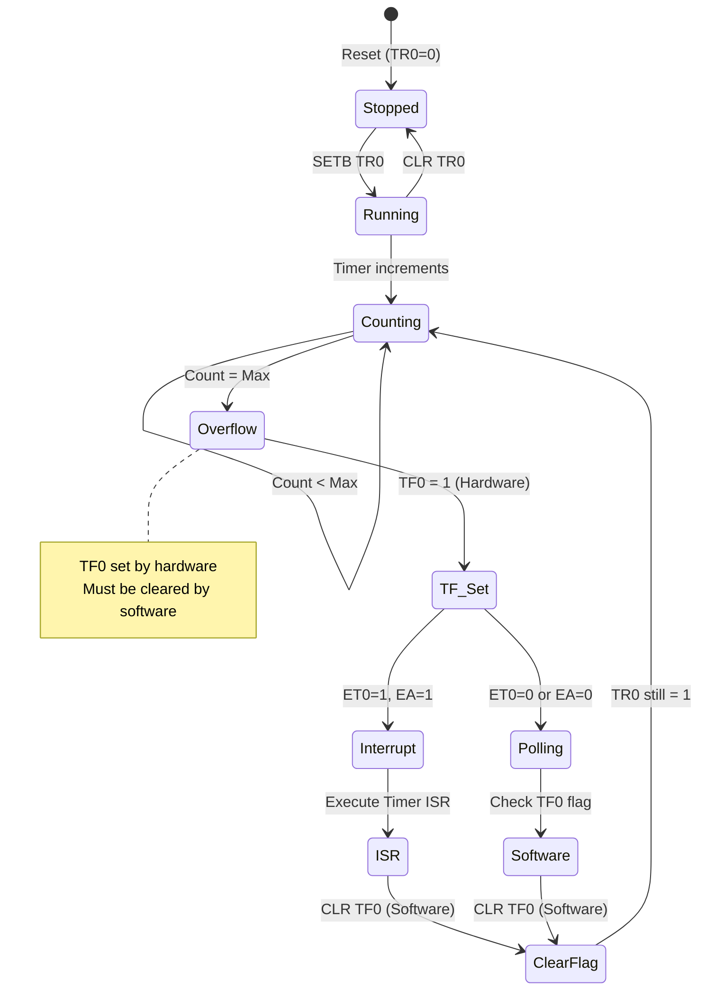
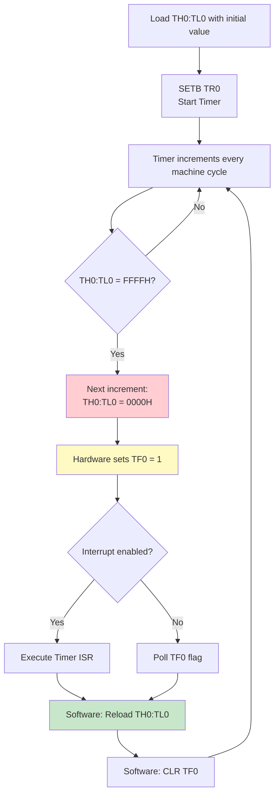
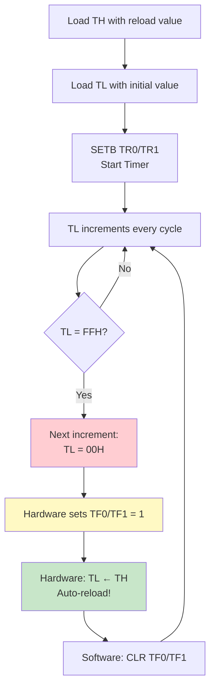
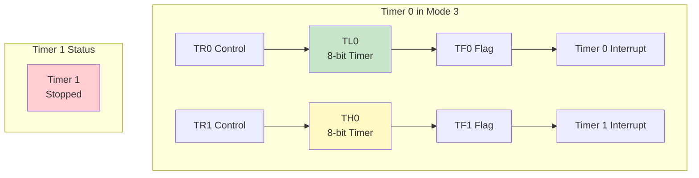

# Timer/Counter Registers - TCON, TMOD, TH0, TL0, TH1, TL1

## Overview

The 8051 microcontroller has two 16-bit programmable timers/counters (Timer 0 and Timer 1) that can operate as timers or event counters. These are controlled by six Special Function Registers that configure modes, control operation, and hold count values.

**Timer/Counter Registers:**

| Register | Address | Name | Bit-Addressable | Reset Value | Function |
|----------|---------|------|-----------------|-------------|----------|
| TCON | 88H | Timer Control | Yes | 00H | Timer run control and overflow flags |
| TMOD | 89H | Timer Mode | No | 00H | Timer mode and configuration |
| TL0 | 8AH | Timer 0 Low | No | 00H | Timer 0 low byte (8 bits) |
| TH0 | 8CH | Timer 0 High | No | 00H | Timer 0 high byte (8 bits) |
| TL1 | 8BH | Timer 1 Low | No | 00H | Timer 1 low byte (8 bits) |
| TH1 | 8DH | Timer 1 High | No | 00H | Timer 1 high byte (8 bits) |

**Primary Functions:**
- **Timing operations**: Generate precise time delays
- **Event counting**: Count external events on T0 (P3.4) or T1 (P3.5) pins
- **Baud rate generation**: Timer 1 commonly used for serial port baud rate
- **Pulse width measurement**: Measure external signal timing
- **Interrupt generation**: Generate periodic interrupts

## TCON - Timer Control Register (88H)

### Register Structure

```
Address: 88H (TCON - Timer Control Register)
Bit:  7    6    5    4    3    2    1    0
     ┌────┬────┬────┬────┬────┬────┬────┬────┐
     │ TF1│ TR1│ TF0│ TR0│ IE1│ IT1│ IE0│ IT0│
     └────┴────┴────┴────┴────┴────┴────┴────┘
      Timer 1      Timer 0    External Interrupts
```

**Bit Definitions:**

| Bit | Symbol | Name | Description | Set By | Cleared By |
|-----|--------|------|-------------|--------|------------|
| 7 | TF1 | Timer 1 Overflow Flag | Set when Timer 1 overflows | Hardware | Software or ISR |
| 6 | TR1 | Timer 1 Run Control | 1=Start Timer 1, 0=Stop Timer 1 | Software | Software |
| 5 | TF0 | Timer 0 Overflow Flag | Set when Timer 0 overflows | Hardware | Software or ISR |
| 4 | TR0 | Timer 0 Run Control | 1=Start Timer 0, 0=Stop Timer 0 | Software | Software |
| 3 | IE1 | External Interrupt 1 Edge Flag | Set on INT1 falling edge | Hardware | Software or ISR |
| 2 | IT1 | Interrupt 1 Type | 1=Edge triggered, 0=Level triggered | Software | Software |
| 1 | IE0 | External Interrupt 0 Edge Flag | Set on INT0 falling edge | Hardware | Software or ISR |
| 0 | IT0 | Interrupt 0 Type | 1=Edge triggered, 0=Level triggered | Software | Software |

**Note:** TCON is bit-addressable, allowing direct bit operations like `SETB TR0` or `CLR TF1`.

### TCON Usage Examples

```assembly
; Start Timer 0
SETB TR0                     ; Set TR0 bit (TCON.4 = 1)

; Stop Timer 1
CLR TR1                      ; Clear TR1 bit (TCON.6 = 0)

; Check Timer 0 overflow
JNB TF0, NO_OVERFLOW         ; Jump if TF0 = 0
; Timer 0 has overflowed
CLR TF0                      ; Clear overflow flag
NO_OVERFLOW:

; Clear Timer 1 overflow flag
CLR TF1                      ; Clear TF1 bit (TCON.7 = 0)
```

**Timer Control Flow:**



## TMOD - Timer Mode Register (89H)

### Register Structure

```
Address: 89H (TMOD - Timer Mode Register)
Bit:  7    6    5    4    3    2    1    0
     ┌────┬────┬────┬────┬────┬────┬────┬────┐
     │GATE│ C/T│ M1 │ M0 │GATE│ C/T│ M1 │ M0 │
     └────┴────┴────┴────┴────┴────┴────┴────┘
      Timer 1 Config    Timer 0 Config
```

**Bit Definitions:**

| Bit | Symbol | Timer | Description |
|-----|--------|-------|-------------|
| 7 | GATE | Timer 1 | Gating control: 1=Timer enabled only when INT1=1 and TR1=1, 0=Timer enabled when TR1=1 |
| 6 | C/T | Timer 1 | Counter/Timer select: 1=Counter mode (external events), 0=Timer mode (internal clock) |
| 5-4 | M1-M0 | Timer 1 | Mode select bits (see mode table below) |
| 3 | GATE | Timer 0 | Gating control: 1=Timer enabled only when INT0=1 and TR0=1, 0=Timer enabled when TR0=1 |
| 2 | C/T | Timer 0 | Counter/Timer select: 1=Counter mode (external events), 0=Timer mode (internal clock) |
| 1-0 | M1-M0 | Timer 0 | Mode select bits (see mode table below) |

**Note:** TMOD is NOT bit-addressable. Use byte operations (MOV, ORL, ANL) to modify.

### Timer Modes (M1, M0)

| M1 | M0 | Mode | Description | Timer Size |
|----|----|------|-------------|------------|
| 0 | 0 | 0 | 13-bit Timer/Counter | TH: 8 bits, TL: 5 bits |
| 0 | 1 | 1 | 16-bit Timer/Counter | TH: 8 bits, TL: 8 bits |
| 1 | 0 | 2 | 8-bit Auto-Reload | TH: reload value, TL: counter |
| 1 | 1 | 3 | Split Timer Mode | Timer 0 only: TL0 and TH0 as separate 8-bit timers |

### TMOD Configuration Examples

```assembly
; Timer 0: Mode 1 (16-bit), Timer mode
MOV TMOD, #01H               ; GATE=0, C/T=0, M1=0, M0=1

; Timer 1: Mode 2 (8-bit auto-reload), Timer mode
MOV TMOD, #20H               ; Timer 1: GATE=0, C/T=0, M1=1, M0=0

; Timer 0: Mode 1, Counter mode (count external events)
MOV TMOD, #05H               ; GATE=0, C/T=1, M1=0, M0=1

; Both timers: Timer 0 Mode 1, Timer 1 Mode 2
MOV TMOD, #21H               ; T0: Mode 1, T1: Mode 2
```

## Timer Count Registers (TH0, TL0, TH1, TL1)

### Register Overview

Each timer has two 8-bit registers that together form the timer count value:

**Timer 0 Registers:**
- **TH0 (8CH)**: Timer 0 High Byte (8 bits)
- **TL0 (8AH)**: Timer 0 Low Byte (8 bits)

**Timer 1 Registers:**
- **TH1 (8DH)**: Timer 1 High Byte (8 bits)
- **TL1 (8BH)**: Timer 1 Low Byte (8 bits)

**Characteristics:**
- Not bit-addressable
- Reset value: 00H
- Read/Write access
- Function depends on timer mode

### 16-bit Timer Structure (Mode 1)

```
Timer 0 (16-bit in Mode 1):
┌─────────────────────────────────────────────┐
│         TH0 (8CH)      │      TL0 (8AH)      │
├────┬────┬────┬────┬────┼────┬────┬────┬────┤
│ B15│ B14│ B13│ B12│ B11│ B10│ B9 │ B8 │ B7 │...│ B0 │
└────┴────┴────┴────┴────┴────┴────┴────┴────┴───┴────┘
  MSB                                              LSB

Count Range: 0000H - FFFFH (0 - 65535)
Overflow: FFFFH → 0000H (sets TF0 flag)
```

### Loading Timer Values

```assembly
; Load 16-bit value into Timer 0 (Mode 1)
MOV TH0, #3CH                ; High byte = 3CH
MOV TL0, #0B0H               ; Low byte = B0H
; Timer 0 = 3CB0H (15536 decimal)

; Load Timer 1 for baud rate (Mode 2)
MOV TH1, #0FDH               ; Reload value for 9600 baud
MOV TL1, #0FDH               ; Initial count value

; Read current timer value
MOV A, TH0                   ; Read high byte
MOV R0, A
MOV A, TL0                   ; Read low byte
MOV R1, A
; R0:R1 now contains Timer 0 value
```

## Timer Operating Modes

### Mode 0: 13-bit Timer/Counter

**Configuration:** M1=0, M0=0

**Structure:**
- TH: 8 bits (full byte)
- TL: 5 bits (lower 5 bits only)
- Total: 13 bits
- Count range: 0000H - 1FFFH (0 - 8191)

**Operation:**
```
13-bit Timer Structure:
┌──────────────────────────────────┐
│    TH (8 bits)   │  TL (5 bits)  │
├────────────────────┼───────────────┤
│ B12 B11 ... B5 B4 │ B3 B2 B1 B0   │
└────────────────────┴───────────────┘
         8 bits            5 bits

Upper 3 bits of TL are ignored
```

**Usage:**
- Rarely used in modern applications
- Provided for compatibility with 8048 microcontroller
- Overflow occurs at 1FFFH → 0000H

### Mode 1: 16-bit Timer/Counter (Most Common)

**Configuration:** M1=0, M0=1

**Structure:**
- TH: 8 bits (high byte)
- TL: 8 bits (low byte)
- Total: 16 bits
- Count range: 0000H - FFFFH (0 - 65535)

**Operation Flow:**



**Example: 50ms delay @ 12MHz**

```assembly
; Calculate timer value for 50ms
; Machine cycle = 12 / 12MHz = 1µs
; 50ms = 50,000 machine cycles
; Timer value = 65536 - 50000 = 15536 = 3CB0H

MOV TMOD, #01H               ; Timer 0, Mode 1
MOV TH0, #3CH                ; High byte
MOV TL0, #0B0H               ; Low byte
SETB TR0                     ; Start timer

WAIT:
JNB TF0, WAIT                ; Wait for overflow
CLR TF0                      ; Clear flag
CLR TR0                      ; Stop timer
; 50ms delay complete
```

### Mode 2: 8-bit Auto-Reload Timer/Counter

**Configuration:** M1=1, M0=0

**Structure:**
- TH: 8 bits (reload value, constant)
- TL: 8 bits (counter, auto-reloads from TH)
- Total: 8-bit counter with automatic reload
- Count range: 00H - FFH (0 - 255)

**Operation:**

```
8-bit Auto-Reload Structure:
┌──────────────────────────────────┐
│    TH (8 bits)   │  TL (8 bits)  │
├──────────────────┼───────────────┤
│  Reload Value    │    Counter    │
│   (Constant)     │  (Increments) │
└──────────────────┴───────────────┘
         ↓ Auto-reload on overflow
         └─────────────────────────┘
```

**Auto-Reload Mechanism:**



**Key Advantage:** No software reload needed - TH automatically reloads into TL on overflow.

**Primary Use Case:** Serial port baud rate generation (Timer 1 Mode 2)

**Example: Timer 1 Mode 2 for 9600 Baud @ 11.0592 MHz**

```assembly
; Configure Timer 1 for serial baud rate generation
; Baud Rate = (2^SMOD / 32) × (Fosc / (12 × [256 - TH1]))
; For 9600 baud with SMOD=0:
; 9600 = (1/32) × (11.0592MHz / (12 × [256 - TH1]))
; TH1 = 253 (FDH)

INIT_SERIAL:
    MOV TMOD, #20H               ; Timer 1, Mode 2 (8-bit auto-reload)
    MOV TH1, #0FDH               ; Reload value = 253
    MOV TL1, #0FDH               ; Initial count = 253
    MOV SCON, #50H               ; Serial Mode 1, REN=1
    SETB TR1                     ; Start Timer 1
    ; Timer 1 now generates baud rate automatically
    ; TL1 counts: FD → FE → FF → 00 (reload from TH1)
    RET
```

**Mode 2 Timing:**

```
Timer 1 Mode 2 Operation:
Time →
TL1:  FDH → FEH → FFH → 00H (reload) → FDH → FEH → FFH → 00H ...
                    ↑                              ↑
                   TF1=1                          TF1=1
                   Auto-reload                    Auto-reload
```

### Mode 3: Split Timer Mode (Timer 0 Only)

**Configuration:** M1=1, M0=1

**Important:** Mode 3 is only available for Timer 0. Timer 1 in Mode 3 stops counting.

**Structure:**
- **TL0**: Operates as an independent 8-bit timer (Timer 0)
  - Uses Timer 0 control bits: TR0, TF0
  - Can generate Timer 0 interrupt
- **TH0**: Operates as an independent 8-bit timer (Timer 1 substitute)
  - Uses Timer 1 control bits: TR1, TF1
  - Can generate Timer 1 interrupt
- Result: Three independent 8-bit timers (TL0, TH0, and Timer 1 if not in Mode 3)

**Split Timer Architecture:**



**Operation:**

```
Mode 3 Configuration:
┌─────────────────────────────────────────────┐
│  Timer 0 Split into Two 8-bit Timers       │
├──────────────────┬──────────────────────────┤
│   TL0 (8-bit)    │      TH0 (8-bit)         │
│   Controlled by  │    Controlled by         │
│   TR0, TF0       │    TR1, TF1              │
│   Timer 0 Int    │    Timer 1 Int           │
└──────────────────┴──────────────────────────┘

Timer 1: Stopped (no control bits available)
```

**Use Cases:**
- Need three independent 8-bit timers
- One timer for baud rate (Timer 1 Mode 2) + two timers for other tasks (Timer 0 Mode 3)
- Precise control of two separate timing operations

**Example: Using Mode 3 for Two Independent Timers**

```assembly
; Configure Timer 0 Mode 3 for two independent 8-bit timers
INIT_MODE3:
    MOV TMOD, #03H               ; Timer 0 Mode 3

    ; Configure TL0 (controlled by TR0, TF0)
    MOV TL0, #00H                ; Start from 0
    SETB TR0                     ; Start TL0

    ; Configure TH0 (controlled by TR1, TF1)
    MOV TH0, #00H                ; Start from 0
    SETB TR1                     ; Start TH0

    ; Enable interrupts if needed
    SETB ET0                     ; Enable Timer 0 interrupt (TL0)
    SETB ET1                     ; Enable Timer 1 interrupt (TH0)
    SETB EA                      ; Enable global interrupts
    RET

; Timer 0 ISR (triggered by TL0 overflow)
ORG 000BH
    LJMP TIMER0_ISR

TIMER0_ISR:
    ; TL0 has overflowed
    CLR TF0                      ; Clear flag
    ; Handle TL0 overflow
    CPL P1.0                     ; Toggle LED
    RETI

; Timer 1 ISR (triggered by TH0 overflow)
ORG 001BH
    LJMP TIMER1_ISR

TIMER1_ISR:
    ; TH0 has overflowed
    CLR TF1                      ; Clear flag
    ; Handle TH0 overflow
    CPL P1.1                     ; Toggle another LED
    RETI
```

**Mode 3 Timing Diagram:**

```
Time →
TL0:  00H → 01H → ... → FFH → 00H (TF0=1) → 01H → ...
      ↑ TR0=1                  ↑ Interrupt

TH0:  00H → 01H → ... → FFH → 00H (TF1=1) → 01H → ...
      ↑ TR1=1                  ↑ Interrupt

Timer 1: Stopped (no control available)
```

## Timer Mode vs Counter Mode

The C/T bit in TMOD determines whether the timer operates as a timer (internal clock) or counter (external events).

### Timer Mode (C/T = 0)

**Operation:**
- Increments on internal clock pulses
- Clock source: System oscillator / 12
- Predictable, precise timing
- Independent of external signals

**Clock Frequency:**
```
Timer Increment Rate = Oscillator Frequency / 12

Examples:
- 12 MHz oscillator → 1 MHz timer clock (1µs per increment)
- 11.0592 MHz oscillator → 921.6 kHz timer clock (1.085µs per increment)
- 24 MHz oscillator → 2 MHz timer clock (0.5µs per increment)
```

**Use Cases:**
- Time delays
- Periodic interrupts
- Baud rate generation
- Real-time clock functions
- PWM generation

### Counter Mode (C/T = 1)

**Operation:**
- Increments on external pin transitions (falling edge)
- Clock source: T0 pin (P3.4) for Timer 0, T1 pin (P3.5) for Timer 1
- Counts external events
- Maximum counting frequency: Oscillator / 24

**External Pin Configuration:**

```
Timer 0 Counter Mode:
┌─────────────────────────────────────┐
│  External Signal → T0 (P3.4)        │
│  Falling Edge Detection             │
│  Counter Increments                 │
└─────────────────────────────────────┘

Timer 1 Counter Mode:
┌─────────────────────────────────────┐
│  External Signal → T1 (P3.5)        │
│  Falling Edge Detection             │
│  Counter Increments                 │
└─────────────────────────────────────┘
```

**Maximum Counting Frequency:**
```
Max Frequency = Oscillator / 24

For 12 MHz: Max = 500 kHz (2µs minimum pulse width)
```

**Use Cases:**
- Event counting (pulses, rotations, etc.)
- Frequency measurement
- RPM measurement
- Product counting on assembly line
- Pulse counting from sensors

**Example: Timer 0 as Event Counter**

```assembly
; Count external events on T0 pin (P3.4)
INIT_COUNTER:
    MOV TMOD, #05H               ; Timer 0: Mode 1, Counter mode (C/T=1)
    MOV TH0, #00H                ; Start from 0
    MOV TL0, #00H
    SETB TR0                     ; Start counting
    RET

; Read event count
READ_COUNT:
    CLR TR0                      ; Stop counter
    MOV A, TH0                   ; Read high byte
    MOV R0, A
    MOV A, TL0                   ; Read low byte
    MOV R1, A
    ; R0:R1 now contains event count
    RET
```

**Comparison Table:**

| Feature | Timer Mode (C/T=0) | Counter Mode (C/T=1) |
|---------|-------------------|---------------------|
| Clock Source | Internal (Fosc/12) | External (T0/T1 pin) |
| Increment Rate | Fixed, predictable | Variable, event-driven |
| Max Frequency | Fosc/12 | Fosc/24 |
| Use Case | Timing operations | Event counting |
| Pin Required | None | T0 (P3.4) or T1 (P3.5) |
| Accuracy | High (crystal) | Depends on external signal |

## Timer Delay Calculations

### Basic Formula (Mode 1: 16-bit Timer)

**Time Delay Calculation:**

```
Machine Cycle Time = 12 / Oscillator Frequency
Timer Increment Rate = 1 / Machine Cycle Time
Maximum Count = 65536 (for 16-bit timer)
Actual Delay = Count × Machine Cycle Time

Initial Timer Value = Maximum Count - Desired Count
                    = 65536 - (Desired Delay / Machine Cycle Time)
```

**Step-by-Step Calculation Process:**

1. **Calculate machine cycle time**
   ```
   T_cycle = 12 / F_osc
   ```

2. **Calculate required count**
   ```
   Count = Desired_Delay / T_cycle
   ```

3. **Calculate initial timer value**
   ```
   Timer_Value = 65536 - Count
   ```

4. **Convert to hex and load into TH:TL**

### Calculation Examples

**Example 1: 10ms delay @ 12 MHz**

```
Step 1: Machine cycle time
T_cycle = 12 / 12MHz = 1µs

Step 2: Required count
Count = 10ms / 1µs = 10,000 cycles

Step 3: Initial timer value
Timer_Value = 65536 - 10000 = 55536 = D8F0H

Step 4: Load timer
TH0 = D8H, TL0 = F0H
```

**Assembly Code:**
```assembly
; 10ms delay @ 12MHz
MOV TMOD, #01H               ; Timer 0, Mode 1
MOV TH0, #0D8H               ; High byte
MOV TL0, #0F0H               ; Low byte
SETB TR0                     ; Start timer
WAIT:
JNB TF0, WAIT                ; Wait for overflow
CLR TF0                      ; Clear flag
CLR TR0                      ; Stop timer
; 10ms delay complete
```

**Example 2: 1ms delay @ 11.0592 MHz**

```
Step 1: Machine cycle time
T_cycle = 12 / 11.0592MHz = 1.085µs

Step 2: Required count
Count = 1ms / 1.085µs = 921.6 ≈ 922 cycles

Step 3: Initial timer value
Timer_Value = 65536 - 922 = 64614 = FC66H

Step 4: Load timer
TH0 = FCH, TL0 = 66H
```

**Example 3: 100µs delay @ 24 MHz**

```
Step 1: Machine cycle time
T_cycle = 12 / 24MHz = 0.5µs

Step 2: Required count
Count = 100µs / 0.5µs = 200 cycles

Step 3: Initial timer value
Timer_Value = 65536 - 200 = 65336 = FF38H

Step 4: Load timer
TH0 = FFH, TL0 = 38H
```

### Mode 2 (8-bit Auto-Reload) Calculations

**Formula:**
```
Reload_Value = 256 - (Desired_Delay / Machine_Cycle_Time)
```

**Example: 250µs periodic interrupt @ 12 MHz**

```
T_cycle = 1µs
Count = 250µs / 1µs = 250
Reload_Value = 256 - 250 = 6 = 06H

TH0 = 06H (reload value)
TL0 = 06H (initial value)
```

### Common Delay Values Table (12 MHz)

| Delay | Count | Timer Value (Hex) | TH | TL |
|-------|-------|-------------------|----|----|
| 1ms | 1,000 | FC18H | FCH | 18H |
| 5ms | 5,000 | EC78H | ECH | 78H |
| 10ms | 10,000 | D8F0H | D8H | F0H |
| 20ms | 20,000 | B1E0H | B1H | E0H |
| 50ms | 50,000 | 3CB0H | 3CH | B0H |
| 100ms | 100,000 | Not possible (>65536) | Use software counter |

**Note:** For delays > 65.536ms @ 12MHz, use multiple timer overflows with a software counter.

## Practical Examples

### Example 1: LED Blinking with Timer Interrupt

Generate a 500ms periodic interrupt to blink an LED.

```assembly
; LED blinking using Timer 0 interrupt (500ms period @ 12MHz)
; Strategy: Use 50ms timer overflow × 10 = 500ms

ORG 0000H
    LJMP MAIN

; Timer 0 interrupt vector
ORG 000BH
    LJMP TIMER0_ISR

ORG 0030H
MAIN:
    MOV SP, #2FH                 ; Initialize stack
    MOV TMOD, #01H               ; Timer 0, Mode 1 (16-bit)
    MOV R7, #10                  ; Counter for 10 × 50ms = 500ms

    ; Load timer for 50ms delay
    MOV TH0, #3CH                ; 50ms @ 12MHz
    MOV TL0, #0B0H

    SETB ET0                     ; Enable Timer 0 interrupt
    SETB EA                      ; Enable global interrupts
    SETB TR0                     ; Start Timer 0

    CLR P1.0                     ; Initialize LED off

LOOP:
    SJMP LOOP                    ; Main loop (do nothing)

; Timer 0 ISR
TIMER0_ISR:
    ; Reload timer for next 50ms
    MOV TH0, #3CH
    MOV TL0, #0B0H

    ; Decrement counter
    DJNZ R7, ISR_EXIT            ; If not zero, exit

    ; Counter reached zero (500ms elapsed)
    MOV R7, #10                  ; Reload counter
    CPL P1.0                     ; Toggle LED

ISR_EXIT:
    RETI
```

### Example 2: Frequency Measurement Using Counter Mode

Measure the frequency of an external signal on T0 pin (P3.4).

```assembly
; Frequency measurement using Timer 0 as counter
; Strategy: Count pulses for 1 second using Timer 1 as timebase

ORG 0000H
    LJMP MAIN

; Timer 1 interrupt vector (1 second timebase)
ORG 001BH
    LJMP TIMER1_ISR

ORG 0030H
MAIN:
    MOV SP, #2FH                 ; Initialize stack

    ; Configure Timer 0 as counter (Mode 1)
    MOV TMOD, #15H               ; T0: Counter Mode 1, T1: Timer Mode 1
    MOV TH0, #00H                ; Clear counter
    MOV TL0, #00H
    SETB TR0                     ; Start counting

    ; Configure Timer 1 for 50ms interrupts (20 × 50ms = 1 second)
    MOV TH1, #3CH                ; 50ms @ 12MHz
    MOV TL1, #0B0H
    MOV R7, #20                  ; Counter for 1 second

    SETB ET1                     ; Enable Timer 1 interrupt
    SETB EA                      ; Enable global interrupts
    SETB TR1                     ; Start Timer 1

LOOP:
    SJMP LOOP

; Timer 1 ISR (called every 50ms)
TIMER1_ISR:
    ; Reload timer
    MOV TH1, #3CH
    MOV TL1, #0B0H

    DJNZ R7, T1_EXIT             ; Decrement counter

    ; 1 second elapsed - read frequency
    CLR TR0                      ; Stop counter
    MOV A, TH0                   ; Read count (frequency in Hz)
    MOV R0, A                    ; High byte
    MOV A, TL0
    MOV R1, A                    ; Low byte
    ; R0:R1 now contains frequency

    ; Reset counter for next measurement
    MOV TH0, #00H
    MOV TL0, #00H
    SETB TR0                     ; Restart counting

    MOV R7, #20                  ; Reload 1-second counter

T1_EXIT:
    RETI
```

### Example 3: PWM Generation Using Timer

Generate a PWM signal with adjustable duty cycle on P1.0.

```assembly
; PWM generation using Timer 0 (Mode 2: 8-bit auto-reload)
; PWM frequency ≈ 4 kHz @ 12MHz
; Duty cycle controlled by R6 (0-255)

ORG 0000H
    LJMP MAIN

; Timer 0 interrupt vector
ORG 000BH
    LJMP TIMER0_ISR

ORG 0030H
MAIN:
    MOV SP, #2FH                 ; Initialize stack
    MOV TMOD, #02H               ; Timer 0, Mode 2 (8-bit auto-reload)

    ; PWM period = 256µs (reload value = 0)
    MOV TH0, #00H                ; Reload value
    MOV TL0, #00H                ; Initial value

    MOV R6, #128                 ; Duty cycle = 50% (128/256)
    MOV R5, #00H                 ; PWM counter

    SETB ET0                     ; Enable Timer 0 interrupt
    SETB EA                      ; Enable global interrupts
    SETB TR0                     ; Start Timer 0

    CLR P1.0                     ; Initialize output low

LOOP:
    ; Main loop can adjust duty cycle
    ; Example: R6 = 64 (25%), R6 = 192 (75%)
    SJMP LOOP

; Timer 0 ISR (called every 1µs @ 12MHz)
TIMER0_ISR:
    INC R5                       ; Increment PWM counter

    MOV A, R5
    CJNE A, R6, CHECK_ZERO       ; Compare with duty cycle
    CLR P1.0                     ; Turn off at duty cycle point
    SJMP PWM_EXIT

CHECK_ZERO:
    MOV A, R5
    JNZ PWM_EXIT                 ; If not zero, exit
    SETB P1.0                    ; Turn on at start of cycle

PWM_EXIT:
    RETI
```

### Example 4: Stopwatch with Timer (Minutes:Seconds Display)

Implement a simple stopwatch using Timer 0 with 1-second resolution.

```assembly
; Stopwatch using Timer 0 (1 second resolution @ 12MHz)
; Display format: MM:SS (stored in R2:R3)

ORG 0000H
    LJMP MAIN

; Timer 0 interrupt vector
ORG 000BH
    LJMP TIMER0_ISR

ORG 0030H
MAIN:
    MOV SP, #2FH                 ; Initialize stack
    MOV TMOD, #01H               ; Timer 0, Mode 1 (16-bit)

    ; Initialize stopwatch
    MOV R2, #00H                 ; Minutes = 0
    MOV R3, #00H                 ; Seconds = 0
    MOV R7, #20                  ; Counter for 1 second (20 × 50ms)

    ; Load timer for 50ms
    MOV TH0, #3CH
    MOV TL0, #0B0H

    SETB ET0                     ; Enable Timer 0 interrupt
    SETB EA                      ; Enable global interrupts
    SETB TR0                     ; Start Timer 0

LOOP:
    ; Display R2:R3 on 7-segment or LCD
    ; Main loop can handle display updates
    SJMP LOOP

; Timer 0 ISR (called every 50ms)
TIMER0_ISR:
    ; Reload timer
    MOV TH0, #3CH
    MOV TL0, #0B0H

    DJNZ R7, ISR_EXIT            ; Decrement counter

    ; 1 second elapsed
    MOV R7, #20                  ; Reload counter

    ; Increment seconds
    INC R3
    MOV A, R3
    CJNE A, #60, ISR_EXIT        ; Check if 60 seconds

    ; 60 seconds reached - increment minutes
    MOV R3, #00H                 ; Reset seconds
    INC R2                       ; Increment minutes

    MOV A, R2
    CJNE A, #60, ISR_EXIT        ; Check if 60 minutes
    MOV R2, #00H                 ; Reset minutes (wrap to 0)

ISR_EXIT:
    RETI
```

## Common Pitfalls and Solutions

### Pitfall 1: Forgetting to Reload Timer in Mode 1

**Problem:**
```assembly
; Incorrect: Timer not reloaded in ISR
TIMER0_ISR:
    CLR TF0                      ; Clear flag
    ; Missing reload!
    CPL P1.0                     ; Toggle LED
    RETI
; Timer continues from 0000H, wrong delay!
```

**Solution:**
```assembly
; Correct: Always reload timer in Mode 1
TIMER0_ISR:
    ; Reload timer for next interval
    MOV TH0, #3CH                ; Reload high byte
    MOV TL0, #0B0H               ; Reload low byte
    CLR TF0                      ; Clear flag
    CPL P1.0                     ; Toggle LED
    RETI
```

**Reason:** Mode 1 does not auto-reload. You must manually reload TH and TL in the ISR for periodic interrupts.

### Pitfall 2: Not Clearing TF Flag in Polling Mode

**Problem:**
```assembly
; Incorrect: TF flag not cleared
DELAY:
    MOV TMOD, #01H
    MOV TH0, #3CH
    MOV TL0, #0B0H
    SETB TR0
WAIT:
    JNB TF0, WAIT                ; Wait for overflow
    ; Missing CLR TF0!
    CLR TR0
    RET
; Next call will immediately pass because TF0 still set!
```

**Solution:**
```assembly
; Correct: Always clear TF flag
DELAY:
    MOV TMOD, #01H
    MOV TH0, #3CH
    MOV TL0, #0B0H
    SETB TR0
WAIT:
    JNB TF0, WAIT                ; Wait for overflow
    CLR TF0                      ; Clear overflow flag
    CLR TR0
    RET
```

**Reason:** TF flag is set by hardware but must be cleared by software. Forgetting to clear it causes incorrect behavior on subsequent timer operations.

### Pitfall 3: Incorrect TMOD Configuration for Both Timers

**Problem:**
```assembly
; Incorrect: Overwriting Timer 0 configuration
MOV TMOD, #01H               ; Configure Timer 0, Mode 1
; ... later ...
MOV TMOD, #20H               ; Configure Timer 1, Mode 2
; Timer 0 configuration lost! TMOD = 20H (Timer 0 now Mode 0)
```

**Solution:**
```assembly
; Correct: Configure both timers at once
MOV TMOD, #21H               ; Timer 0: Mode 1, Timer 1: Mode 2
; TMOD = 0010 0001b
; Bits 7-4: Timer 1 (Mode 2)
; Bits 3-0: Timer 0 (Mode 1)

; Or use ORL to preserve existing configuration
MOV TMOD, #01H               ; Configure Timer 0, Mode 1
ORL TMOD, #20H               ; Add Timer 1, Mode 2 (preserves Timer 0)
; TMOD = 21H
```

**Reason:** TMOD is not bit-addressable. Writing to TMOD overwrites the entire register, affecting both Timer 0 and Timer 1 configurations.

### Pitfall 4: Timer Calculation Errors

**Problem:**
```assembly
; Incorrect: Wrong calculation for 1ms delay @ 12MHz
; Mistake: Using 1000 instead of calculating from 65536
MOV TH0, #03H                ; Wrong!
MOV TL0, #0E8H               ; TH0:TL0 = 03E8H = 1000
SETB TR0
WAIT:
JNB TF0, WAIT
; This gives 64536µs delay, not 1ms!
```

**Solution:**
```assembly
; Correct: Calculate initial value properly
; For 1ms @ 12MHz:
; Machine cycle = 1µs
; Count needed = 1000 cycles
; Initial value = 65536 - 1000 = 64536 = FC18H

MOV TH0, #0FCH               ; Correct high byte
MOV TL0, #18H                ; Correct low byte
SETB TR0
WAIT:
JNB TF0, WAIT
CLR TF0
; Gives exactly 1ms delay
```

**Reason:** Timer counts UP from initial value to FFFFH, then overflows. Initial value = 65536 - desired_count, not the desired count itself.

## Best Practices

### 1. Always Initialize TMOD Before Using Timers

✅ **Recommended:**
```assembly
; Clear and configure TMOD at program start
MOV TMOD, #21H               ; Timer 0: Mode 1, Timer 1: Mode 2
```

❌ **Not Recommended:**
```assembly
; Assuming TMOD is already configured
SETB TR0                     ; May use wrong mode!
```

### 2. Use Mode 2 for Periodic Operations

✅ **Efficient:**
```assembly
; Mode 2 auto-reloads, no software reload needed
MOV TMOD, #02H               ; Timer 0, Mode 2
MOV TH0, #06H                ; Reload value
MOV TL0, #06H                ; Initial value
SETB TR0
; ISR only needs to clear TF0
```

❌ **Less Efficient:**
```assembly
; Mode 1 requires manual reload in ISR
MOV TMOD, #01H
; ISR must reload TH0:TL0 every time
```

### 3. Always Clear TF Flag

```assembly
; In polling mode
JNB TF0, $
CLR TF0                      ; Always clear flag

; In interrupt mode
TIMER_ISR:
    ; TF0 cleared automatically by hardware when entering ISR
    ; But good practice to clear explicitly if using polling elsewhere
    CLR TF0
    RETI
```

### 4. Document Timer Calculations

```assembly
; Good practice: Document calculations
; Target delay: 10ms @ 12MHz
; Machine cycle: 1µs
; Count needed: 10,000 cycles
; Initial value: 65536 - 10000 = 55536 = D8F0H
MOV TH0, #0D8H
MOV TL0, #0F0H
```

### 5. Use Appropriate Mode for Application

| Application | Recommended Mode | Reason |
|-------------|------------------|--------|
| One-time delay | Mode 1 (16-bit) | Maximum range, precise |
| Periodic interrupt | Mode 2 (8-bit auto-reload) | No software reload needed |
| Baud rate generation | Mode 2 (8-bit auto-reload) | Standard for serial port |
| Event counting | Mode 1 (16-bit counter) | Maximum count range |
| Two independent timers | Mode 3 (split timer) | Three timers from two |

## Summary

The 8051 microcontroller provides two versatile 16-bit timer/counters (Timer 0 and Timer 1) controlled by six Special Function Registers. These timers are essential for timing operations, event counting, baud rate generation, and interrupt generation.

**Register Summary:**

| Register | Address | Bit-Addressable | Function |
|----------|---------|-----------------|----------|
| TCON | 88H | Yes | Timer control and overflow flags |
| TMOD | 89H | No | Timer mode configuration |
| TL0 | 8AH | No | Timer 0 low byte |
| TH0 | 8CH | No | Timer 0 high byte |
| TL1 | 8BH | No | Timer 1 low byte |
| TH1 | 8DH | No | Timer 1 high byte |

**Timer Modes:**

| Mode | M1 M0 | Description | Size | Auto-Reload |
|------|-------|-------------|------|-------------|
| 0 | 0 0 | 13-bit timer/counter | 8+5 bits | No |
| 1 | 0 1 | 16-bit timer/counter | 16 bits | No |
| 2 | 1 0 | 8-bit auto-reload | 8 bits | Yes |
| 3 | 1 1 | Split timer (Timer 0 only) | Two 8-bit | No |

**Key Control Bits (TCON):**

- **TR0/TR1**: Timer run control (1=start, 0=stop)
- **TF0/TF1**: Timer overflow flags (set by hardware, cleared by software)

**Operating Modes:**

- **Timer Mode (C/T=0)**: Increments on internal clock (Fosc/12)
- **Counter Mode (C/T=1)**: Increments on external pin transitions (T0/T1)

**Critical Points to Remember:**

1. **TCON is bit-addressable** - Use SETB/CLR for TR0, TR1, TF0, TF1
2. **TMOD is NOT bit-addressable** - Use MOV/ORL/ANL for configuration
3. **Mode 1 requires manual reload** - Reload TH:TL in ISR for periodic operation
4. **Mode 2 auto-reloads** - TH reloads into TL automatically on overflow
5. **TF flags must be cleared by software** - In polling mode or ISR
6. **Timer calculation formula**: Initial_Value = 65536 - Desired_Count
7. **Machine cycle time**: 12 / Oscillator_Frequency

**Common Applications:**

- Time delays and periodic interrupts
- Serial port baud rate generation (Timer 1 Mode 2)
- Event counting and frequency measurement
- PWM signal generation
- Real-time clock functions
- Stopwatch and timing applications

**Best Practices:**

- ⚠️ Always initialize TMOD before using timers
- ⚠️ Always clear TF flags after checking them
- ⚠️ Use Mode 2 for periodic operations (auto-reload)
- ⚠️ Document timer calculations in comments
- ⚠️ Configure both timers together in TMOD to avoid overwriting
- ⚠️ Reload timer values in Mode 1 ISRs

By understanding these timer/counter registers and their operating modes, you can implement precise timing, event counting, and interrupt-driven operations in 8051 applications.

## Related Topics

- **Interrupt System (IE, IP)**: Timer interrupts (ET0, ET1) and priority
- **Serial Port (SCON, SBUF)**: Timer 1 Mode 2 for baud rate generation
- **PCON Register**: SMOD bit affects baud rate calculation
- **Port 3 (P3)**: T0 (P3.4) and T1 (P3.5) pins for counter mode
- **Program Status Word (PSW)**: Affected by timer ISRs

---

**Reference:** This document covers the Timer/Counter registers (TCON, TMOD, TH0, TL0, TH1, TL1) in the 8051 microcontroller architecture.
